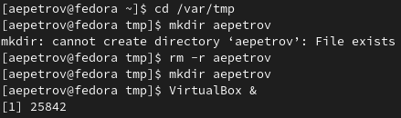
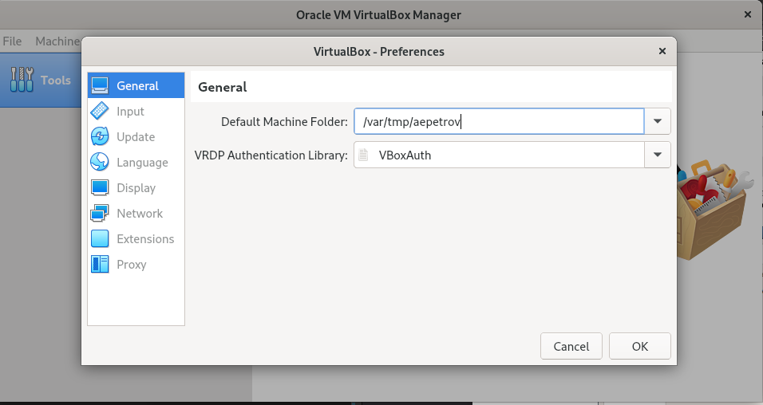
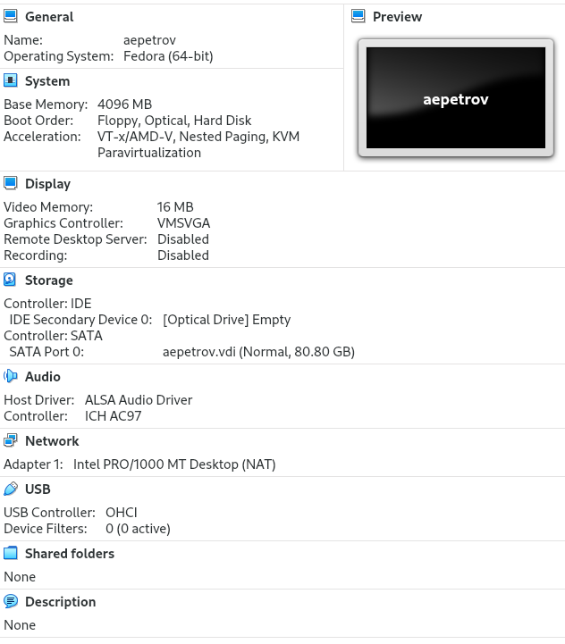
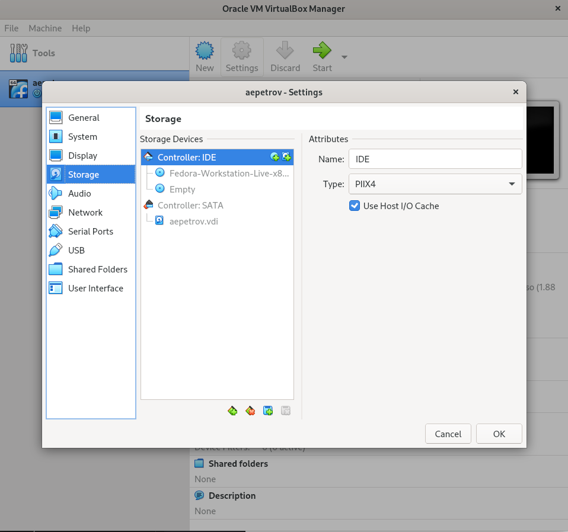
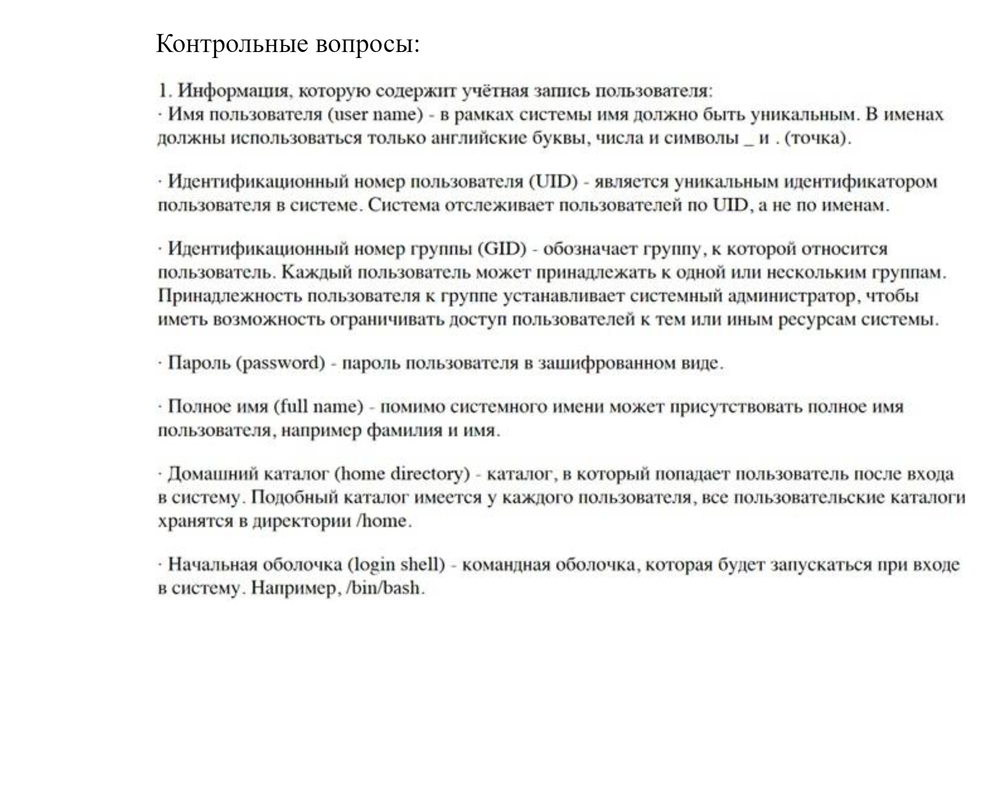
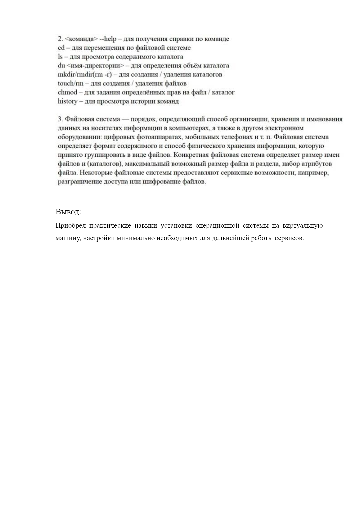

---
## Front matter
title: "Лабораторная работа н.1"
subtitle: "Установка и конфигурация операционной системы на виртуальную машину"
author: "Петров Артем Евгеньевич"

## Generic otions
lang: ru-RU
toc-title: "Содержание"

## Bibliography
bibliography: bib/cite.bib
csl: pandoc/csl/gost-r-7-0-5-2008-numeric.csl

## Pdf output format
toc: true # Table of contents
toc-depth: 2
lof: true # List of figures
lot: false # List of tables
fontsize: 12pt
linestretch: 1.5
papersize: a4
documentclass: scrreprt
## I18n polyglossia
polyglossia-lang:
  name: russian
  options:
	- spelling=modern
	- babelshorthands=true
polyglossia-otherlangs:
  name: english
## I18n babel
babel-lang: russian
babel-otherlangs: english
## Fonts
mainfont: PT Serif
romanfont: PT Serif
sansfont: PT Sans
monofont: PT Mono
mainfontoptions: Ligatures=TeX
romanfontoptions: Ligatures=TeX
sansfontoptions: Ligatures=TeX,Scale=MatchLowercase
monofontoptions: Scale=MatchLowercase,Scale=0.9
## Biblatex
biblatex: true
biblio-style: "gost-numeric"
biblatexoptions:
  - parentracker=true
  - backend=biber
  - hyperref=auto
  - language=auto
  - autolang=other*
  - citestyle=gost-numeric
## Pandoc-crossref LaTeX customization
figureTitle: "Рис."
tableTitle: "Таблица"
listingTitle: "Листинг"
lofTitle: "Список иллюстраций"
lotTitle: "Список таблиц"
lolTitle: "Листинги"
## Misc options
indent: true
header-includes:
  - \usepackage{indentfirst}
  - \usepackage{float} # keep figures where there are in the text
  - \floatplacement{figure}{H} # keep figures where there are in the text
---

# Цель работы

Целью данной работы является приобретение практических навыков установки опера-
ционной системы на виртуальную машину, настройки минимально необходимых для
дальнейшей работы сервисов

# Задание

Дождитесь загрузки графического окружения и откройте терминал. В окне термина-
ла проанализируйте последовательность загрузки системы, выполнив команду dmesg.
Можно просто просмотреть вывод этой команды:

``` 
dmesg | less
```

Можно использовать поиск с помощью grep:

``` 
dmesg | grep -i "то, что ищем"
``` 

Получите следующую информацию.
1. Версия ядра Linux (Linux version).
2. Частота процессора (Detected Mhz processor).
3. Модель процессора (CPU0).
4. Объем доступной оперативной памяти (Memory available).
5. Тип обнаруженного гипервизора (Hypervisor detected).
6. Тип файловой системы корневого раздела.
7. Последовательность монтирования файловых систем.

# Выполнение лабораторной работы

Описываются проведённые действия, в качестве иллюстрации даётся ссылка на иллюстрацию (рис. [-@fig:001])

{ #fig:001 width=70% }

1. Создадим папку с своим именем в ДК(aepetrov) в каталоге /var/tmp и запустим VirtualBox(рис. [-@fig:001])

{ #fig:001 width=70% }
 
2. Запустим VB и укажем папку для наших машин, как ту, что мы создали шагом ранее(рис. [-@fig:002]).

```
VirtualBox &
```

{#fig:002 width=70%}

3. Создадим виртуальную машину с похожими параметрами.(рис. [-@fig:003])

{#fig:003 width=70%}

4. Скачаем образ fedora и зайдем в настройки нашей виртуальной машины и выберем это образ, как оптический привод.(рис. [-@fig:004])

{#fig:004 width=70%}

5. Теперь проведем первоначальную настройку ОС и виртуальная машина готова!

## Выполнение домашнего задания.

1. Получить версию ядра Linux

```
dmesg | grep -I "Linux version"
```

2. Узнать частоту процессора

```
dmesg | grep -I "processor"
```

3. Узнать модель процессора

```
dmesg | grep -I "CPU0"
```

4. Узнать объем доступной оперативной памяти

```
free -m
```

5. Узнать тип обнаруженного гипервизора

```
dmesg | grep -I "Hypervisor detected"
```

6. Узнать тип файловой системы корневого раздела

```
mount | grep /dev/sdb
```

7. Узнать последовательность монтирования файловых систем

```
df -h
```

## Контрольные вопросы

{ width=70%}
{ width=70%}

4. Чтобы узнать последовательность монтирования файловых систем, надо прописать команду:

```
df -h
```

5. Чтобы удалить зависший процесс, надо вопспользоваться командой kill [номер процесс, узнать можно при помощи jobs] или комбинацией клавиш ctrl+c.

# Выводы

Я приобрел практические навыки работы с операционной системой Linux и научился создавать виртуальные машины.


