---
## Front matter
title: "Лабораторная работа н.2"
subtitle: "Управление версиями"
author: "Петров Артем Евгеньевич"

## Generic otions
lang: ru-RU
toc-title: "Содержание"

## Bibliography
bibliography: bib/cite.bib
csl: pandoc/csl/gost-r-7-0-5-2008-numeric.csl

## Pdf output format
toc: true # Table of contents
toc-depth: 2
lof: true # List of figures
lot: false # List of tables
fontsize: 12pt
linestretch: 1.5
papersize: a4
documentclass: scrreprt
## I18n polyglossia
polyglossia-lang:
  name: russian
  options:
	- spelling=modern
	- babelshorthands=true
polyglossia-otherlangs:
  name: english
## I18n babel
babel-lang: russian
babel-otherlangs: english
## Fonts
mainfont: PT Serif
romanfont: PT Serif
sansfont: PT Sans
monofont: PT Mono
mainfontoptions: Ligatures=TeX
romanfontoptions: Ligatures=TeX
sansfontoptions: Ligatures=TeX,Scale=MatchLowercase
monofontoptions: Scale=MatchLowercase,Scale=0.9
## Biblatex
biblatex: true
biblio-style: "gost-numeric"
biblatexoptions:
  - parentracker=true
  - backend=biber
  - hyperref=auto
  - language=auto
  - autolang=other*
  - citestyle=gost-numeric
## Pandoc-crossref LaTeX customization
figureTitle: "Рис."
tableTitle: "Таблица"
listingTitle: "Листинг"
lofTitle: "Список иллюстраций"
lotTitle: "Список таблиц"
lolTitle: "Листинги"
## Misc options
indent: true
header-includes:
  - \usepackage{indentfirst}
  - \usepackage{float} # keep figures where there are in the text
  - \floatplacement{figure}{H} # keep figures where there are in the text
---

# Цель работы

- Изучить идеологию и применение средств контроля версий.
- Освоить умения по работе с git.

# Задание

- Создать базовую конфигурацию для работы с git.
- Создать ключ SSH.
- Создать ключ PGP.
- Настроить подписи git.
- Зарегистрироваться на Github.
- Создать локальный каталог для выполнения заданий по предмету.

# Теоретическое введение
Системы контроля версий (Version Control System, VCS) применяются при работе нескольких человек над одним проектом. Обычно основное дерево проекта хранится в локальном
или удалённом репозитории, к которому настроен доступ для участников проекта. При
внесении изменений в содержание проекта система контроля версий позволяет их
фиксировать, совмещать изменения, произведённые разными участниками проекта,
производить откат к любой более ранней версии проекта, если это требуется.
В классических системах контроля версий используется централизованная модель,
предполагающая наличие единого репозитория для хранения файлов. Выполнение большинства функций по управлению версиями осуществляется специальным сервером.
Участник проекта (пользователь) перед началом работы посредством определённых
команд получает нужную ему версию файлов. После внесения изменений, пользователь
размещает новую версию в хранилище. При этом предыдущие версии не удаляются
из центрального хранилища и к ним можно вернуться в любой момент. Сервер может
сохранять не полную версию изменённых файлов, а производить так называемую дельтакомпрессию — сохранять только изменения между последовательными версиями, что
позволяет уменьшить объём хранимых данных.
Системы контроля версий поддерживают возможность отслеживания и разрешения
конфликтов, которые могут возникнуть при работе нескольких человек над одним
файлом. Можно объединить (слить) изменения, сделанные разными участниками (автоматически или вручную), вручную выбрать нужную версию, отменить изменения вовсе
или заблокировать файлы для изменения. В зависимости от настроек блокировка не
позволяет другим пользователям получить рабочую копию или препятствует изменению
рабочей копии файла средствами файловой системы ОС, обеспечивая таким образом,
привилегированный доступ только одному пользователю, работающему с файлом.
Системы контроля версий также могут обеспечивать дополнительные, более гибкие
функциональные возможности. Например, они могут поддерживать работу с несколькими версиями одного файла, сохраняя общую историю изменений до точки ветвления
версий и собственные истории изменений каждой ветви. Кроме того, обычно доступна
информация о том, кто из участников, когда и какие изменения вносил. Обычно такого
рода информация хранится в журнале изменений, доступ к которому можно ограничить.
В отличие от классических, в распределённых системах контроля версий центральный
репозиторий не является обязательным.
Среди классических VCS наиболее известны CVS, Subversion, а среди распределённых — Git, Bazaar, Mercurial. Принципы их работы схожи, отличаются они в основном
синтаксисом используемых в работе команд.


# Выполнение лабораторной работы

## Создание учетной записи на github.com ##

- Создание учентой записи в моем случае не требуется, поэтому перейдем к следующему заданию.

## Установка Программного обесепечения ##

### Установка git-flow ###
  
- Установим git-flow согласно указаниям (рис. [-@fig:001])

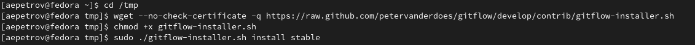{#fig:001 width=70%}

### Установка gh ###

- Установим gh(рис. [-@fig:002])

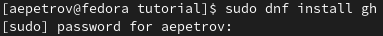{#fig:002 width=70%}

## Базовая настройка git
 
### Зададим имя и email(рис. [-@fig:003]):
  
```
1. git config --global user.name "Artyem Petrov"
2. git config --global user.email"fittedorangeofficial@mail.ru"
```

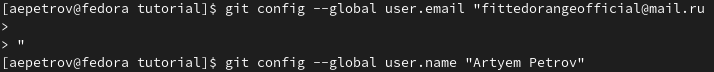{#fig:003 width=70%}

### Настроим utf-8 в выводе сообщений git(рис. [-@fig:004]):

```
1. git config --global core.quotepath false
```

### Настроим верификацию и подписание коммитов(1) и задаим имя начальной ветке(2)(рис. [-@fig:004]):
- Настроим верификацию и подписание коммитов:
  
```
1. git config --global init.defaultBranch master
```

- Параметры autocrlf и safecrlf:
  
```
1. git config --global core.autocrlf input
2. git config --global core.safecrlf warn
```

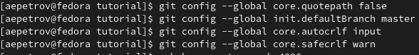{#fig:004 width=70%}

## Создание ключей ssh по алгоритмам rsa & ed25519(рис. [-@fig:005])

```
1. ssh-keygen -t rsa -b 4096
2. ssh-keygen -t ed25519
```

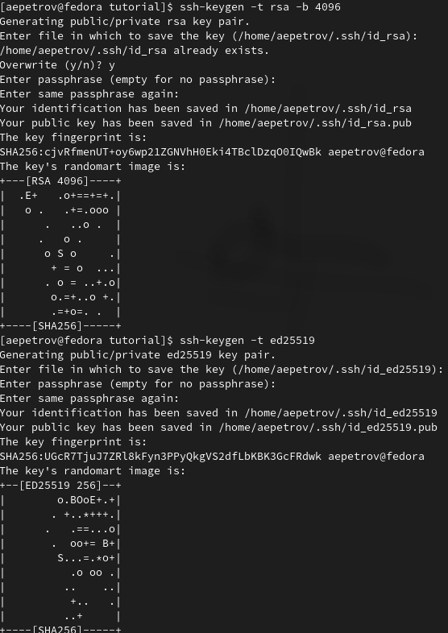{#fig:005 width=70%}

## Создание ключа pgp(рис. [-@fig:006])

- Генерируем ключ:
  
```
1. gpg --full-generate-key
```

- Выбираем следующим образом: RSA & RSA, 4096, 0, Artyem, fittedorangeofficial@mail.ru.

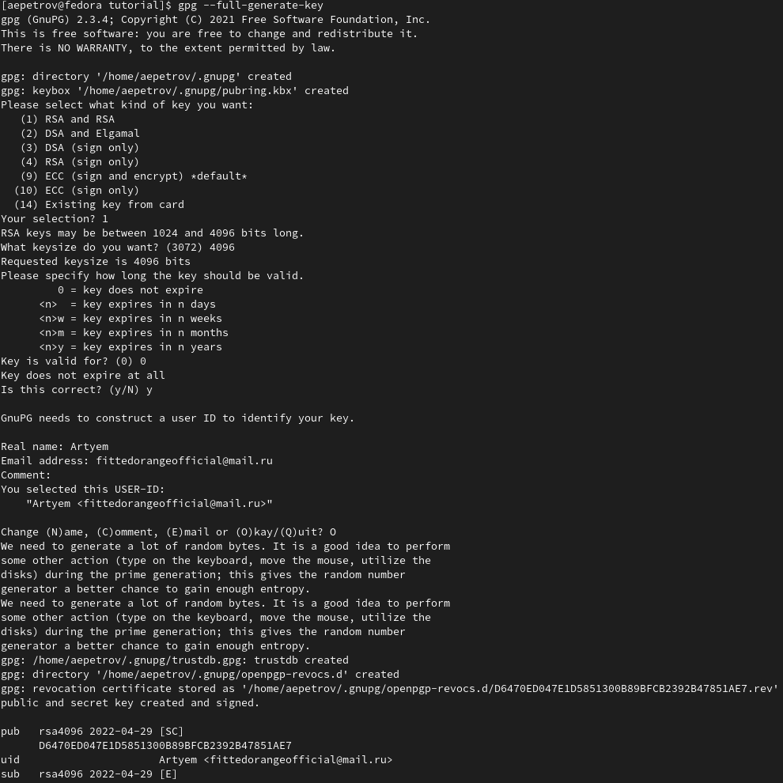{#fig:006 width=70%}

## Добавление PGP ключа в GitHub

- Выводи список ключей и копируем отпечаток приватного ключа(рис. [-@fig:007]):
  
```
gpg --list-secret-keys --keyid-format LONG
```

- Отпечаток ключа — это последовательность байтов, используемая для идентификации более длинного, по сравнению с самим отпечатком ключа.

- Формат строки:
  sec Алгоритм/Отпечаток_ключа Дата_создания [Флаги] [Годен_до] ID_ключа
    Ключен выделен на рис. [-@fig:007]:

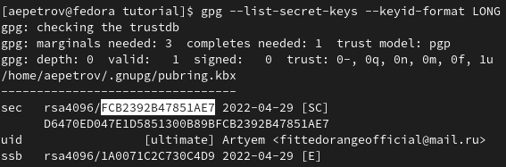{#fig:007 width=70%}

- Cкопируйте ваш сгенерированный PGP ключ в буфер обмена(рис. [-@fig:008]):

```
1. gpg --armor --export <PGP Fingerprint> | xclip -sel clip
```

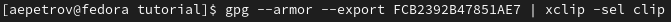{#fig:008 width=70%}

– Перейдем в настройки GitHub (https://github.com/settings/keys), нажмем на кнопку New GPG key и вставьте полученный ключ в поле ввода(рис. [-@fig:009])

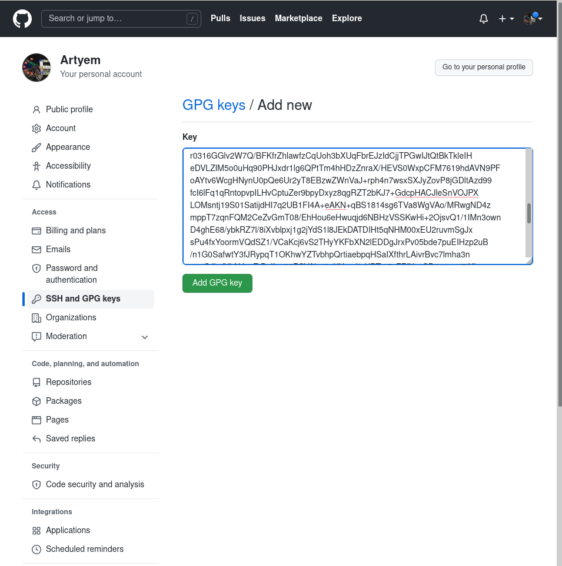{#fig:009 width=70%}

## Настройка автоматических подписей коммитов git
- Используя введёный email, укажим Git применять его при подписи коммитов(рис. [-@fig:010]):

```
1. git config --global user.signingkey <PGP Fingerprint>
2. git config --global commit.gpgsign true
3. git config --global gpg.program $(which gpg2)
```

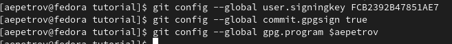{#fig:010 width=70%}

## Настройка gh.
- Для начала авторизуемся(рис. [-@fig:011]):

```
gh auth login
```

- Утилита задаст несколько вопрос и попросит токен  в конце аутентификации, который можно создать в настройках разработчика(https://github.com/settings/tokens)[link]. Если токен введен правильно, то вы авторизируетесь.
  
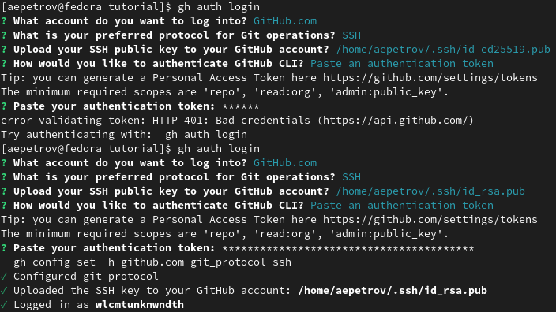{#fig:011 width=70%}

## Шаблон для рабочего пространства

- Шаблон находится по ссылке: (https://github.com/yamadharma/course-directory-student-template)

### Создание репозитория на основе шаблона

- Создадим необходимую директорию и перейдем в нее(рис. [-@fig:012]): 

```
1. mkdir -p ~/work/study/2021-2022/"Операционные системы"
2. cd ~/work/study/2021-2022/"Операционные системы"
```

- Создадим репозиторий в нашей директории(рис. [-@fig:012]):

```
1. gh repo create study_2021-2022_os-intro
--template=yamadharma/course-directory-student-template --public
```

- Скопируем содержимое репозитория преподавателя к нам в репозиторий(рис. [-@fig:012]):

``` 
1. git clone --recursive
2. git@github.com:<owner>/study_2021-2022_os-intro.git os-intro
```

{#fig:012 width=70%}
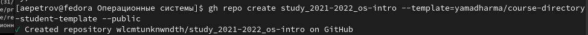{#fig:012 width=70%}
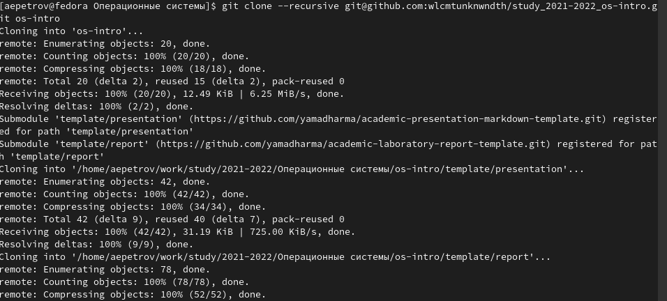{#fig:012 width=70%}

### Настройка каталога курса
- Перейдем в каталог курса(рис. [-@fig:013])

```
cd ~/work/study/2021-2022/"Операционные системы"/os-intro
```

- Удалим лишние файлы(рис. [-@fig:013])

```
rm package.json
```

- Создадим необходимые каталоги(рис. [-@fig:013]):

```
make COURSE=os-intro
```

- После отправим файлы на сервер(рис. [-@fig:013]):

```
1. git add .
2. git commit -am 'feat(main): make course structure'
```

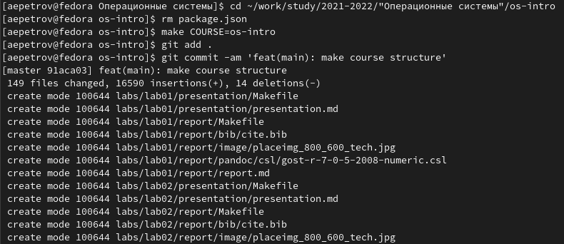{#fig:013 width=70%}

- Окончательно "толкнем" их на сервер(рис. [-@fig:014]):

```
git push
```  

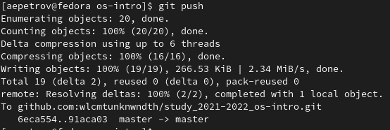{#fig:014 width=70%}

## Контрольные вопросы

1. Системы контроля версий — это программные инструменты, помогающие командам разработчиков управлять изменениями в исходном коде с течением времени. Системы контроля версий (Version Control System, VCS) применяются при работе нескольких человек над одним проектом.

2. Объясните следующие понятия VCS и их отношения: хранилище, commit, история, рабочая копия.

Хранилище – репозиторий - место хранения всех версий и служебной информации.

Commit - это команда для записи индексированных изменений в репозиторий.

История – место, где сохраняются все коммиты, по которым можно посмотреть данные о коммитах.

Рабочая копия – текущее состояние файлов проекта, основанное на версии, загруженной из хранилища.

3. Что представляют собой и чем отличаются централизованные и децентрализованные VCS? Приведите примеры VCS каждого вида

Централизованные системы – это системы, в которых одно основное хранилище всего проекта, и каждый пользователь копирует необходимые ему файлы, изменяет и вставляет обратно. Пример – Subversion.

Децентрализованные системы – система, в которой каждый пользователь имеет свой вариант репозитория и есть возможность добавлять и забирать изменения из репозиториев. Пример – Git.

4. . Опишите действия с VCS при единоличной работе с хранилищем.

5. Опишите порядок работы с общим хранилищем VCS.

6. Каковы основные задачи, решаемые инструментальным средством git?

У Git две основных задачи: первая — хранить информацию обо всех изменениях в вашем коде, начиная с самой первой строчки, а вторая — обеспечение удобства командной работы над кодом.

7. Назовите и дайте краткую характеристику командам git.

– создание основного дерева репозитория: git init

– получение обновлений (изменений) текущего дерева из

центрального репозитория: git pull

– отправка всех произведённых изменений локального дерева в центральный репозиторий: git push

– просмотр списка изменённых файлов в текущей директории: git status

– просмотр текущих изменения: git diff

– сохранение текущих изменений: – добавить все изменённые и/или созданные файлы и/или каталоги: git add .

– добавить конкретные изменённые и/или созданные файлы и/или каталоги: git add

– удалить файл и/или каталог из индекса репозитория (при этом файл и/или каталог остаётся в локальной директории): git rm имена_файлов

– сохранить все добавленные изменения и все изменённые файлы: git commit -am 'Описание коммита'

– сохранить добавленные изменения с внесением комментария через встроенный редактор: git commit

– создание новой ветки, базирующейся на текущей: git checkout -b имя_ветки

– переключение на некоторую ветку: git checkout имя_ветки (при переключении на ветку, которой ещё нет в локальном репозитории, она будет создана и связана с удалённой)

– отправка изменений конкретной ветки в центральный репозиторий: 1 git push origin имя_ветки

– слияние ветки с текущим деревом: 1 git merge —no-ff имя_ветки

– удаление локальной уже слитой с основным деревом ветки: git

branch -d имя_ветки

– принудительное удаление локальной ветки: git branch -D имя_ветки

– удаление ветки с центрального репозитория: git push origin :имя_ветки

8. Приведите примеры использования при работе с локальным и удалённым репозиториями.

9. Что такое и зачем могут быть нужны ветви (branches)?

Ветка (англ. branch) — это последовательность коммитов, в которой ведётся параллельная разработка какого-либо функционала. Ветки нужны, чтобы несколько программистов могли вести работу над одним и тем же проектом или даже файлом одновременно, при этом не мешая друг другу. Кроме того, ветки используются для тестирования экспериментальных функций: чтобы не повредить основному проекту, создается новая ветка специально для экспериментов.

10. Как и зачем можно игнорировать некоторые файлы при commit?

Игнорируемые файлы — это, как правило, артефакты сборки и файлы, генерируемые машиной из исходных файлов в вашем репозитории, либо файлы, которые по какой-либо иной причине не должны попадать в коммиты. В Git нет специальной команды для указания игнорируемых файлов: вместо этого необходимо вручную отредактировать файл . Временно игнорировать

изменения в файле можно командой git update-index-assumeunchanged<file>

# Выводы

Благодаря данной работе я научился пользоваться системой контроля версий git, github, gitflow и т.д.