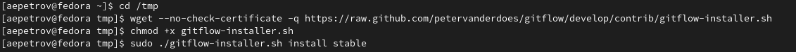
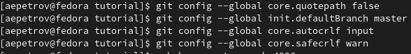
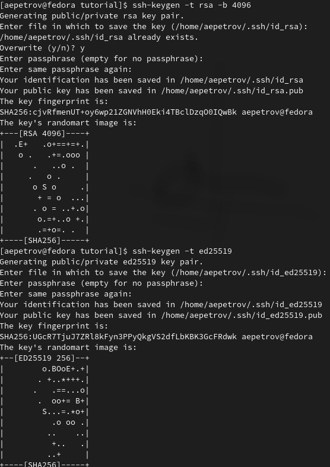
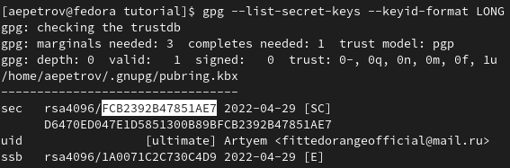
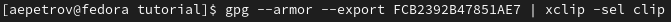
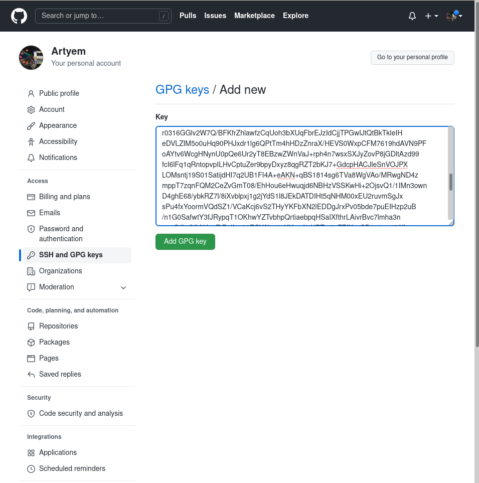
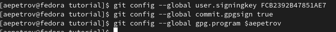
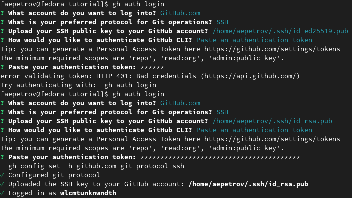
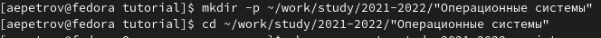
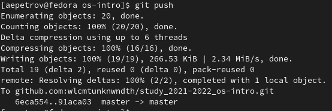

---
## Front matter
title: "Лабораторная работа н.3"
subtitle: "Markdown"
author: "Петров Артем Евгеньевич"

## Generic otions
lang: ru-RU
toc-title: "Содержание"

## Bibliography
bibliography: bib/cite.bib
csl: pandoc/csl/gost-r-7-0-5-2008-numeric.csl

## Pdf output format
toc: true # Table of contents
toc-depth: 2
lof: true # List of figures
lot: true # List of tables
fontsize: 12pt
linestretch: 1.5
papersize: a4
documentclass: scrreprt
## I18n polyglossia
polyglossia-lang:
  name: russian
  options:
	- spelling=modern
	- babelshorthands=true
polyglossia-otherlangs:
  name: english
## I18n babel
babel-lang: russian
babel-otherlangs: english
## Fonts
mainfont: PT Serif
romanfont: PT Serif
sansfont: PT Sans
monofont: PT Mono
mainfontoptions: Ligatures=TeX
romanfontoptions: Ligatures=TeX
sansfontoptions: Ligatures=TeX,Scale=MatchLowercase
monofontoptions: Scale=MatchLowercase,Scale=0.9
## Biblatex
biblatex: true
biblio-style: "gost-numeric"
biblatexoptions:
  - parentracker=true
  - backend=biber
  - hyperref=auto
  - language=auto
  - autolang=other*
  - citestyle=gost-numeric
## Pandoc-crossref LaTeX customization
figureTitle: "Рис."
tableTitle: "Таблица"
listingTitle: "Листинг"
lofTitle: "Список иллюстраций"
lotTitle: "Список таблиц"
lolTitle: "Листинги"
## Misc options
indent: true
header-includes:
  - \usepackage{indentfirst}
  - \usepackage{float} # keep figures where there are in the text
  - \floatplacement{figure}{H} # keep figures where there are in the text
---

# Цель работы

- Изучить идеологию и применение средств контроля версий.
- Освоить умения по работе с git.

# Задание

- Создать базовую конфигурацию для работы с git.
- Создать ключ SSH.
- Создать ключ PGP.
- Настроить подписи git.
- Зарегистрироваться на Github.
- Создать локальный каталог для выполнения заданий по предмету.

# Теоретическое введение
Чтобы создать заголовок, используйте знак ( # ), например:
```
1 # This is heading 1
2 ## This is heading 2
3 ### This is heading 3
4 #### This is heading 4
```
Чтобы задать для текста полужирное начертание, заключите его в двойные звездочки:
```
1 This text is **bold**.
```
Чтобы задать для текста курсивное начертание, заключите его в одинарные звездочки:
```
This text is *italic*.
```
Чтобы задать для текста полужирное и курсивное начертание, заключите его в тройные
звездочки:
``` 
This is text is both ***bold and italic***
```

Блоки цитирования создаются с помощью символа >:
``` > The drought had lasted now for ten million years, and the reign of
the terrible lizards had long since ended. Here on the Equator, in
the continent which would one day be known as Africa, the battle
for existence had reached a new climax of ferocity, and the victor
was not yet in sight. In this barren and desiccated land, only the
small or the swift or the fierce could flourish, or even hope to
survive.
```

Неупорядоченный (маркированный) список можно отформатировать с помощью звез-
дочек или тире:
```
 - List item 1
 - List item 2
 - List item 3
```

Чтобы вложить один список в другой, добавьте отступ для элементов дочернего списка:
```
 List item 1
 - List item A
 - List item B
 - List item 2
```
Упорядоченный список можно отформатировать с помощью соответствующих цифр:
```
 1. First instruction
 1. Second instruction
 1. Third instruction
```
Чтобы вложить один список в другой, добавьте отступ для элементов дочернего списка:
```
 1. First instruction
 1. Sub-instruction
 1. Sub-instruction
 1. Second instruction
```
Синтаксис Markdown для встроенной ссылки состоит из части [link text] , представ-
ляющей текст гиперссылки, и части (file-name.md) – URL-адреса или имени файла,
на который дается ссылка:
```
[link text](file-name.md)
```
Markdown поддерживает как встраивание фрагментов кода в предложение, так и их
размещение между предложениями в виде отдельных огражденных блоков. Огражденные
блоки кода — это простой способ выделить синтаксис для фрагментов кода. Общий
формат огражденных блоков кода:
``` language
your code goes in here
```
Верхние и нижние индексы:
записывается как
```
H~2O~0
```
записывается как
```
2^10^
```
Внутритекстовые формулы делаются аналогично формулам LaTeX. Например, формула
sin2(𝑥) + cos2(𝑥) = 1 запишется как
```
$\sin^2 (x) + \cos^2 (x) = 1$
```
Выключные формулы:
sin2(𝑥) + cos2(𝑥) = 1
{#eq:eq:sin2+cos2} со ссылкой в тексте «Смотри формулу ([-@eq:eq:sin2+cos2]).» записывается как
```
1 $$
2 \sin^2 (x) + \cos^2 (x) = 1
3 $$ {#eq:eq:sin2+cos2}
4
5 Смотри формулу ([-@eq:eq:sin2+cos2])
```
Для обработки файлов в формате Markdown будем использовать Pandoc
https://pandoc.org/. Конкретно, нам понадобится программа pandoc ,
pandoc-citeproc [https://github.com/jgm/pandoc/releases](https://github.com/jgm/pandoc/releases), 
pandoc-crossref
[https://github.com/lierdakil/pandoc-crossref/releases](https://github.com/lierdakil/pandoc-crossref/releases).

Преобразовать файл README.md можно следующим образом:
```
1 pandoc README.md -o README.pdf
или так
1 pandoc README.md -o README.docx
Можно использовать следующий Makefile
1 FILES = $(patsubst %.md, %.docx, $(wildcard *.md))
2 FILES += $(patsubst %.md, %.pdf, $(wildcard *.md))
3
4 LATEX_FORMAT =
5
6 FILTER = --filter pandoc-crossref
7
8 %.docx: %.md
9 -pandoc "$<" $(FILTER) -o "$@"
10
11 %.pdf: %.md
12 -pandoc "$<" $(LATEX_FORMAT) $(FILTER) -o "$@"
13
14 all: $(FILES)
15 @echo $(FILES)
16
17 clean:
18 -rm $(FILES) *~
```

# Выполнение лабораторной работы

## Создание учетной записи на github.com ##

- Создание учентой записи в моем случае не требуется, поэтому перейдем к следующему заданию.

## Установка Программного обесепечения ##

### Установка git-flow ###
  
- Установим git-flow согласно указаниям (рис. [-@fig:001])

{#fig:001 width=70%}

### Установка gh ###

- Установим gh(рис. [-@fig:002])

{#fig:002 width=70%}

## Базовая настройка git
 
### Зададим имя и email(рис. [-@fig:003]):
  
```
1. git config --global user.name "Artyem Petrov"
2. git config --global user.email"fittedorangeofficial@mail.ru"
```

{#fig:003 width=70%}

### Настроим utf-8 в выводе сообщений git(рис. [-@fig:004]):

```
1. git config --global core.quotepath false
```

### Настроим верификацию и подписание коммитов(1) и задаим имя начальной ветке(2)(рис. [-@fig:004]):
- Настроим верификацию и подписание коммитов:
  
```
1. git config --global init.defaultBranch master
```

- Параметры autocrlf и safecrlf:
  
```
1. git config --global core.autocrlf input
2. git config --global core.safecrlf warn
```

{#fig:004 width=70%}

## Создание ключей ssh по алгоритмам rsa & ed25519(рис. [-@fig:005])

```
1. ssh-keygen -t rsa -b 4096
2. ssh-keygen -t ed25519
```

{#fig:005 width=70%}

## Создание ключа pgp(рис. [-@fig:006])

- Генерируем ключ:
  
```
1. gpg --full-generate-key
```

- Выбираем следующим образом: RSA & RSA, 4096, 0, Artyem, fittedorangeofficial@mail.ru.

{#fig:006 width=70%}

## Добавление PGP ключа в GitHub

- Выводи список ключей и копируем отпечаток приватного ключа(рис. [-@fig:007]):
  
```
gpg --list-secret-keys --keyid-format LONG
```

- Отпечаток ключа — это последовательность байтов, используемая для идентификации более длинного, по сравнению с самим отпечатком ключа.

- Формат строки:
  sec Алгоритм/Отпечаток_ключа Дата_создания [Флаги] [Годен_до] ID_ключа
    Ключен выделен на рис. [-@fig:007]:

{#fig:007 width=70%}

- Cкопируйте ваш сгенерированный PGP ключ в буфер обмена(рис. [-@fig:008]):

```
1. gpg --armor --export <PGP Fingerprint> | xclip -sel clip
```

{#fig:008 width=70%}

– Перейдем в настройки GitHub (https://github.com/settings/keys), нажмем на кнопку New GPG key и вставьте полученный ключ в поле ввода(рис. [-@fig:009])

{#fig:009 width=70%}

## Настройка автоматических подписей коммитов git
- Используя введёный email, укажим Git применять его при подписи коммитов(рис. [-@fig:010]):

```
1. git config --global user.signingkey <PGP Fingerprint>
2. git config --global commit.gpgsign true
3. git config --global gpg.program $(which gpg2)
```

{#fig:010 width=70%}

## Настройка gh.
- Для начала авторизуемся(рис. [-@fig:011]):

```
gh auth login
```

- Утилита задаст несколько вопрос и попросит токен  в конце аутентификации, который можно создать в настройках разработчика(https://github.com/settings/tokens)[link]. Если токен введен правильно, то вы авторизируетесь.
  
{#fig:011 width=70%}

## Шаблон для рабочего пространства

- Шаблон находится по ссылке: (https://github.com/yamadharma/course-directory-student-template)

### Создание репозитория на основе шаблона

- Создадим необходимую директорию и перейдем в нее(рис. [-@fig:012]): 

```
1. mkdir -p ~/work/study/2021-2022/"Операционные системы"
2. cd ~/work/study/2021-2022/"Операционные системы"
```

- Создадим репозиторий в нашей директории(рис. [-@fig:012]):

```
1. gh repo create study_2021-2022_os-intro
--template=yamadharma/course-directory-student-template --public
```

- Скопируем содержимое репозитория преподавателя к нам в репозиторий(рис. [-@fig:012]):

``` 
1. git clone --recursive
2. git@github.com:<owner>/study_2021-2022_os-intro.git os-intro
```

{#fig:012 width=70%}
{#fig:012 width=70%}
{#fig:012 width=70%}

### Настройка каталога курса
- Перейдем в каталог курса(рис. [-@fig:013])

```
cd ~/work/study/2021-2022/"Операционные системы"/os-intro
```

- Удалим лишние файлы(рис. [-@fig:013])

```
rm package.json
```

- Создадим необходимые каталоги(рис. [-@fig:013]):

```
make COURSE=os-intro
```

- После отправим файлы на сервер(рис. [-@fig:013]):

```
1. git add .
2. git commit -am 'feat(main): make course structure'
```

{#fig:013 width=70%}

- Окончательно "толкнем" их на сервер(рис. [-@fig:014]):

```
git push
```  

{#fig:014 width=70%}

# Выводы

Благодаря данной лабораторной работе я научился пользоваться языком разметки markdown, что, как я считаю, невероятно важно. Ведь важно не просто пользоваться графическим интерфейсом, но и уметь пользоваться базисными методами оформления текста. Спасибо за внимание!


