---
## Front matter
title: "Отчет по лабораторной работе н.4"
subtitle: "Основы интерфейса взаимодействия
пользователя с системой Unix на уровне командной строки"
author: "Петров Артем Евгеньевич"

## Generic otions
lang: ru-RU
toc-title: "Содержание"

## Bibliography
bibliography: bib/cite.bib
csl: pandoc/csl/gost-r-7-0-5-2008-numeric.csl

## Pdf output format
toc: true # Table of contents
toc-depth: 2
lof: true # List of figures
lot: true # List of tables
fontsize: 12pt
linestretch: 1.5
papersize: a4
documentclass: scrreprt
## I18n polyglossia
polyglossia-lang:
  name: russian
  options:
	- spelling=modern
	- babelshorthands=true
polyglossia-otherlangs:
  name: english
## I18n babel
babel-lang: russian
babel-otherlangs: english
## Fonts
mainfont: PT Serif
romanfont: PT Serif
sansfont: PT Sans
monofont: PT Mono
mainfontoptions: Ligatures=TeX
romanfontoptions: Ligatures=TeX
sansfontoptions: Ligatures=TeX,Scale=MatchLowercase
monofontoptions: Scale=MatchLowercase,Scale=0.9
## Biblatex
biblatex: true
biblio-style: "gost-numeric"
biblatexoptions:
  - parentracker=true
  - backend=biber
  - hyperref=auto
  - language=auto
  - autolang=other*
  - citestyle=gost-numeric
## Pandoc-crossref LaTeX customization
figureTitle: "Рис."
tableTitle: "Таблица"
listingTitle: "Листинг"
lofTitle: "Список иллюстраций"
lotTitle: "Список таблиц"
lolTitle: "Листинги"
## Misc options
indent: true
header-includes:
  - \usepackage{indentfirst}
  - \usepackage{float} # keep figures where there are in the text
  - \floatplacement{figure}{H} # keep figures where there are in the text
---

# Цель работы
Приобретение практических навыков взаимодействия пользователя с системой посредством командной строки.

# Задание
1. Определите полное имя вашего домашнего каталога. Далее относительно этого ката-
лога будут выполняться последующие упражнения.
2. Выполните следующие действия:
2.1. Перейдите в каталог /tmp.
2.2. Выведите на экран содержимое каталога /tmp. Для этого используйте команду ls
с различными опциями. Поясните разницу в выводимой на экран информации.
2.3. Определите, есть ли в каталоге /var/spool подкаталог с именем cron?
2.4. Перейдите в Ваш домашний каталог и выведите на экран его содержимое. Опре-
делите, кто является владельцем файлов и подкаталогов?
3. Выполните следующие действия:
3.1. В домашнем каталоге создайте новый каталог с именем newdir.
3.2. В каталоге ~/newdir создайте новый каталог с именем morefun.
3.3. В домашнем каталоге создайте одной командой три новых каталога с именами
letters, memos, misk. Затем удалите эти каталоги одной командой.
3.4. Попробуйте удалить ранее созданный каталог ~/newdir командой rm. Проверьте,
был ли каталог удалён.
3.5. Удалите каталог ~/newdir/morefun из домашнего каталога. Проверьте, был ли
каталог удалён.
4. С помощью команды man определите, какую опцию команды ls нужно использо-
вать для просмотра содержимое не только указанного каталога, но и подкаталогов,
входящих в него.
5. С помощью команды man определите набор опций команды ls, позволяющий отсорти-
ровать по времени последнего изменения выводимый список содержимого каталога
с развёрнутым описанием файлов.
6. Используйте команду man для просмотра описания следующих команд: cd, pwd, mkdir,
rmdir, rm. Поясните основные опции этих команд.
7. Используя информацию, полученную при помощи команды history, выполните мо-
дификацию и исполнение нескольких команд из буфера команд.


# Теоретическое введение

- Формат команды. Командой в операционной системе называется записанный по
специальным правилам текст (возможно с аргументами), представляющий собой ука-
зание на выполнение какой-либо функций (или действий) в операционной системе.
Обычно первым словом идёт имя команды, остальной текст — аргументы или опции,
конкретизирующие действие.
Общий формат команд можно представить следующим образом:
<имя_команды><разделитель><аргументы>

- Команда man. Команда man используется для просмотра (оперативная помощь) в диа-
логовом режиме руководства (manual) по основным командам операционной системы
типа Linux.
Формат команды:
man <команда>
Пример (вывод информации о команде man):

```
man man
```

- Kоманда cd. Команда cd используется для перемещения по файловой системе опера-
ционной системы типа Linux.
Замечание 1. Файловая система ОС типа Linux — иерархическая система каталогов,
подкаталогов и файлов, которые обычно организованы и сгруппированы по функ-
циональному признаку. Самый верхний каталог в иерархии называется корневым
и обозначается символом /. Корневой каталог содержит системные файлы и другие
каталоги.
Формат команды:

```
cd [путь_к_каталогу]
```
 
Переход к родительскому каталогу или к домашнему:

```
1. cd ..
2. cd
```

Инструкция к cd:

```
man cd
```

- Команда pwd. Для определения абсолютного пути к текущему каталогу используется
команда pwd (print working directory).
Пример (абсолютное имя текущего каталога пользователя dharma):

```
1. pwd
```

результат:

```
1. /afs/dk.sci.pfu.edu.ru/home/d/h/dharma
```

- Команда ls. Команда ls используется для просмотра содержимого каталога.
Формат команды:

```
ls [-опции] [путь]
```

- Некоторые файлы в операционной системе скрыты от просмотра и обычно исполь-
зуются для настройки рабочей среды. Имена таких файлов начинаются с точки. Для
того, чтобы отобразить имена скрытых файлов, необходимо использовать команду ls
с опцией a:

```
ls -a
```

/-Kaталог
*-Исполняемый файл
@-Ссылка

- Чтобы вывести на экран подробную информацию о файлах и каталогах, необходимо
использовать опцию l. При этом о каждом файле и каталоге будет выведена следующая
информация:
– тип файла,
– право доступа,
– число ссылок,
– владелец,
– размер,
– дата последней ревизии,
– имя файла или каталога.
Команда:

```
ls -alF
```
- оманда mkdir используется для создания каталогов.
Формат команды:

```
mkdir имя_каталога1 [имя_каталога2...]
```

Интересны следующие опции:
--mode (или -m) — установка атрибутов доступа;
--parents (или -p) — создание каталога вместе с родительскими по отношению к нему
каталогами.
Атрибуты задаются в численной или символьной нотации:
```
mkdir --mode=777 dir
```
или

```
mkdir -m a+rwx dir
```

Опция --parents (краткая форма -p) позволяет создавать иерархическую цепочку
подкаталогов, создавая все промежуточные каталоги:
```
mkdir -p ~/dir1/dir2/dir3
```
- Команда rm. Команда rm используется для удаления файлов и/или каталогов.
Формат команды:
rm [-опции] [файл]
Если требуется, чтобы выдавался запрос подтверждения на удаление файла, то необхо-
димо использовать опцию i.
Чтобы удалить каталог, содержащий файлы, нужно использовать опцию r. Без указания
этой опции команда не будет выполняться.
Пример:

```
1. cd
2. mkdir abs
3.rm abc
4.
5. rm: abc is a directory
6.
7 rm -r abc
```

Если каталог пуст, то можно воспользоваться командой rmdir. Если удаляемый
каталог содержит файлы, то команда не будет выполнена — нужно использовать rm -
r имя_каталога.
Команда history. Для вывода на экран списка ранее выполненных команд исполь-
зуется команда history. Выводимые на экран команды в списке нумеруются. К любой
команде из выведенного на экран списка можно обратиться по её номеру в списке,
воспользовавшись конструкцией !<номер_команды>.
Пример:

```
1. history
2. 1 pwd
3. 2 ls
4. 3 ls -a
5. 4 ls -l
6. 5 cd /
7. 6 history
8.
9. !5
10. cd /
```
Можно модифицировать команду из выведенного на экран списка при помощи следующей конструкции:
!<номер_команды>:s/<что_меняем>/<на_что_меняем>
Пример:

```
1. !3:s/a/F
2. ls -F

```
Если в заданном контексте встречаются специальные символы (типа «.»,
«/», «*» и т.д.), надо перед ними поставить символ экранирования \ (обратный слэш).
Использование символа «;». Если требуется выполнить последовательно несколько
команд, записанный в одной строке, то для этого используется символ точка с запятой
Пример:

```
1 cd; ls
```

# Выполнение лабораторной работы

## Задание 1.
 - Определим полное имя нашего домашнего каталога
командами(рис. [-@fig:001]): 

```
1. cd
2. pwd
```

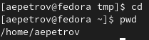{#fig:001 width=70% }
 
## Задание 2
- 2.1. Перейдем в каталог tmp: 

```
cd ~/tmp
```
- 2.2. Выведем на экран содержимое каталога /tmp с помощью различных опций(по очереди):

Простой список каталога(рис. [-@fig:002]):

```
ls
```

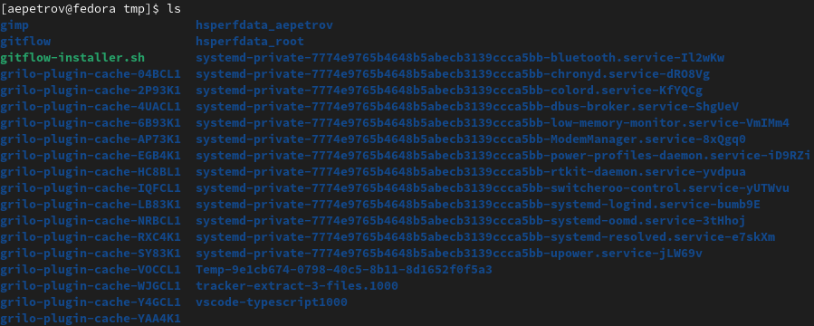{#fig:002 width=70%}

Вывод списка каталога с спрятанными файлами(рис. [-@fig:002]):

```
ls -a
```


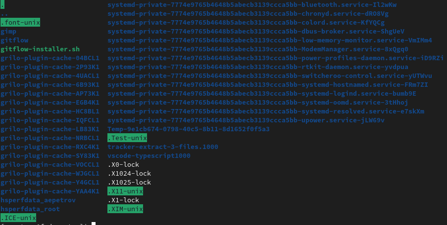){#fig:003 width=70%}

Вывод списка каталога с спрятанными файлами, типом файлов, числом ссылок, именем владельца, размером и датой последней ревизии(рис. [-@fig:004]):

```
ls -alF
```

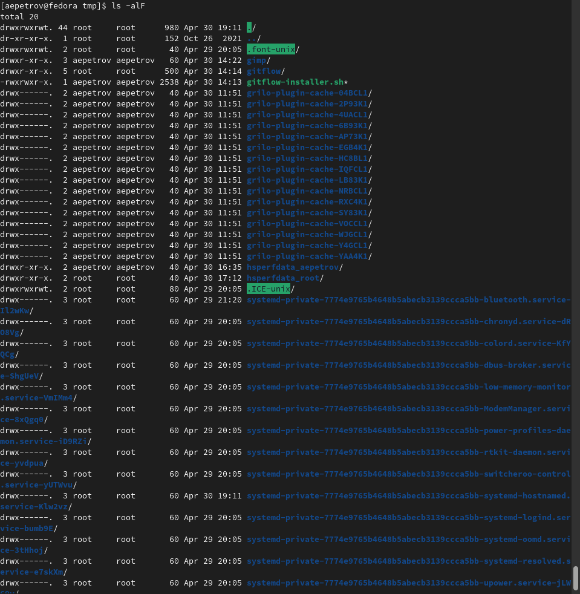{#fig:004 width=70% }

- 2.3. Определить, есть ли в каталоге /var/spool подкаталог с именем /cron

Нам поможет команда(рис. [-@fig:005]):

```
1. cd /var/spool 
2. ls 
```


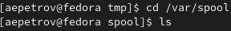{#fig:005 width=70%}

- 2.4. Пейдем в домашний каталог и выведем на экран его содержимое и определим, кто является владельцем файлов и подкаталогов(рис. [-@fig:006])

```
1. cd
2. ls -alF
```

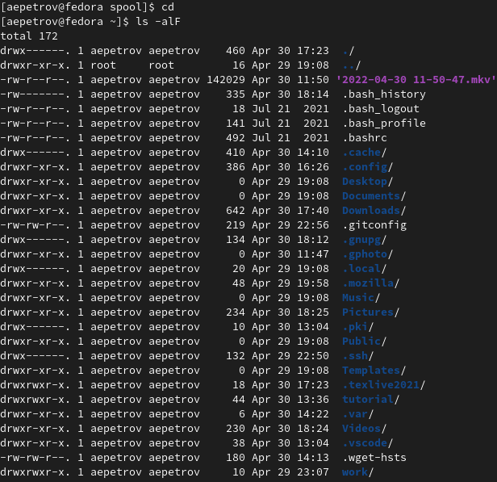{#fig:006 width=70%}

## Задание 3

- 3.1. и 3.2. Создать в домашнем каталоге новый каталог с именем newdir и в нем каталог morefun(рис. [-@fig:007]):

```
1. cd
2. mkdir newdir
3. mkdir newdir/morefun
```

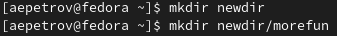{#fig:007 width=70%}

- 3.3. Создать одной командой три новых каталога: letters, memos, misk. Затем удалить их одной командой(рис. [-@fig:008])

```
1. cd
2. mkdir letters memos misk 
3. rm -r letters memos misk
```

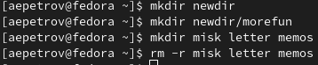{#fig:008 width=70%}

- 3.4. и 3.5. Удалить каталог newdir командой rm, проверить, удалился ли он(рис. [-@fig:009]) и удалить каталог ~/newdir/morefun из домашнего каталога и проверить, удалился ли(рис. [-@fig:010]):

Проверим первое:

```
1. cd 
2. rm newdir
```

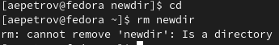{#fig:009 width=70%}

Без особых прав непустую директорую удалить нельзя. 

Перейдем к следующему указанию:

Удалим  ~/newdir/morefun из домашнего каталога

```
1. cd newdir
2. rm -r morefun
3. ls
```

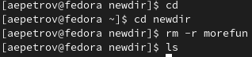{#fig:010 width=70%}

C помощью ключа -r нам это удастся. 

## Задание 4

- C помощью man посмотрим, какую опцию ls надо использовать, что посмотреть содержимое не только каталога, но и его подкаталогов, входящих в него:

Используем следующие команды(рис. [-@fig:011]):

```
man ls
```

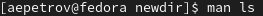){#fig:011 width=70%}

И найдем нужную:

Это опция -R, --recursive(рис. [-@fig:012]):

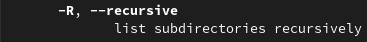{#fig:012 width=70%}

## Задание 5

- С помощью команды man определим набор опций команды ls, позволяющий отсортировать по времени последнего изменения выводимый список содержимого каталога
с развёрнутым описанием файлов.

Используем следующую команду:

```
man ls
```

Найдем опцию(рис. [-@fig:013]):

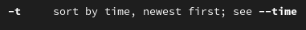{#fig:013 width=70%}

## Задание 6

- Используeм команду man для просмотра описания следующих команд: cd, pwd, mkdir,
rmdir, rm. Поясните основные опции этих команд.

1. cd(рис. [-@fig:014])

```
man cd
```

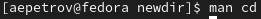{ #fig:014 width=70%}

команда cd(change directory)(рис. [-@fig:015])
cd [-L|[-P [-e]] [-@]] [dir]
Меняет директорию на dir, но если dir не указана, то на ведет в домашний каталог. -P - позволяет следовать по символическим ссылкам перед тем, как будут обработаны все переходы "..";
-L - переходит по символическим ссылкам только после того, как были обработаны "..". -e - если папку, в которую нужно перейти не удалось найти - выдает ошибку.

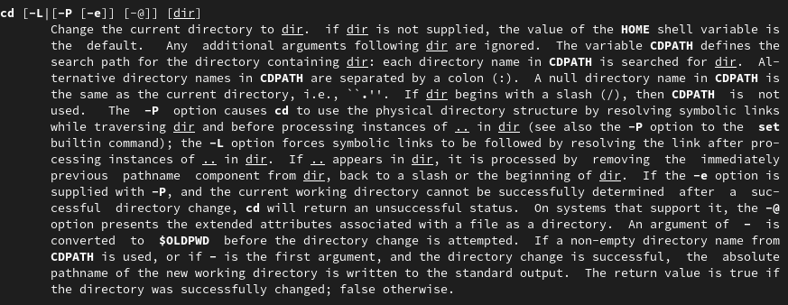{#fig:015 width=70%}

2. pwd

```
man pwd
```

Команда pwd(print working directory) выводит текущую рабочую директорию.
Команда pwd принимает только два аргумента(рис. [-@fig:016]):
  -L, --logical) — не разрешать симлинки.
  -P, --physical) — отображать физическую директорию безсимлинков.

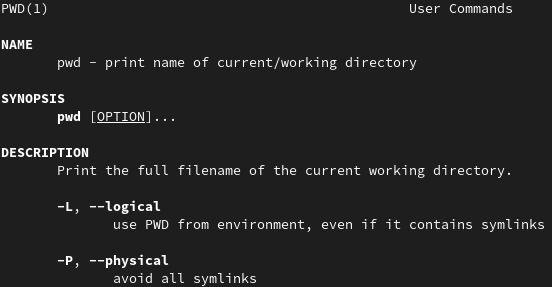{#fig:016 width=70%}

3. mkdir

```
man mkdir
```

(рис. [-@fig:017]): mkdir [o] [dir] -Создание новых директорий.
  -p, --parents-Создать все директории, которые указаны внутри пути. Если какая-либо директория существует, то предупреждение об этом не выводится.
  -m=MODE, --mode=MODE Устанавливает права доступа для создаваемой директории. Синтаксис MODE такой же как у команды chmod
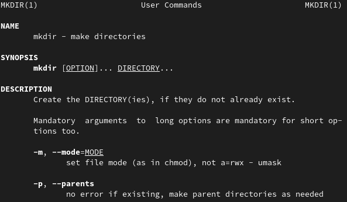{#fig:017 width=70%}

4. rmdir

```
man rmdir
```  

(рис. [-@fig:018]): rmdir [option] [dir] -Удаляет каталог.
  -p -Удаляет родительские каталоги.

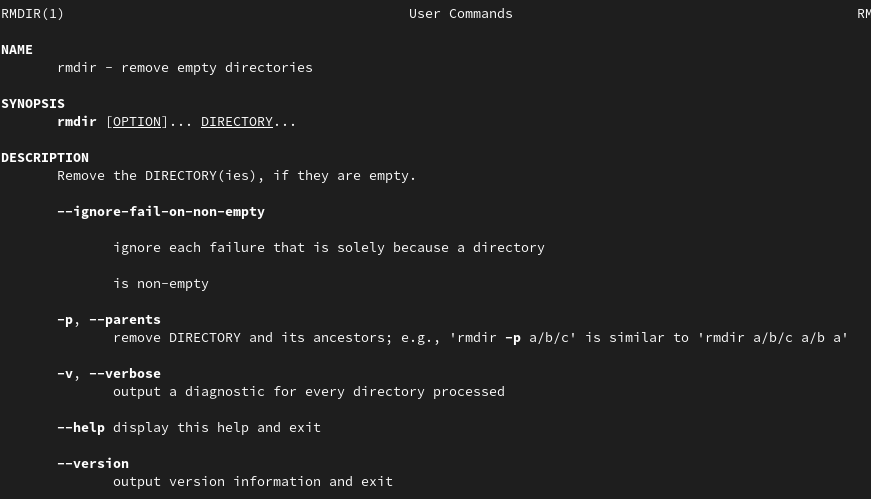{#fig:018 width=70%}

5. rm 

```
man rm
```

rm [o] [file || dir] - Удаление файлов и директорий (рис. [-@fig:019])

  -f или --force - Игнорировать несуществующие файлы и аргументы. Никогда не выдавать запросы на подтверждение удаления.
  -i - Выводить запрос на подтверждение удаления каждого файла.
  -r или -R или --recursive - Удаление директорий и их содержимого. 
  Рекурсивное удаление.-d или --dir - Удалять пустые директории.
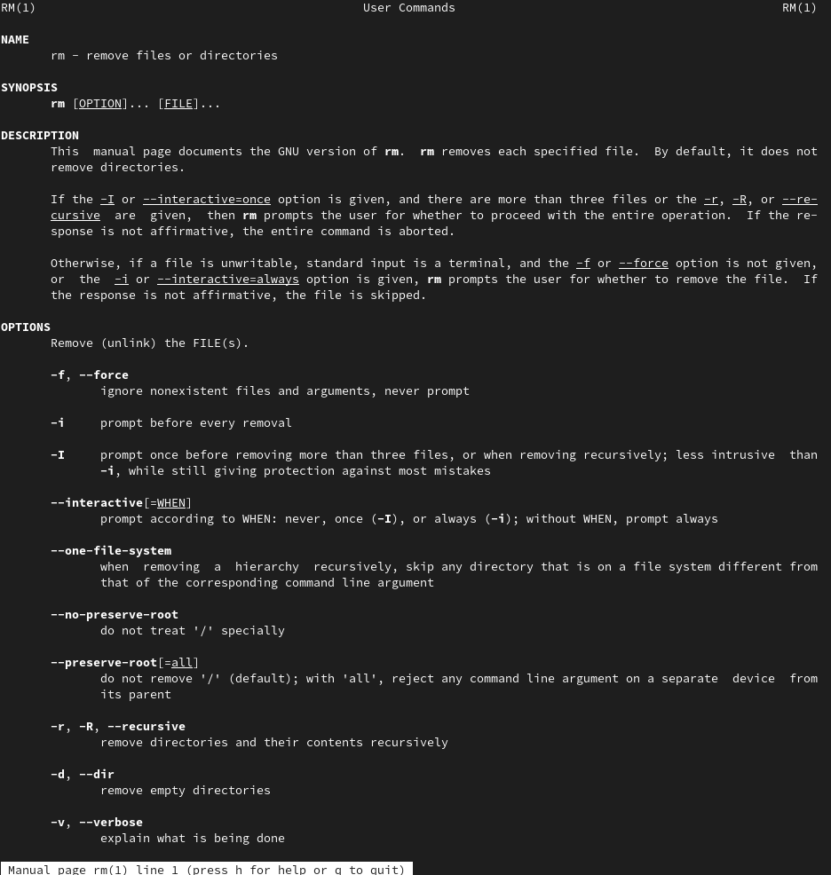{ #fig:019 width=70%}

## Задание 7
- Используя информацию, полученную при помощи команды history, выполним модификацию и исполнение нескольких команд из буфера команд.
  1. Выполним следующие действия(рис. [-@fig:020]):

```
1. history
2. !32:s/-Rt/
```
У нас вместо 

```
ls -Rt
```

Будет выполнена команда(рис. [-@fig:020]):

```
ls 
```

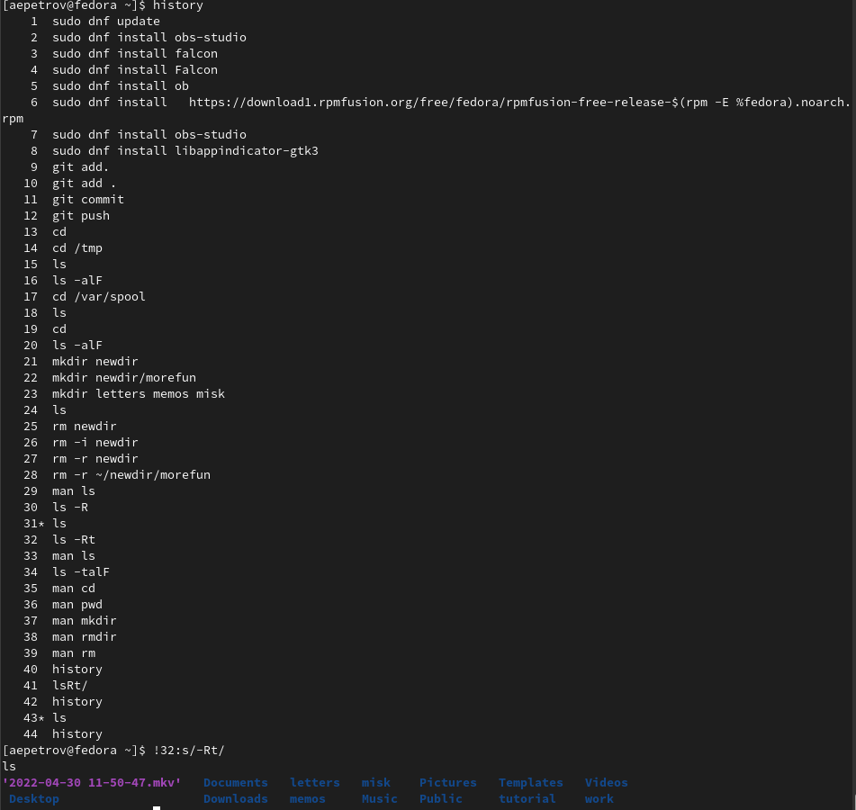{#fig:020 width=70%}
  
  2. Теперь по-другому(рис. [-@fig:021])

```
history
!2:s/obs-studio/wine
```

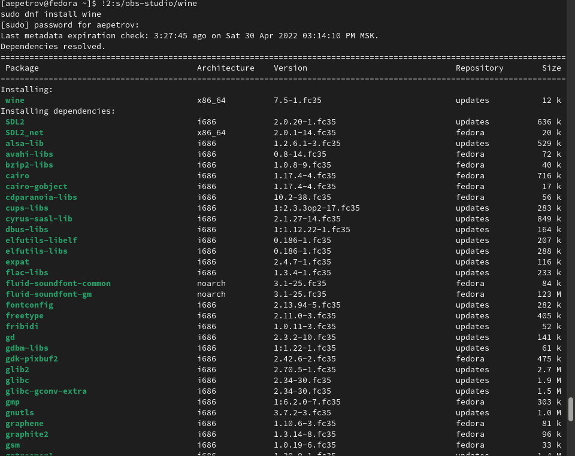{#fig:021 width=70%}

из команды sudo dnf install obs-studio я вызвал sudo dnf install wine 

# Ответы на контрольные вопросы 

1. Командная строка-средство управления системой и ядром с помощью разнообразных команд.
2. pwd
3. ls -alF
4. ls -a
5. rm, rmdir. Да, можно, если воспользоваться командой rm -r.
6. history
7. ```![номер команды]:s/[что меняем]/[на что меняем]```
8. mkdir letters memos videos || rm waw.exe; mkdir waw.exe || mkdir var/{letters, memos, videos}
9.  Символ экранирования-это символ, который разделяет директории(родительские с их подкаталогами) и(или) файлы. К примеру, /var и /tmp.   
10. Эта опция показывает уровни доступа для каждого пользователя или группы, дата измения, владельца, формат(исполняемый файл, ссылка, директория)
11. Относительный путь-путь, который начинается с текущего каталога(не домашнего или корневого). При нахождении в домашнем каталоге нам придется писать cd var/tmp/sys, а если мы находимся в каталоге tmp, то мы будем писать cd sys. Это абсолютный и относительный путь соответственно.
12. С помощью функции man 
13. Tab
  

# Выводы

C помощью данной лабораторной работы я научился пользоваться средствами консоли для перемещения по директориям, для удаления файлов и директорий. Кроме того, я научился пользоваться справкой разработчика man, что лучше разбираться в процессе использования команды.

