---
## Front matter
lang: ru-RU
title: Анализ файловой системы Linux.
Команды для работы с файлами и каталогами
author: Petrov Artyem

## Formatting
toc: false
slide_level: 2
theme: metropolis
header-includes: 
 - \metroset{progressbar=frametitle,sectionpage=progressbar,numbering=fraction}
 - '\makeatletter'
 - '\beamer@ignorenonframefalse'
 - '\makeatother'
aspectratio: 43
section-titles: true
---

# Выполнение лабораторной работы


## Задание 1. Выполнение примеров из первой части лабораторной работы

- Примеры для пункта 5.2.2.(рис. [-@fig:001] - [-@fig:004])

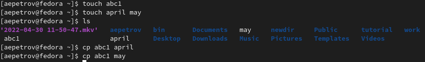{#fig:001 width=70%}
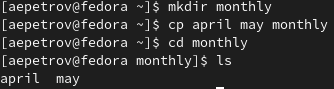{#fig:002 width=70%}
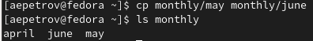{#fig:003 width=70%}
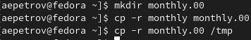{#fig:004 width=70%}

- Примеры пункта 5.2.3.(рис. [-@fig:005])
  
  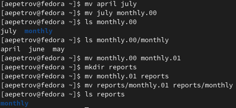{#fig:005 width=70%}

- Примеры пункта 5.2.5.(рис. [-@fig:006])
  
  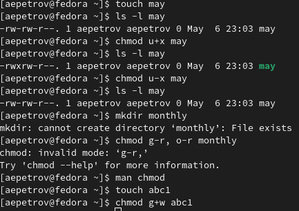{#fig:006 width=70%}

## Задание 2.

1. (рис. [-@fig:007])
   
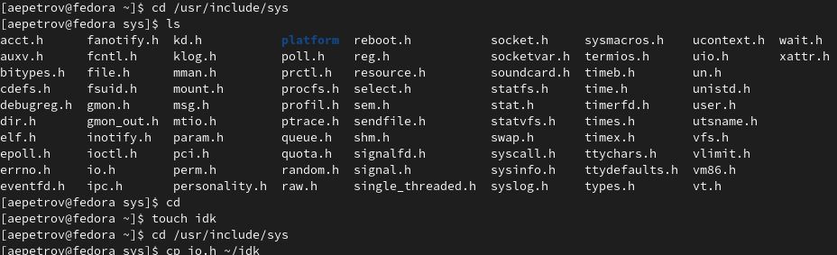{#fig:007 width=70%}

2. - 4 (рис. [-@fig:008])
   
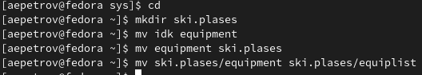{#fig:008 width=70%}

5. - 8 (рис. [-@fig:009])
   
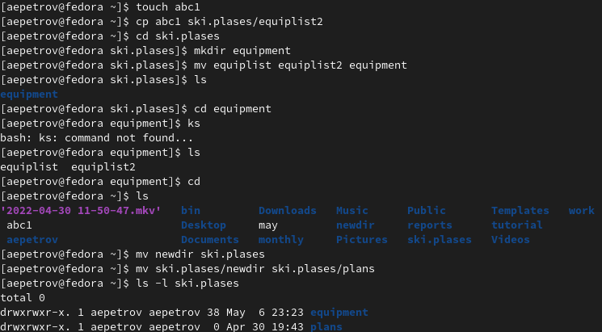{#fig:009 width=70%}

## Задание 3.

- Воспользуемся восьмиричными кодами и присвои права в соответствии с таблицей в теоретических сведениях(рис. [-@fig:010])

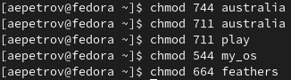{#fig:010 width=70%}

## Задание 4. 

1. 
   
   ```
   ls /etc/password
   ```

2. 

``` 
cp ~/feathers 
~/file.old
```

3. 
   ```
   1. cd
   2. mv file.old play
   ```

4. 
   ```
   cp play fun
   ```


5. 
  ```
  1. cd
  2. mv fun play 
  3. mv play games
  ```

6. 
   ```
  1. cd
  2. chmod u-r feathers 
   ```

7. см (рис. [-@fig:011])
   
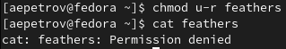{#fig:011 width=70%}

8. см (рис. [-@fig:012])
   
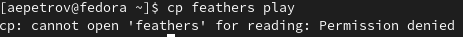{#fig:012 width=70%}

9. 
  ```
  1. cd
  2. chmod u+r feathers 
  ```

10. 
  ```
  1. cd
  2. chmod u-x play 
  ```

11. см (рис. [-@fig:013])
   
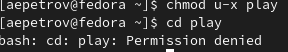{#fig:013 width=70%}

12. 
  ```
  1. cd
  2. chmod u-x play 
  ```

## Задание 5. 

- mount - команда добавляет файловую систему(HD, SSD, IDE) в дерево файловой системы Unix
- fsck - команда используется для восстановления одной или нескольких файловых систем
- msck - команда позволяет выполнить фрагментацию жесткого диска или создать очередную файловую систему
- kill - полность останавливает какой-либо процесс

