---
## Front matter
title: "Лабораторная работа н.5"
subtitle: "Анализ файловой системы Linux. Команды для работы с файлами и каталогами"
author: "Петров Артем Евгеньевич"

## Generic otions
lang: ru-RU
toc-title: "Содержание"

## Bibliography
bibliography: bib/cite.bib
csl: pandoc/csl/gost-r-7-0-5-2008-numeric.csl

## Pdf output format
toc: true # Table of contents
toc-depth: 2
lof: true # List of figures
lot: true # List of tables
fontsize: 12pt
linestretch: 1.5
papersize: a4
documentclass: scrreprt
## I18n polyglossia
polyglossia-lang:
  name: russian
  options:
	- spelling=modern
	- babelshorthands=true
polyglossia-otherlangs:
  name: english
## I18n babel
babel-lang: russian
babel-otherlangs: english
## Fonts
mainfont: PT Serif
romanfont: PT Serif
sansfont: PT Sans
monofont: PT Mono
mainfontoptions: Ligatures=TeX
romanfontoptions: Ligatures=TeX
sansfontoptions: Ligatures=TeX,Scale=MatchLowercase
monofontoptions: Scale=MatchLowercase,Scale=0.9
## Biblatex
biblatex: true
biblio-style: "gost-numeric"
biblatexoptions:
  - parentracker=true
  - backend=biber
  - hyperref=auto
  - language=auto
  - autolang=other*
  - citestyle=gost-numeric
## Pandoc-crossref LaTeX customization
figureTitle: "Рис."
tableTitle: "Таблица"
listingTitle: "Листинг"
lofTitle: "Список иллюстраций"
lotTitle: "Список таблиц"
lolTitle: "Листинги"
## Misc options
indent: true
header-includes:
  - \usepackage{indentfirst}
  - \usepackage{float} # keep figures where there are in the text
  - \floatplacement{figure}{H} # keep figures where there are in the text
---

# Цель работы

Ознакомление с файловой системой Linux, её структурой, именами и содержанием
каталогов. Приобретение практических навыков по применению команд для работы
с файлами и каталогами, по управлению процессами (и работами), по проверке исполь-
зования диска и обслуживанию файловой системы.

# Задание

1. Выполните все примеры, приведённые в первой части описания лабораторной работы.
2. Выполните следующие действия, зафиксировав в отчёте по лабораторной работе
используемые при этом команды и результаты их выполнения:
  - Скопируйте файл /usr/include/sys/io.h в домашний каталог и назовите его equipment. Если файла io.h нет,то используйте любой другой файл в каталоге /usr/include/sys/ вместо него.
  -  В домашнем каталоге создайте директорию ~/ski.plases.
  - Переместите файл equipment в каталог ~/ski.plases.
  - Переименуйте файл ~/ski.plases/equipment в /ski.plases/equiplist.
  - Создайте в домашнем каталоге файл abc1 и скопируйте его в каталог ~/ski.plases, назовите его equiplist2.
  - Создайте каталог с именем equipment в каталоге ~/ski.plases.
  - Переместите файлы ~/ski.plases/equiplist и equiplist2 в каталог /ski.plases/equipment.
  - Создайте и переместите каталог ~/newdir в каталог  ski.plases и назовите его plans.
3. Определите опции команды chmod, необходимые для того, чтобы присвоить перечис-
ленным ниже файлам выделенные права доступа, считая, что в начале таких прав
нет:
  - drwxr--r-- ... australia
  - drwx--x--x ... play
  - -r-xr--r-- ... my_os
  - -rw-rw-r-- ... feathers
При необходимости создайте нужные файлы.
4. Проделайте приведённые ниже упражнения, записывая в отчёт по лабораторной
работе используемые при этом команды:
  - Просмотрите содержимое файла /etc/password.
  - Скопируйте файл ~/feathers в файл /usr/file.old.
  - Переместите файл ~/file.old в каталог /usr/play.
  - Скопируйте каталог ~/play в каталог /usr/fun.
  - Переместите каталог ~/fun в каталог /usr/play и назовите его games.
  - Лишите владельца файла ~/feathers права на чтение.
  - Что произойдёт, если вы попытаетесь просмотреть файл ~/feathers командой
cat?
  - Что произойдёт, если вы попытаетесь скопировать файл ~/feathers?
  - Дайте владельцу файла ~/feathers право на чтение.
  -  Лишите владельца каталога ~/play права на выполнение.
  -  Перейдите в каталог ~/play. Что произошло?
  -  Дайте владельцу каталога ~/play право на выполнение.
5. Прочитайте man по командам mount, fsck, mkfs, kill и кратко их охарактеризуйте,
приведя примеры.

# Теоретическое введение

- Для создания текстового файла можно использовать команду touch.
Формат команды:

``` 
touch имя-файла
``` 

- Для просмотра файлов небольшого размера можно использовать команду cat.
Формат команды:

``` 
cat имя-файла
``` 

- Для просмотра файлов постранично удобнее использовать команду less.
Формат команды:

``` 
less имя-файла
``` 

- Команда cp используется для копирования файлов и каталогов.
Формат команды:

``` 
cp [-опции] исходный_файл целевой_файл
``` 

- Команды mv и mvdir предназначены для перемещения и переименования файлов
и каталогов.
Формат команды mv:

```
mv [-опции] старый_файл новый_файл
```

- Каждый файл или каталог имеет права доступа (табл. 5.1).
В сведениях о файле или каталоге указываются:
– тип файла (символ (-) обозначает файл, а символ (d) — каталог);
– права для владельца файла (r — разрешено чтение, w — разрешена запись, x — разрешено выполнение, - — право доступа отсутствует);
– права для членов группы (r — разрешено чтение, w — разрешена запись, x — разрешено
выполнение, - — право доступа отсутствует);
– права для всех остальных (r — разрешено чтение, w — разрешена запись, x — разрешено выполнение, - — право доступа отсутствует).

- Права доступа к файлу или каталогу можно изменить, воспользовавшись командой
chmod. Сделать это может владелец файла (или каталога) или пользователь с правами
администратора.
Формат команды:

```
chmod режим имя_файла
```

Режим (в формате команды) имеет следующие компоненты структуры и способ запи-
си:
'=' установить право
'-' лишить права
'+' дать право
'r' чтение
'w' запись
'x' выполнение
'u' (user) владелец файла
'g' (group) группа, к которой принадлежит владелец файла
'o' (others) все остальные
Двоичная  Восьмиричная    Символьная
111       7               rwx
110       6               rw-
101       5               r-x
100       4               r--
011       3               -wx
010       2               -w-
001       1               --x
000       0               ---

- Файловая система в Linux состоит из фалов и каталогов. Каждому физическому носи-
телю соответствует своя файловая система.
Существует несколько типов файловых систем. Перечислим наиболее часто встречаю-
щиеся типы:
– ext2fs (second extended filesystem);
– ext2fs (third extended file system);
– ext4 (fourth extended file system);
– ReiserFS;
– xfs;
– fat (file allocation table);
– ntfs (new technology file system).
Для просмотра используемых в операционной системе файловых систем можно воспользоваться командой mount без параметров. 
Точка монтирования — каталог (путь к каталогу), к которому присоединяются файлы устройств.
Другой способ определения смонтированных в операционной системе файловых систем — просмотр файла/etc/fstab. Сделать это можно например с помощью команды
cat:

```
cat /etc/fstab
```

В каждой строке этого файла указано:
– имя устройство;
– точка монтирования;
– тип файловой системы;
– опции монтирования;
– специальные флаги для утилиты dump;
– порядок проверки целостности файловой системы с помощью утилиты fsck.
Для определения объёма свободного пространства на файловой системе можно вос-
пользоваться командой df, которая выведет на экран список всех файловых систем
в соответствии с именами устройств, с указанием размера и точки монтирования. Например:

```
df
```

С помощью команды fsck можно проверить (а в ряде случаев восстановить) целостность файловой системы:
Формат команды:

```
fsck имя_устройства
```

# Выполнение лабораторной работы


## Задание 1. Выполнение примеров из первой части лабораторной работы

- Примеры для пункта 5.2.2.(рис. [-@fig:001] - [-@fig:004])

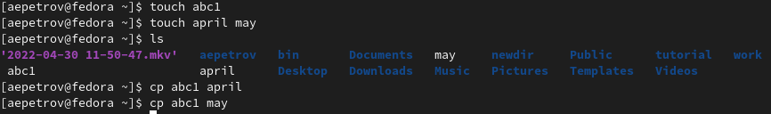{#fig:001 width=70%}
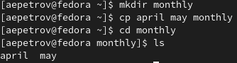{#fig:002 width=70%}
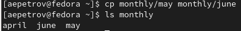{#fig:003 width=70%}
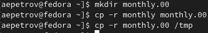{#fig:004 width=70%}

- Примеры пункта 5.2.3.(рис. [-@fig:005])
  
  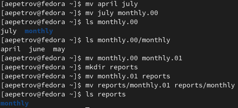{#fig:005 width=70%}

- Примеры пункта 5.2.5.(рис. [-@fig:006])
  
  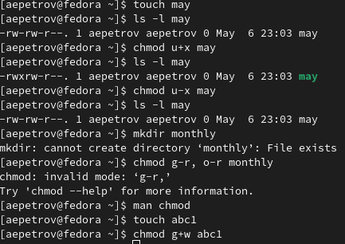{#fig:006 width=70%}

## Задание 2.

1. (рис. [-@fig:007])
   
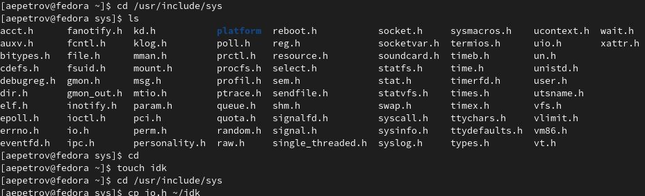{#fig:007 width=70%}

2. - 4 (рис. [-@fig:008])
   
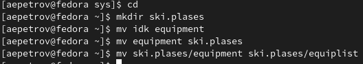{#fig:008 width=70%}

5. - 8 (рис. [-@fig:009])
   
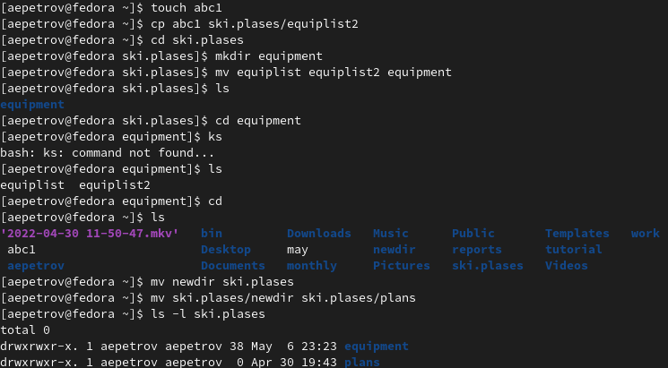{#fig:009 width=70%}

## Задание 3.

- Воспользуемся восьмиричными кодами и присвои права в соответствии с таблицей в теоретических сведениях(рис. [-@fig:010])

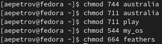{#fig:010 width=70%}

## Задание 4. 

1. 
   
   ```
   ls /etc/password
   ```

2. 

``` 
cp ~/feathers 
~/file.old
```

3. 
   ```
   1. cd
   2. mv file.old play
   ```

4. 
   ```
   cp play fun
   ```


5. 
  ```
  1. cd
  2. mv fun play 
  3. mv play games
  ```

6. 
   ```
  1. cd
  2. chmod u-r feathers 
   ```

7. см (рис. [-@fig:011])
   
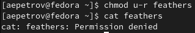{#fig:011 width=70%}

8. см (рис. [-@fig:012])
   
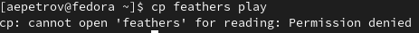{#fig:012 width=70%}

9. 
  ```
  1. cd
  2. chmod u+r feathers 
  ```

10. 
  ```
  1. cd
  2. chmod u-x play 
  ```

11. см (рис. [-@fig:013])
   
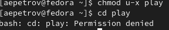{#fig:013 width=70%}

12. 
  ```
  1. cd
  2. chmod u-x play 
  ```

## Задание 5. 

- mount - команда добавляет файловую систему(HD, SSD, IDE) в дерево файловой системы Unix
- fsck - команда используется для восстановления одной или нескольких файловых систем
- msck - команда позволяет выполнить фрагментацию жесткого диска или создать очередную файловую систему
- kill - полность останавливает какой-либо процесс

# Ответы на контрольные вопросы 

1. см (рис. [-@fig:014])
   
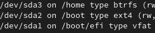{#fig:014 width=70%}

- На моем ПК установлен один ЖД формата ext4(Fedora). 

2. Общая структура файловой системы представляет собой дерево, корнем которого является корневой каталог. В UNIX-подобных- /

см (рис. [-@fig:015])
   
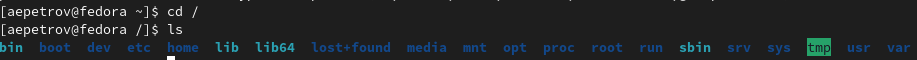{#fig:015 width=70%}

В корневом каталоге присутствуют директории:

- /bin - (binaries) бинарные файлы пользователя

Этот каталог содержит исполняемые файлы. Здесь расположены программы, которые можно использовать в однопользовательском режиме или режиме восстановления. Одним словом, те утилиты, которые могут использоваться пока еще не подключен каталог /usr/. Это такие общие команды, как cat, ls, tail, ps и т д.

- /sbin - (system binaries) системные исполняемые файлы

Так же как и /bin, содержит двоичные исполняемые файлы, которые доступны на ранних этапах загрузки, когда не примонтирован каталог /usr. Но здесь находятся программы, которые можно выполнять только с правами суперпользователя. Это разные утилиты для обслуживания системы. Например, iptables, reboot, fdisk, ifconfig,swapon и т д.

- etc - (etcetera) конфигурационные файлы

В этой папке содержатся конфигурационные файлы всех программ, установленных в системе. Кроме конфигурационных файлов, в системе инициализации Init Scripts, здесь находятся скрипты запуска и завершения системных демонов, монтирования файловых систем и автозагрузки программ. Структура каталогов linux в этой папке может быть немного запутанной, но предназначение всех их - настройка и конфигурация.

- /dev - (devices) файлы устройств

В Linux все, в том числе внешние устройства являются файлами. Таким образом, все подключенные флешки, клавиатуры, микрофоны, камеры - это просто файлы в каталоге /dev/. Этот каталог содержит не совсем обычную файловую систему. Структура файловой системы Linux и содержащиеся в папке /dev файлы инициализируются при загрузке системы, сервисом udev. Выполняется сканирование всех подключенных устройств и создание для них специальных файлов. Это такие устройства, как: /dev/sda, /dev/sr0, /dev/tty1, /dev/usbmon0 и т д.

- tmp (temp) - Временные файлы

В этом каталоге содержатся временные файлы, созданные системой, любыми программами или пользователями. Все пользователи имеют право записи в эту директорию.

Файлы удаляются при каждой перезагрузке. Аналогом Windows является папка Windows\Temp, здесь тоже хранятся все временные файлы.

- /usr - (user applications) Программы пользователя

Это самый большой каталог с большим количеством функций. Тут наиболее большая структура каталогов Linux. Здесь находятся исполняемые файлы, исходники программ, различные ресурсы приложений, картинки, музыку и документацию.

- mnt (mount) - Монтирование

В этот каталог системные администраторы могут монтировать внешние или дополнительные файловые системы.

- /sys (system) - Информация о системе

Назначение каталогов Linux из этой папки - получение информации о системе непосредственно от ядра. Это еще одна файловая система организуемая ядром и позволяющая просматривать и изменить многие параметры работы системы, например, работу swap, контролировать вентиляторы и многое другое.

3. 
  ```
  mount [файл_устройства] [папка_назначения]
  ```

4. . 
- Один блок адресуется несколькими mode (принадлежит нескольким файлам).

- Блок помечен как свободный, но в то же время занят (на него ссылается onode).

- Блок помечен как занятый, но в то же время свободен (ни один inode на него не ссылается).

- Неправильное число ссылок в inode (недостаток или избыток ссылающихся записей в каталогах).

- Несовпадение между размером файла и суммарным размером адресуемых inode блоков.

- Недопустимые адресуемые блоки (например, расположенные за пределами файловой системы).

- "Потерянные" файлы (правильные inode, на которые не ссылаются записи каталогов).

- Недопустимые или неразмещенные номера inode в записях каталогов.
  
Повреждения устраняются с помощью команды fsck 

5. C помощью команды mkfs
6. 
- Для просмотра файлов небольшого размера можно использовать     команду cat.
Формат команды:

``` 
cat имя-файла
``` 

- Для просмотра файлов постранично удобнее использовать командуless.
Формат команды:

``` 
less имя-файла
``` 

- Команда head выводит по умолчанию первые 10 строк файла.
Формат команды:

``` 
head [-n] имя-файла,
``` 

где n — количество выводимых строк.


- Команда tail выводит умолчанию 10 последних строк файла.
Формат команды:

``` 
tail [-n] имя-файла,
``` 

где n — количество выводимых строк.

7. Kоманда cp используется для копирования файлов и каталогов.
Формат команды:

``` 
cp [-опции] исходный_файл целевой_файл
``` 

Опции:

-i Запрос на подтверждение
-r Копировать каталоги рекурсивно
-f Если требуется, удаляет существующие файлы, в которые происходит копирование.

8. Команды mv и mvdir предназначены для перемещения и переименования файлов
и каталогов.
Формат команды mv:

```
mv [-опции] старый_файл новый_файл
```

9. Каждый файл или каталог имеет права доступа (табл. 5.1).
В сведениях о файле или каталоге указываются:
– тип файла (символ (-) обозначает файл, а символ (d) — каталог);
– права для владельца файла (r — разрешено чтение, w — разрешена запись, x — разрешено выполнение, - — право доступа отсутствует);
– права для членов группы (r — разрешено чтение, w — разрешена запись, x — разрешено
выполнение, - — право доступа отсутствует);
– права для всех остальных (r — разрешено чтение, w — разрешена запись, x — разрешено выполнение, - — право доступа отсутствует).

- Права доступа к файлу или каталогу можно изменить, воспользовавшись командой
chmod. Сделать это может владелец файла (или каталога) или пользователь с правами
администратора.
Формат команды:

```
chmod режим имя_файла
```

Режим (в формате команды) имеет следующие компоненты структуры и способ запи-
си:
'=' установить право
'-' лишить права
'+' дать право
'r' чтение
'w' запись
'x' выполнение
'u' (user) владелец файла
'g' (group) группа, к которой принадлежит владелец файла
'o' (others) все остальные
Двоичная  Восьмиричная    Символьная
111       7               rwx
110       6               rw-
101       5               r-x
100       4               r--
011       3               -wx
010       2               -w-
001       1               --x
000       0               ---


# Выводы

- С помощью данной лабораторной работы мы научились пользоваться файловой системой Linux(UNIX), узнали много полезных команд для базового ориентирования в файловой системе. Научились восстанавливать диски, создавать разделы, приостанавливать процессы в системе.
