---
## Front matter
lang: ru-RU
title: Lab06. Поиск файлов. Перенаправление ввода-вывода. Просмотр запущенных процессов
author: Petrov Artyem

## Formatting
toc: false
slide_level: 2
theme: metropolis
header-includes: 
 - \metroset{progressbar=frametitle,sectionpage=progressbar,numbering=fraction}
 - '\makeatletter'
 - '\beamer@ignorenonframefalse'
 - '\makeatother'
aspectratio: 43
section-titles: true
---

# Цель работы

Ознакомление с инструментами поиска файлов и фильтрации текстовых данных.
Приобретение практических навыков: по управлению процессами (и заданиями), по
проверке использования диска и обслуживанию файловых систем.

# Задание

1. Осуществите вход в систему, используя соответствующее имя пользователя.
2. Запишите в файл file.txt названия файлов, содержащихся в каталоге /etc. Допи-
шите в этот же файл названия файлов, содержащихся в вашем домашнем каталоге.
3. Выведите имена всех файлов из file.txt, имеющих расширение .conf, после чего
запишите их в новый текстовой файл conf.txt.
4. Определите, какие файлы в вашем домашнем каталоге имеют имена, начинавшиеся
с символа c? Предложите несколько вариантов, как это сделать.
5. Выведите на экран (по странично) имена файлов из каталога /etc, начинающиеся
с символа h.
6. Запустите в фоновом режиме процесс, который будет записывать в файл ~/logfile
файлы, имена которых начинаются с log.
7. Удалите файл ~/logfile.
8. Запустите из консоли в фоновом режиме редактор gedit.
9. Определите идентификатор процесса gedit, используя команду ps, конвейер и фильтр
grep. Как ещё можно определить идентификатор процесса?
10. Прочтите справку (man) команды kill, после чего используйте её для завершения
процесса gedit.
11. Выполните команды df и du, предварительно получив более подробную информацию
об этих командах, с помощью команды man.
12. Воспользовавшись справкой команды find, выведите имена всех директорий, имею-
щихся в вашем домашнем каталоге.


# Выполнение лабораторной работы

## Задание 1

- При запуске системы войдем в учетную запись aepetrov
  
## Задание 2. 
- (рис. [-@fig:001])
  Воспользуемся функциями команды stdout > и >>

```  
1. cd
2. ls /etc > file.txt
3. ls >> file.txt
```

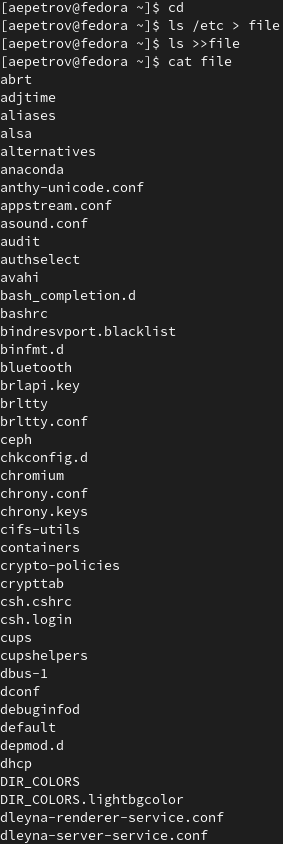{#fig:001 width=70%}

## Задание 3

- Воспользуемся след. командами(рис. [-@fig:002]):

```
1. cd
2. cat file.txt | grep .conf > conf.txt
3. cat conf.txt
```

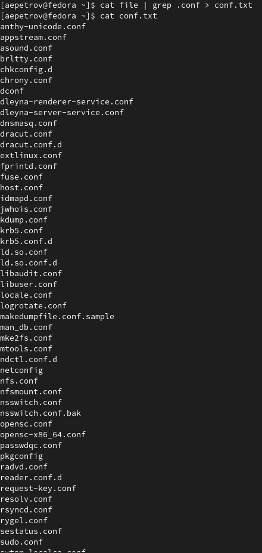{#fig:002 width=70%}

## Задание 4

- Для того, чтобы определить, какие файлы в домашнем каталоге начинаются с символа 'c', можно воспользоваться двумя самыми тривиальными способами:

1. (рис. [-@fig:003])

```
1. cd
2. find ~/ -name "c*" -print
```

Данный способ выведет нам все файлы, включая файлы директорий, которым ~/ приходится родительской, что не совсем удобно.

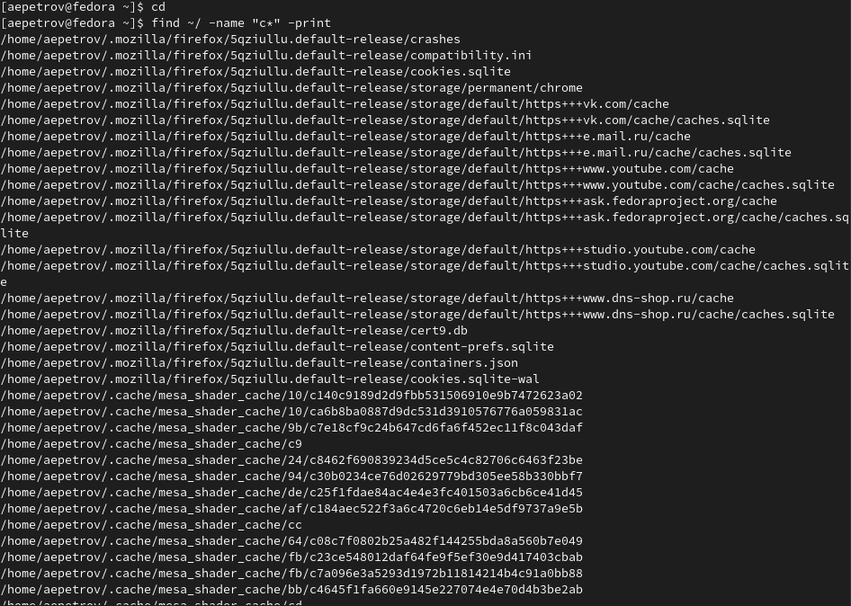{#fig:003 width=70%}

2. (рис. [-@fig:004])

```
1. cd
2. ls | grep c*
```

Второй способ куда более подоходит по формулировке задания.

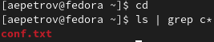{#fig:004 width=70%}

## Задание 5

- Воспользуемся командой из прошлой лабораторной работы:

```
cd 
ls /etc > newfile | less newfile
```

(рис. [-@fig:005], (рис. [-@fig:006]))
  
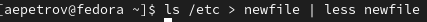{#fig:005 width=70%}

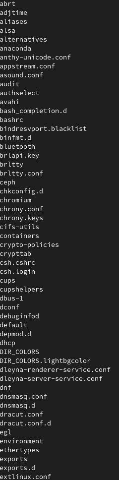{#fig:006 width=70%}

## Задание 6

- Воспользуемся командой find и  &, чтобы запустить задачу в фоновом режиме(рис. [-@fig:007]):

```
1. cd
2. sudo find / -name "log*" -print > logfile & 
```

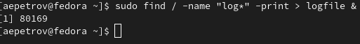{#fig:007 width=70%}

## Задание 7

- Удалим файл logfile(рис. [-@fig:008]):

```
1. cd
2. rm -r logfile
```
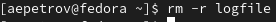{#fig:008 width=70%}

 
## Задание 8

- Запустим gedit в фоновом режиме след. образом (рис. [-@fig:009]):
   
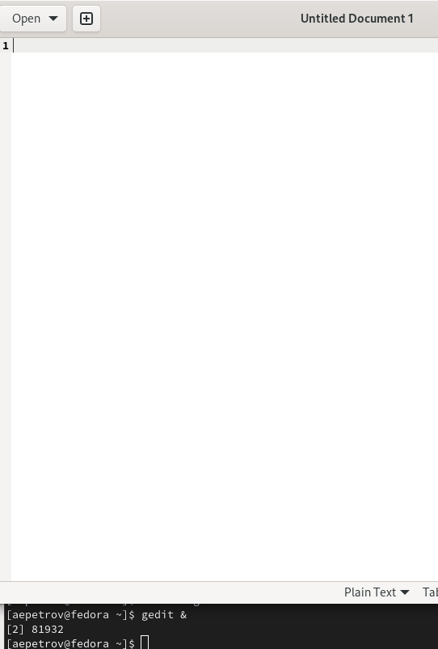{#fig:009 width=70%}

## Задание 9

- Выполним задание следующим образом(рис. [-@fig:010]):

```
ps aux | grep gedit
```

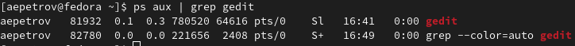{#fig:010 width=70%}

## Задание 10

- Прочитаем справку с помощью man(рис. [-@fig:011]):
  
```
man kill
```
    
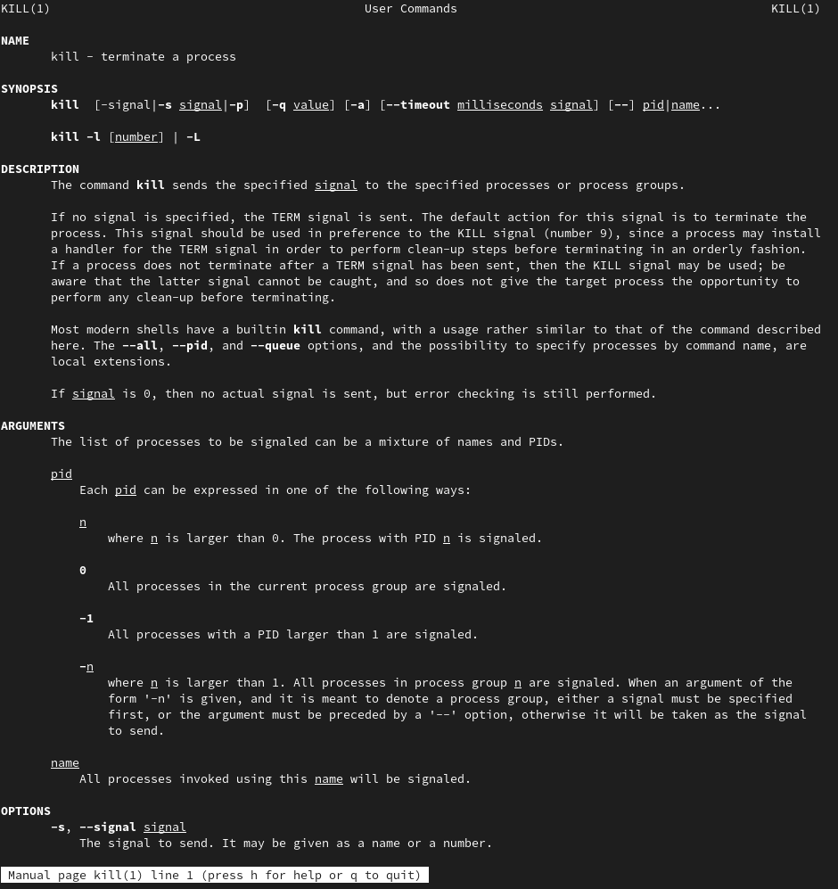{#fig:011 width=70%}

- Теперь закроем процесс gedit, его номер 83988  (рис. [-@fig:012]):

```
kill 83988 
```

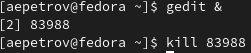{#fig:012 width=70%}

## Задание 11

- Справка по командам df и du(рис. [-@fig:013] - [-@fig:014])
   
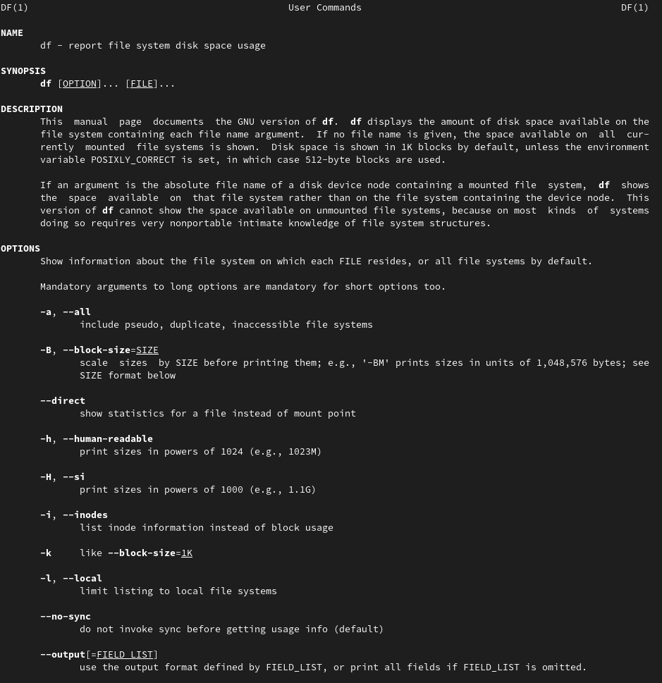{#fig:013 width=70%}
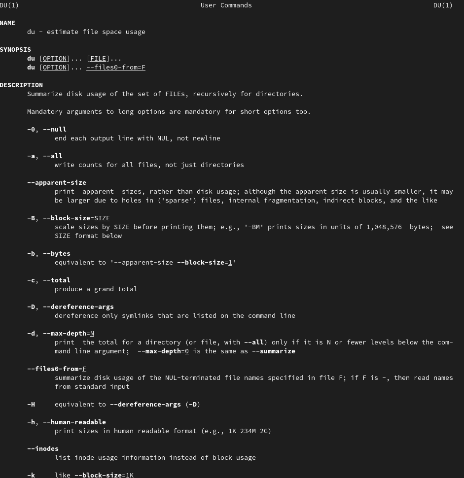{#fig:014 width=70%}

- Запуск du(рис. [-@fig:015])

```
du
```

Программа показывает, сколько килобайт информации занимает каждый файл
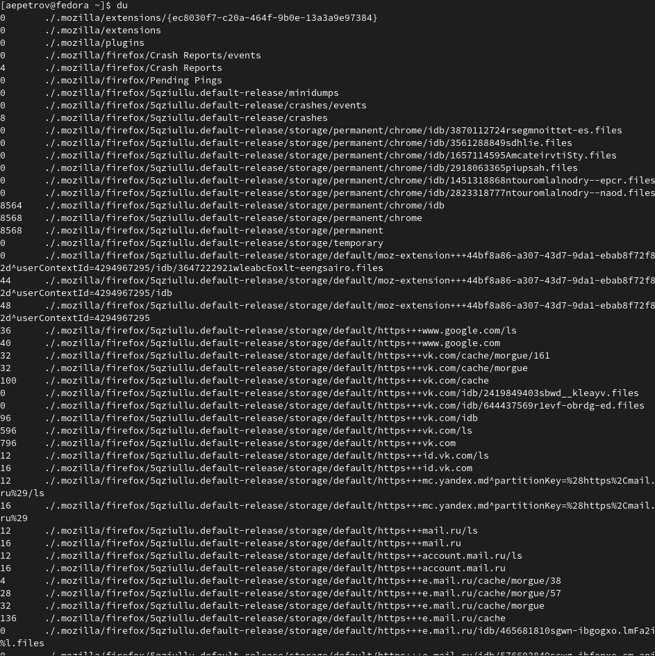{#fig:015 width=70%}

- Запуск df(рис. [-@fig:016])

```
df
```

Программа показывает, сколько килобайт информации занимает каждый раздел диска(ов).
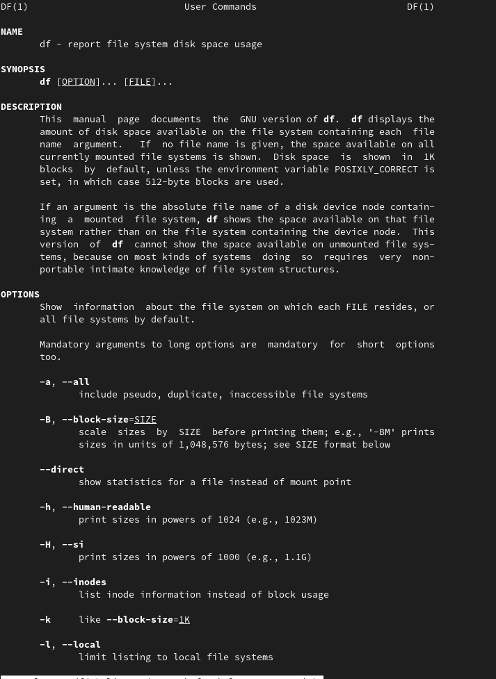{#fig:016 width=70%}

## Задание 12

- Справка по команде find (рис. [-@fig:017])

```
man find
```

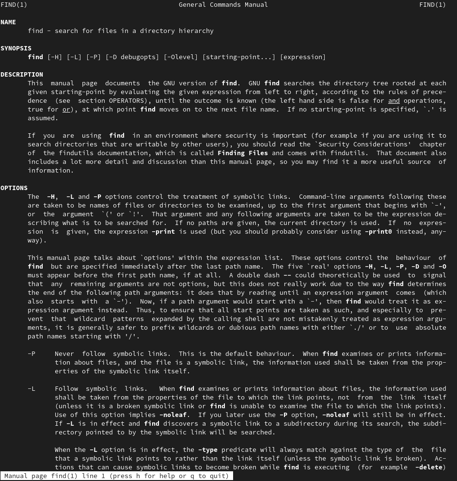{#fig:017 width=70%}

- Вывод только имен файлов в домашнем каталоге будет производится следующим образом(рис. [-@fig:018]):

```
find ~ -maxdepth 1
```

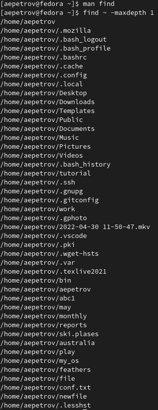{#fig:017 width=70%}

# Выводы

Сегодня на лабораторной работы мы научились пользоваться средствами потокового вывода, ввода. Кроме того, научились вычленять нужную нам информацию и управлять процессами в нашей системе.