---
## Front matter
title: "Лабораторная работа н.6"
subtitle: "Поиск файлов. Перенаправление ввода-вывода. Просмотр запущенных процессов"
author: "Петров Артем Евгеньевич"

## Generic otions
lang: ru-RU
toc-title: "Содержание"

## Bibliography
bibliography: bib/cite.bib
csl: pandoc/csl/gost-r-7-0-5-2008-numeric.csl

## Pdf output format
toc: true # Table of contents
toc-depth: 2
lof: true # List of figures
lot: true # List of tables
fontsize: 12pt
linestretch: 1.5
papersize: a4
documentclass: scrreprt
## I18n polyglossia
polyglossia-lang:
  name: russian
  options:
	- spelling=modern
	- babelshorthands=true
polyglossia-otherlangs:
  name: english
## I18n babel
babel-lang: russian
babel-otherlangs: english
## Fonts
mainfont: PT Serif
romanfont: PT Serif
sansfont: PT Sans
monofont: PT Mono
mainfontoptions: Ligatures=TeX
romanfontoptions: Ligatures=TeX
sansfontoptions: Ligatures=TeX,Scale=MatchLowercase
monofontoptions: Scale=MatchLowercase,Scale=0.9
## Biblatex
biblatex: true
biblio-style: "gost-numeric"
biblatexoptions:
  - parentracker=true
  - backend=biber
  - hyperref=auto
  - language=auto
  - autolang=other*
  - citestyle=gost-numeric
## Pandoc-crossref LaTeX customization
figureTitle: "Рис."
tableTitle: "Таблица"
listingTitle: "Листинг"
lofTitle: "Список иллюстраций"
lotTitle: "Список таблиц"
lolTitle: "Листинги"
## Misc options
indent: true
header-includes:
  - \usepackage{indentfirst}
  - \usepackage{float} # keep figures where there are in the text
  - \floatplacement{figure}{H} # keep figures where there are in the text
---


# Цель работы

Ознакомление с инструментами поиска файлов и фильтрации текстовых данных.
Приобретение практических навыков: по управлению процессами (и заданиями), по
проверке использования диска и обслуживанию файловых систем.

# Задание

1. Осуществите вход в систему, используя соответствующее имя пользователя.
2. Запишите в файл file.txt названия файлов, содержащихся в каталоге /etc. Допи-
шите в этот же файл названия файлов, содержащихся в вашем домашнем каталоге.
3. Выведите имена всех файлов из file.txt, имеющих расширение .conf, после чего
запишите их в новый текстовой файл conf.txt.
4. Определите, какие файлы в вашем домашнем каталоге имеют имена, начинавшиеся
с символа c? Предложите несколько вариантов, как это сделать.
5. Выведите на экран (по странично) имена файлов из каталога /etc, начинающиеся
с символа h.
6. Запустите в фоновом режиме процесс, который будет записывать в файл ~/logfile
файлы, имена которых начинаются с log.
7. Удалите файл ~/logfile.
8. Запустите из консоли в фоновом режиме редактор gedit.
9. Определите идентификатор процесса gedit, используя команду ps, конвейер и фильтр
grep. Как ещё можно определить идентификатор процесса?
10. Прочтите справку (man) команды kill, после чего используйте её для завершения
процесса gedit.
11. Выполните команды df и du, предварительно получив более подробную информацию
об этих командах, с помощью команды man.
12. Воспользовавшись справкой команды find, выведите имена всех директорий, имею-
щихся в вашем домашнем каталоге.

# Теоретическое введение

- В системе по умолчанию открыто три специальных потока:
– stdin — стандартный поток ввода (по умолчанию: клавиатура), файловый дескриптор
0;
– stdout — стандартный поток вывода (по умолчанию: консоль), файловый дескриптор
1;
– stderr — стандартный поток вывод сообщений об ошибках (по умолчанию: консоль),
файловый дескриптор 2.
Большинство используемых в консоли команд и программ записывают результаты
своей работы в стандартный поток вывода stdout. Например, команда ls выводит в стан-
дартный поток вывода (консоль) список файлов в текущей директории. Потоки вывода
и ввода можно перенаправлять на другие файлы или устройства. Проще всего это делается
с помощью символов >, >>, <, <<.

- Конвейер (pipe) служит для объединения простых команд или утилит в цепочки, в ко-
торых результат работы предыдущей команды передаётся последующей.

онвейеры можно группировать в цепочки и выводить с помощью перенаправления
в файл, например:

```
ls -la |sort > sortilg_list
```

Вывод команды ls -la передаётся команде сортировки sort\verb, которая пишет ре-
зультат в файл sorting_list\verb.
Чаще всего скрипты на Bash используются в качестве автоматизации каких-то рутин-
ных операций в консоли, отсюда иногда возникает необходимость в обработке stdout
одной команды и передача на stdin другой команде, при этом результат выполнения
команды должен обработан.

- Команда find используется для поиска и отображения на экран имён файлов, соответ-
ствующих заданной строке символов.
Формат команды:

```
find путь [-опции]
```

Путь определяет каталог, начиная с которого по всем подкаталогам будет вестись
поиск.

- Найти в текстовом файле указанную строку символов позволяет команда grep.
Формат команды:

```
grep строка имя_файла
```

Кроме того, команда grep способна обрабатывать стандартный вывод других команд
(любой текст). Для этого следует использовать конвейер, связав вывод команды с вводом
grep.

- Команда df показывает размер каждого смонтированного раздела диска.
Формат команды:

```
df [-опции] [файловая_система]
```

- Любую выполняющуюся в консоли команду или внешнюю программу можно запустить
в фоновом режиме. Для этого следует в конце имени команды указать знак амперсанда &. Например:

```
gedit &
```

Будет запущен текстовой редактор gedit в фоновом режиме. Консоль при этом не будет
заблокирована.
Запущенные фоном программы называются задачами (jobs). Ими можно управлять
с помощью команды jobs, которая выводит список запущенных в данный момент задач.
Для завершения задачи необходимо выполнить команду

```
kill %номер задачи
```

- Любой команде, выполняемой в системе, присваивается идентификатор процесса
(process ID). Получить информацию о процессе и управлять им, пользуясь идентифи-
катором процесса, можно из любого окна командного интерпретатора.

- Команда ps используется для получения информации о процессах.
Формат команды:

```
ps [-опции]
```

Для получения информации о процессах, управляемых вами и запущенных (работающих или остановленных) на вашем терминале, используйте опцию aux.

# Выполнение лабораторной работы

## Задание 1

- При запуске системы войдем в учетную запись aepetrov
  
## Задание 2. 
- (рис. [-@fig:001])
  Воспользуемся функциями команды stdout > и >>

```  
1. cd
2. ls /etc > file.txt
3. ls >> file.txt
```

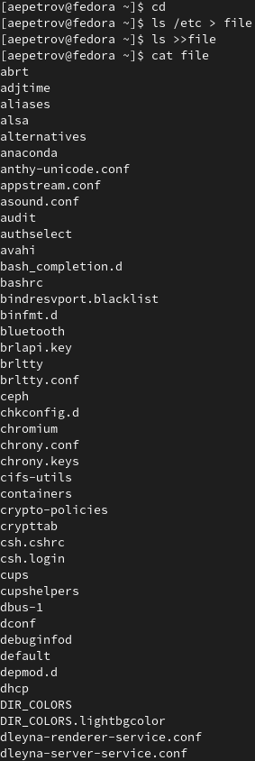{#fig:001 width=70%}

## Задание 3

- Воспользуемся след. командами(рис. [-@fig:002]):

```
1. cd
2. cat file.txt | grep .conf > conf.txt
3. cat conf.txt
```

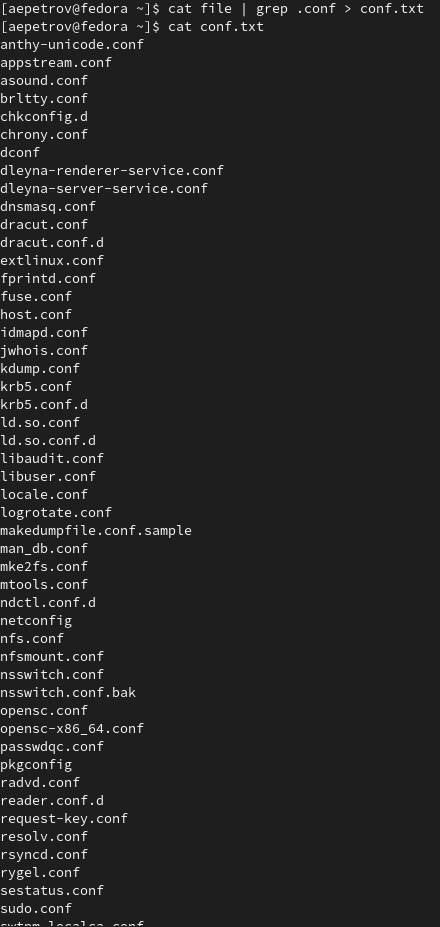{#fig:002 width=70%}

## Задание 4

- Для того, чтобы определить, какие файлы в домашнем каталоге начинаются с символа 'c', можно воспользоваться двумя самыми тривиальными способами:

1. (рис. [-@fig:003])

```
1. cd
2. find ~/ -name "c*" -print
```

Данный способ выведет нам все файлы, включая файлы директорий, которым ~/ приходится родительской, что не совсем удобно.

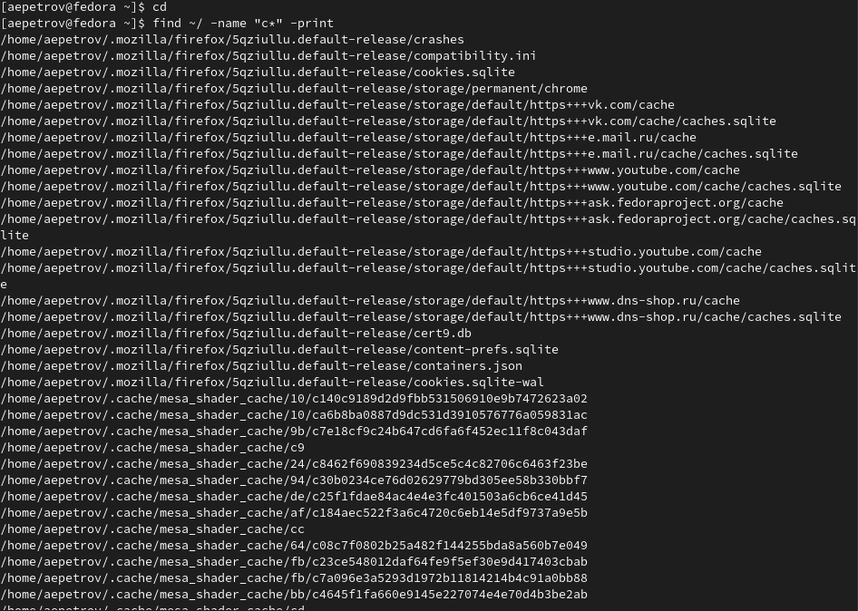{#fig:003 width=70%}

2. (рис. [-@fig:004])

```
1. cd
2. ls | grep c*
```

Второй способ куда более подоходит по формулировке задания.

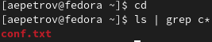{#fig:004 width=70%}

## Задание 5

- Воспользуемся командой из прошлой лабораторной работы:

```
cd 
ls /etc > newfile | less newfile
```

(рис. [-@fig:005], (рис. [-@fig:006]))
  
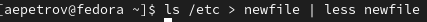{#fig:005 width=70%}

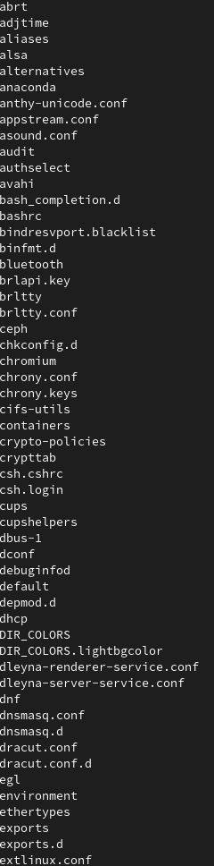{#fig:006 width=70%}

## Задание 6

- Воспользуемся командой find и  &, чтобы запустить задачу в фоновом режиме(рис. [-@fig:007]):

```
1. cd
2. sudo find / -name "log*" -print > logfile & 
```

{#fig:007 width=70%}

## Задание 7

- Удалим файл logfile(рис. [-@fig:008]):

```
1. cd
2. rm -r logfile
```
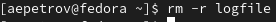{#fig:008 width=70%}

 
## Задание 8

- Запустим gedit в фоновом режиме след. образом (рис. [-@fig:009]):
   
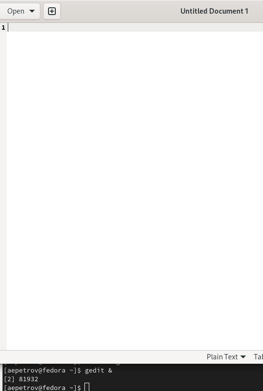{#fig:009 width=70%}

## Задание 9

- Выполним задание следующим образом(рис. [-@fig:010]):

```
ps aux | grep gedit
```

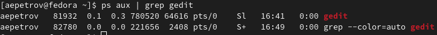{#fig:010 width=70%}

## Задание 10

- Прочитаем справку с помощью man(рис. [-@fig:011]):
  
```
man kill
```
    
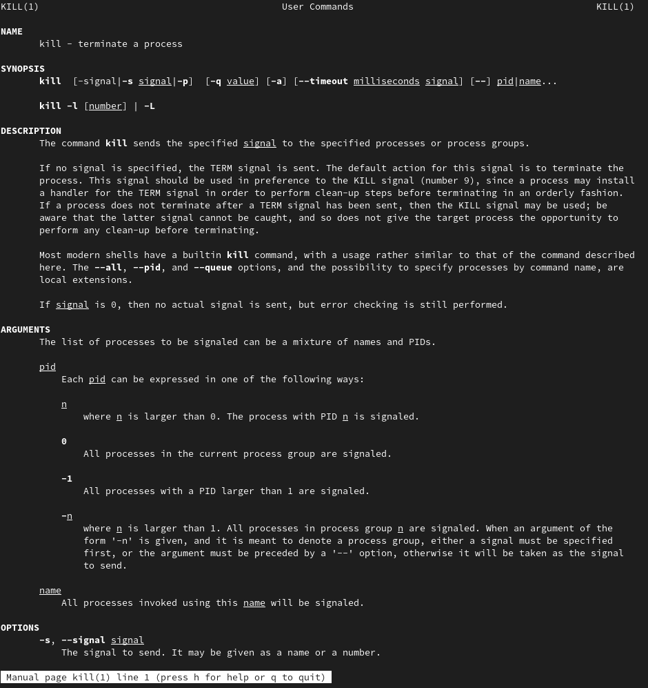{#fig:011 width=70%}

- Теперь закроем процесс gedit, его номер 83988  (рис. [-@fig:012]):

```
kill 83988 
```

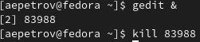{#fig:012 width=70%}

## Задание 11

- Справка по командам df и du(рис. [-@fig:013] - [-@fig:014])
   
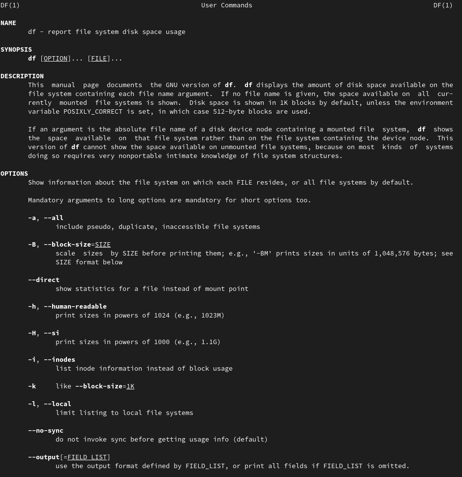{#fig:013 width=70%}
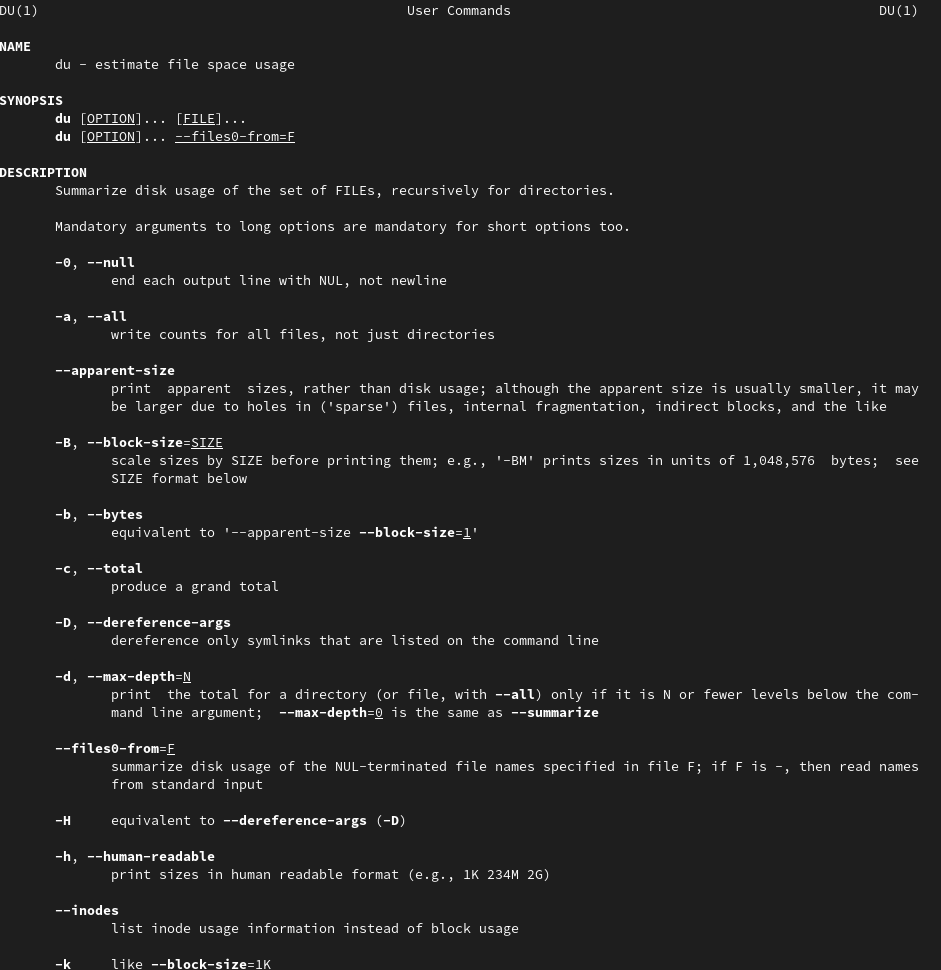{#fig:014 width=70%}

- Запуск du(рис. [-@fig:015])

```
du
```

Программа показывает, сколько килобайт информации занимает каждый файл
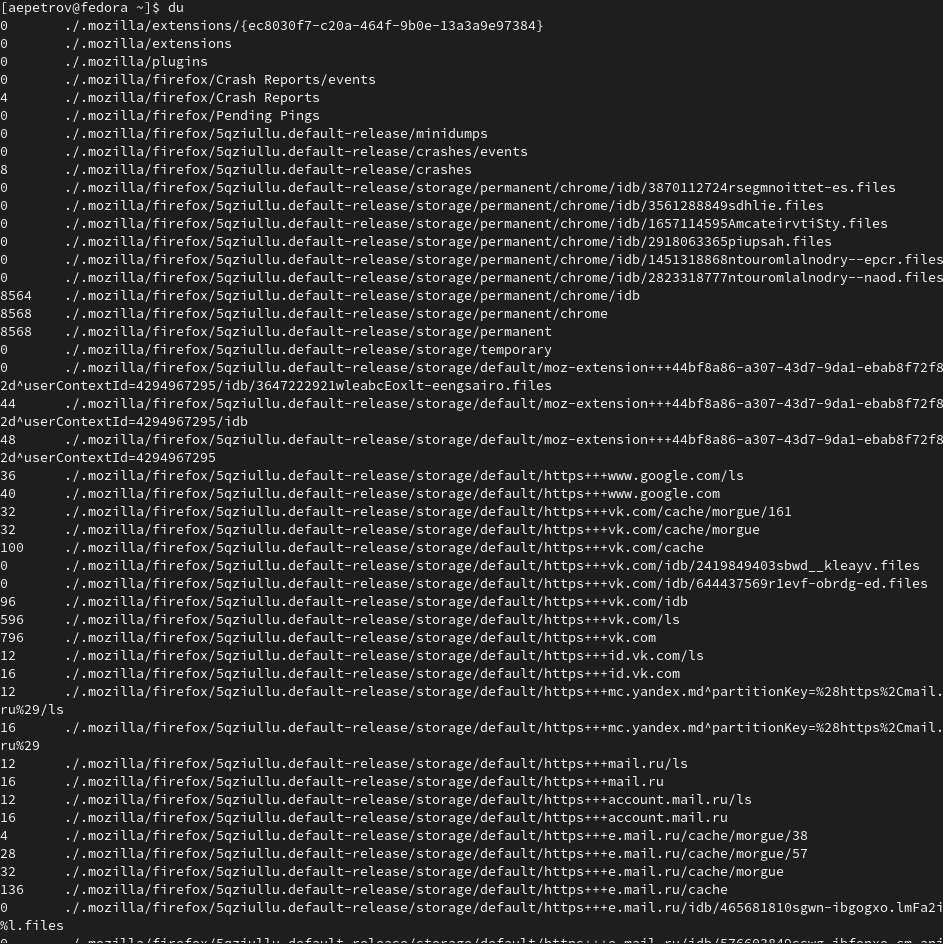{#fig:015 width=70%}

- Запуск df(рис. [-@fig:016])

```
df
```

Программа показывает, сколько килобайт информации занимает каждый раздел диска(ов).
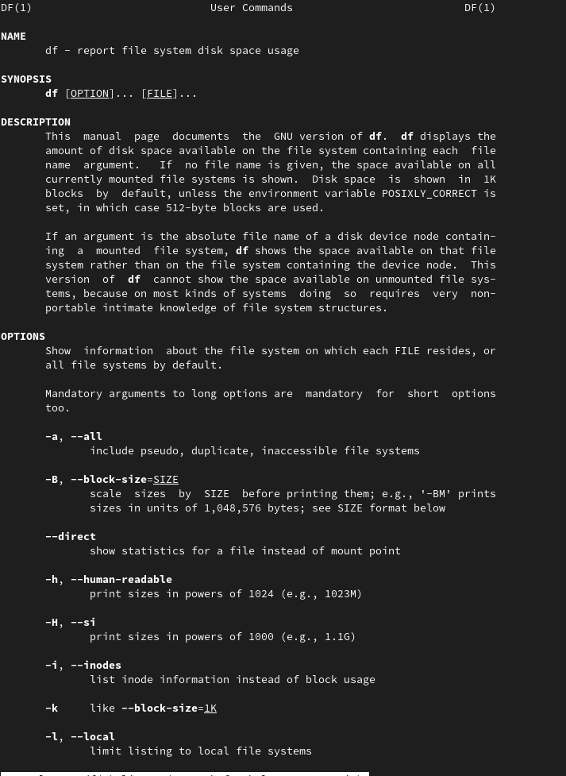{#fig:016 width=70%}

## Задание 12

- Справка по команде find (рис. [-@fig:017])

```
man find
```

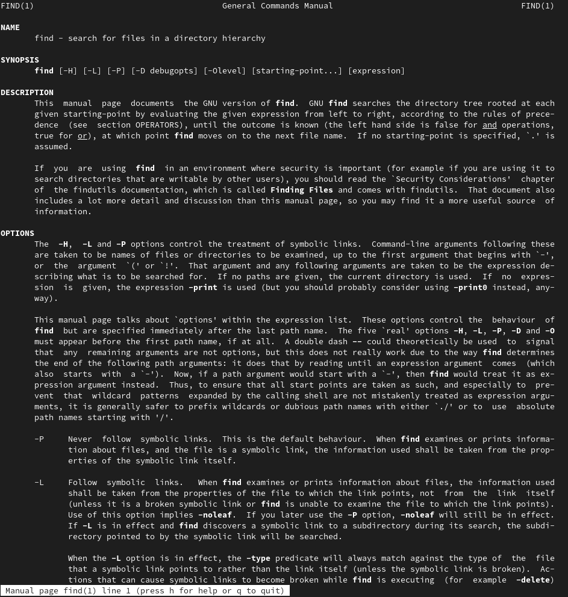{#fig:017 width=70%}

- Вывод только имен файлов в домашнем каталоге будет производится следующим образом(рис. [-@fig:018]):

```
find ~ -maxdepth 1
```

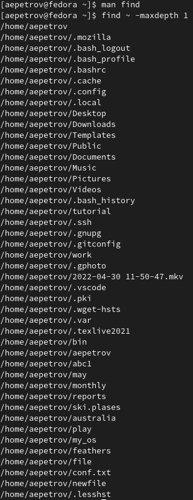{#fig:017 width=70%}

# Ответы на контрольные вопросы

1. stdout, stdin, stderr
2. Операция > создает новый файл или перезаписывает старый, а >> дополняет старый
3. Конвейер - специализированный процесс Linux, который позволяет командам идти одна за другой
4. Процесс - это непосредственно выполнение команд, а программа-это набор инструкций и указаний
5. GID и UID - идентификаторы группы и пользователя. Каждый индентификатор определяет права пользователя и/или группы.
6. Задачи(jobs) - это фоновые процессы, которые происходят без нашего надзора и, зачастую, указания. Команды jobs, kill и указание к запуску в фоновом режиме(&) позволяют нам ими управлять.
7. Команда top отображает запущенные процессы и их потребеление разл. ресурсов
8. find [directory] [option] - ищет программы по указаной инстуркции(благодаря разл. опциям). К примеру, find ~ -name "c*" -maxdepth 1 -print выведет все директории и файлы в домашнем каталоге
9. Да, благодаря команде grep. Особенно хорошо это помогает при конвейрном использовании команды. grep -option [имя]. К примеру, ls ~ | grep *.cpp выведет все программы в домашнем каталоге, которые оканчиваются на .сpp.
10. С помощью команды df
11. С помощью команды du ~ -s
12. C помощью команды kill, если он не фоновый. Или jobs | grep [имя программы/процесса], вам выдаст номер. После: kill [номер, под которым выполняется процесс]
# Выводы

Сегодня на лабораторной работы мы научились пользоваться средствами потокового вывода, ввода. Кроме того, научились вычленять нужную нам информацию и управлять процессами в нашей системе.


