---
## Front matter
title: "Отчет по выполнению лабораторной работы н.7"
subtitle: "Командная оболочка Midnight Commander"
author: "Петров Артем Евгеньевич"

## Generic otions
lang: ru-RU
toc-title: "Содержание"

## Bibliography
bibliography: bib/cite.bib
csl: pandoc/csl/gost-r-7-0-5-2008-numeric.csl

## Pdf output format
toc: true # Table of contents
toc-depth: 2
lof: true # List of figures
lot: true # List of tables
fontsize: 12pt
linestretch: 1.5
papersize: a4
documentclass: scrreprt
## I18n polyglossia
polyglossia-lang:
  name: russian
  options:
	- spelling=modern
	- babelshorthands=true
polyglossia-otherlangs:
  name: english
## I18n babel
babel-lang: russian
babel-otherlangs: english
## Fonts
mainfont: PT Serif
romanfont: PT Serif
sansfont: PT Sans
monofont: PT Mono
mainfontoptions: Ligatures=TeX
romanfontoptions: Ligatures=TeX
sansfontoptions: Ligatures=TeX,Scale=MatchLowercase
monofontoptions: Scale=MatchLowercase,Scale=0.9
## Biblatex
biblatex: true
biblio-style: "gost-numeric"
biblatexoptions:
  - parentracker=true
  - backend=biber
  - hyperref=auto
  - language=auto
  - autolang=other*
  - citestyle=gost-numeric
## Pandoc-crossref LaTeX customization
figureTitle: "Рис."
tableTitle: "Таблица"
listingTitle: "Листинг"
lofTitle: "Список иллюстраций"
lotTitle: "Список таблиц"
lolTitle: "Листинги"
## Misc options
indent: true
header-includes:
  - \usepackage{indentfirst}
  - \usepackage{float} # keep figures where there are in the text
  - \floatplacement{figure}{H} # keep figures where there are in the text
---

# Цель работы

Освоение основных возможностей командной оболочки Midnight Commander. Приобретение навыков практической работы по просмотру каталогов и файлов; манипуляций
с ними.

# Задание

Здесь приводится описание задания в соответствии с рекомендациями
методического пособия и выданным вариантом.

# Теоретическое введение

Функциональные клавиши mc
F1 Вызов контекстно-зависимой подсказки
F2 Вызов пользовательского меню с возможностью создания и/или допол-
нения дополнительных функций
F3 Просмотр содержимого файла, на который указывает подсветка в ак-
тивной панели (без возможности редактирования)
F4 Вызов встроенного в mc редактора для изменения содержания файла,
на который указывает подсветка в активной панели
F5 Копирование одного или нескольких файлов, отмеченных в первой
(активной) панели, в каталог, отображаемый на второй панели
F6 Перенос одного или нескольких файлов, отмеченных в первой (актив-
ной) панели, в каталог, отображаемый на второй панели
F7 Создание подкаталога в каталоге, отображаемом в активной панели
F8 Удаление одного или нескольких файлов (каталогов), отмеченных в первой (активной) панели файлов
F9 Вызов меню mc
F10 Выход из mc

# Выполнение лабораторной работы

## Задание по MC
(рис. [-@fig:001])

{ #fig:001 width=70% } 

1. Вызовем команду man (рис. [-@fig:001])

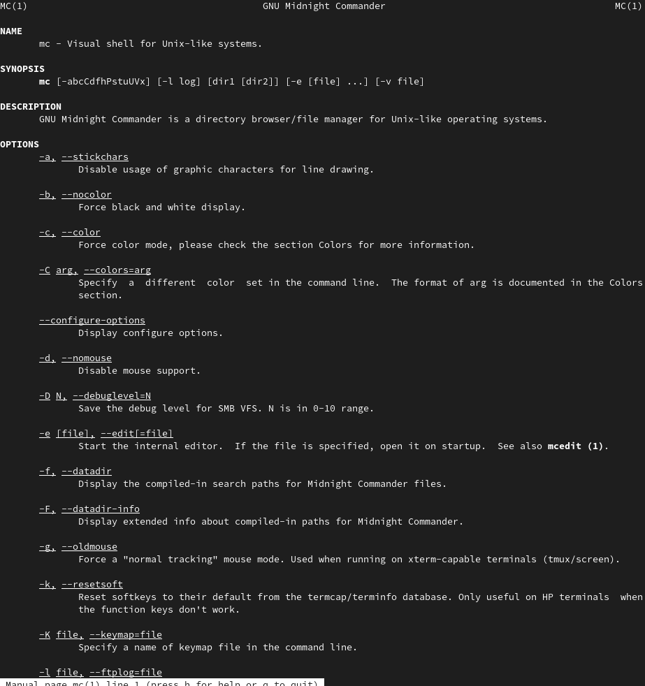{ #fig:001 width=70% } 
   
```
man mc 
```

2. Изучим его структуру и меню.
   
Подробнее:

Функциональные клавиши mc
F1 Вызов контекстно-зависимой подсказки
F2 Вызов пользовательского меню с возможностью создания и/или допол-
нения дополнительных функций
F3 Просмотр содержимого файла, на который указывает подсветка в ак-
тивной панели (без возможности редактирования)
F4 Вызов встроенного в mc редактора для изменения содержания файла,
на который указывает подсветка в активной панели
F5 Копирование одного или нескольких файлов, отмеченных в первой
(активной) панели, в каталог, отображаемый на второй панели
F6 Перенос одного или нескольких файлов, отмеченных в первой (актив-
ной) панели, в каталог, отображаемый на второй панели
F7 Создание подкаталога в каталоге, отображаемом в активной панели
F8 Удаление одного или нескольких файлов (каталогов), отмеченных в первой (активной) панели файлов
F9 Вызов меню mc
F10 Выход из mc

3. Выполним несколько операций:
   1. Выделение(f3-начало и когда закончим, то жмем тот же f3) 
   2. Копирование-перемещение.(рис. [-@fig:002] и [-@fig:003])

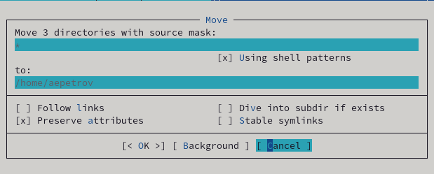{ #fig:002 width=70% }
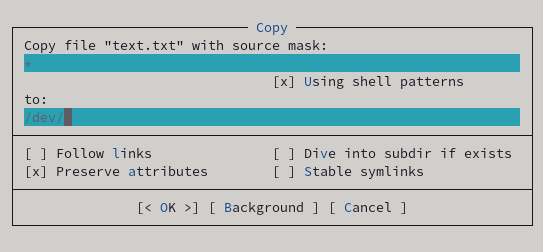{ #fig:003 width=70% } 
   3. Получение информации о размере и правах доступа(рис. [-@fig:004]:

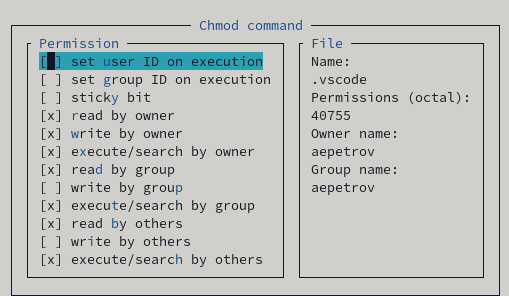{ #fig:004 width=70% }

Размер можно узнать, если выделить файл.
4. Выполним основные команды меню левой панели(рис. [-@fig:005]:

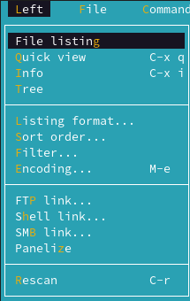{ #fig:005 width=70% }

- File listing-отобразить файловую систему в привычном нам виде.
- Quick view-просмотреть файл без возможности редактирования.
- Info-информация о выбранном файле
- Tree-отобразить файловую систему в виде дерева(рис. [-@fig:006]:

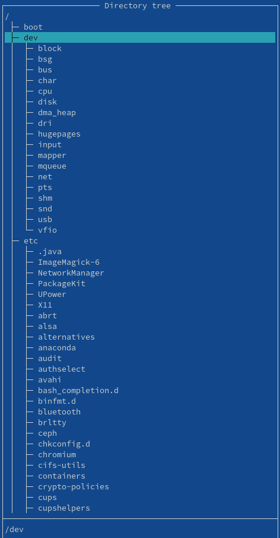{ #fig:006 width=70% }

5. Выполним основные команды меню File(рис. [-@fig:007]):
   
- View-просмотреть каталог.
- View file-просмотреть файл без возможности редактирования.
- Filtered view-просмотр по определнным параметрам.
- Edit-редактировать файл с помощью встроенного редактора.
- Copy-копировать и вставить в нужную директория или файл
- Link-установить жесткую ссылку.
- Symlink-установить символьную ссылку.
- Chown-изменить права доступа.
- Mkdir-создать каталог.
- Delete-удалить.
- Select group-выбрать несколько файлов
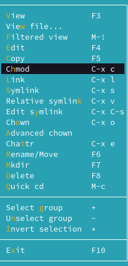{ #fig:007 width=70% }

6. С помощью соответствующих средств подменю Command осуществим(рис. [-@fig:008]):
   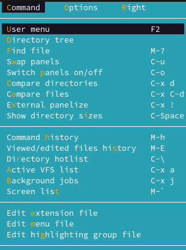{ #fig:008 width=70% }
   
   - поиск в файловой системе файла с заданными условиями(например,файла с расширением .c или .cpp, содержащего строку main)(рис. [-@fig:009] и [-@fig:010])
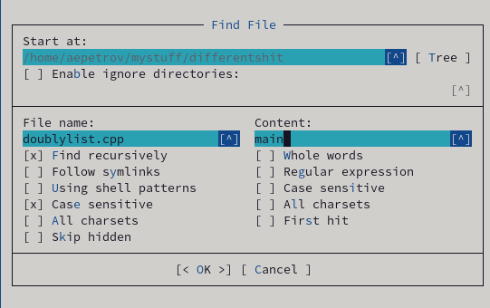{ #fig:009 width=70% }
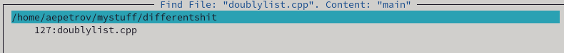{ #fig:010 width=70% }

   - С помощью SHIFT+F7 повторим любую команду.
   - Нажмем ctrl+U, введем cd и нажмем ctrl+u еще раз.
7. Теперь нажмем f9 и изучим подменю Option(рис. [-@fig:011]).
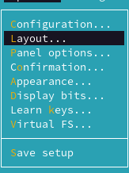{ #fig:011 width=70% }

## Задание по встроенному редактору mc. 

1. Воспользуемся командами:

```
cd 
touch text 
mc 
```

2. Откроем созданный файл.
3. Скопируем текст комбинацией клавиш ctrl+c и вставим файл комбинацией shift+insert.
4. Проделаем с текстом следующие манипуляции:
   - Удалим строку, выделив ее для начала(f3), а потом нажмем f8
   - Выделим строку и нажмем f5, потом перейдем в начале вставленного текста и нажмем enter
   - Сохраним файл с помощью f2
   - Нажмем ctrl+u
   - Ctrl+end или ctrl+home переведет нас в конец файла или в его начало соответственно. 
   - Сохраним через f2 и выйдем из файла с помощью f10.
5. Откроем любой файл с исходным текстом на некотором языке программирования.
# Выводы

С помощью данной лабораторной работы мы научились пользоваться командной оболочкой midnight commander. Приобрели навыки практической работы по просмотру файлов и каталогов, манипуляции с ними.
