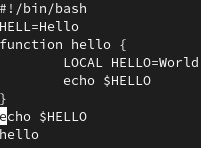
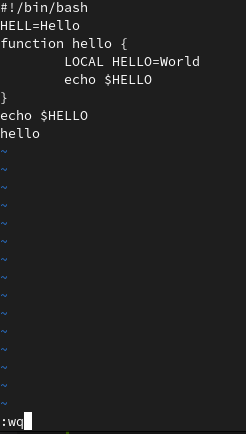
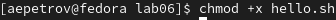
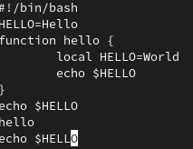

---
## Front matter
lang: ru-RU
title: Structural approach to the deep learning method
author: |
	Leonid A. Sevastianov\inst{1,3}
	\and
	Anton L. Sevastianov\inst{1}
	\and
	Edik A. Ayrjan\inst{2}
	\and
	Anna V. Korolkova\inst{1}
	\and
	Dmitry S. Kulyabov\inst{1,2}
	\and
	Imrikh Pokorny\inst{4}
institute: |
	\inst{1}RUDN University, Moscow, Russian Federation
	\and
	\inst{2}LIT JINR, Dubna, Russian Federation
	\and
	\inst{3}BLTP JINR, Dubna, Russian Federation
	\and
	\inst{4}Technical University of Košice, Košice, Slovakia
date: NEC--2019, 30 September -- 4 October, 2019 Budva, Montenegro

## Formatting
toc: false
slide_level: 2
theme: metropolis
header-includes: 
 - \metroset{progressbar=frametitle,sectionpage=progressbar,numbering=fraction}
 - '\makeatletter'
 - '\beamer@ignorenonframefalse'
 - '\makeatother'
aspectratio: 43
section-titles: true
---

# Цель работы

Познакомиться с операционной системой Linux. Получить практические навыки работы с редактором vi, установленным по умолчанию практически во всех дистрибутивах.

# Задание

Задание 1. Создание нового файла с использованием vi
1. Создайте каталог с именем ~/work/os/lab06.
2. Перейдите во вновь созданный каталог.
3. Вызовите vi и создайте файл hello.sh

```
1 vi hello.sh
```

4. Нажмите клавишу i и вводите следующий текст.

```
1 #!/bin/bash
2 HELL=Hello
3 function hello {
4 LOCAL HELLO=World
5 echo $HELLO
6 }
7 echo $HELLO
8 hello
```

5. Нажмите клавишу Esc для перехода в командный режим после завершения ввода текста.
6. Нажмите : для перехода в режим последней строки и внизу вашего экрана появится
приглашение в виде двоеточия.
7. Нажмите w (записать) и q (выйти), а затем нажмите клавишу Enter для сохранения
вашего текста и завершения работы.
8. Сделайте файл исполняемым

```
1 chmod +x hello.sh
```

Задание 2. Редактирование существующего файла
1. Вызовите vi на редактирование файла
```
1 vi ~/work/os/lab06/hello.sh
```
1. Установите курсор в конец слова HELL второй строки.
2. Перейдите в режим вставки и замените на HELLO. Нажмите Esc для возврата в команд-
ный режим.
4. Установите курсор на четвертую строку и сотрите слово LOCAL.
5. Перейдите в режим вставки и наберите следующий текст: local, нажмите Esc для
возврата в командный режим.
6. Установите курсор на последней строке файла. Вставьте после неё строку, содержащую следующий текст: echo $HELLO.
7. Нажмите Esc для перехода в командный режим.
8. Удалите последнюю строку.
9. Введите команду отмены изменений u для отмены последней команды.
10. Введите символ : для перехода в режим последней строки. Запишите произведённые
изменения и выйдите из vi


# Выполнение лабораторной работы

## Задание 1. 

1. 2. Создадим каталог с именем ~/work/os/lab06 и перейдем в него.
   
```
cd ~/work/os
mkdir lab06
cd lab06
```

3. Вызовем vi и создадим файл hello.sh:
   
```
vi hello.sh
```

4. Нажмем клавищу i и введем следующий текст(рис. [-@fig:001]):

```
1 #!/bin/bash
2 HELL=Hello
3 function hello {
4 LOCAL HELLO=World
5 echo $HELLO
6 }
7 echo $HELLO
8 hello
```

{ #fig:001 width=70% }

5. Нажмем клавишу Esc для перехода в командный режим после завершения ввода текста.
6. Нажмем : для перехода в режим последней строки и появится следующие(рис. [-@fig:002]):
   
{ #fig:002 width=70% }

7. Введем wq (рис. [-@fig:002]) и enter для сохранения результата.
8. Теперь в терминале сделаем файл исполняем(рис. [-@fig:003]):

```
chmod +x hello.sh 
```

{ #fig:003 width=70% }

## Задание 2. 

1. Вызовем vi на редактирование файла:

```
vi ~/work/os/lab06/hello.sh
```

2. Установим курсор в конец слова HELL во второй строчке. 
3. Нажмем i, чтобы перейти в режим вставки и заменим HELL на HELLO
4. Теперь сделаем то же самое, установим курсор на четвертую строку и сотрем LOCAL.
5. Перейдем опять в режим вставки и наберем local на том месте, где было LOCAL, потом нажмем esc, чтобы вернуться в командный режим.
6. Теперь установим курсор на последней строке файла. Скопируем echo
HELLO(перейдем в предпоследнюю строку и нажмем Y). Теперь вернемся в последнюю строку, перейдем в ее конец и нажмем P, чтобы вставить текст после курсора(рис. [-@fig:004]). 
{ #fig:004 width=70% }
7. Теперь нажмем ESC, чтобы перейти в командный режим.
8. Сотрем последнюю строку.
9. Нажмем u для отмены изменений(рис. [-@fig:005]).
{ #fig:005 width=70% }
10. Перейдем в режим последней строки(нажав :). Запишем wq.

# Выводы

Благодаря этой лабораторной работе мы научились пользоваться редактором vi и его горячим клавишам, которых достаточно много. 


