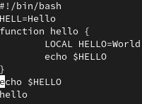
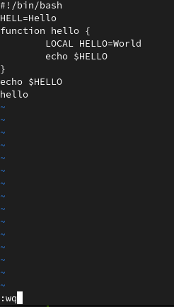
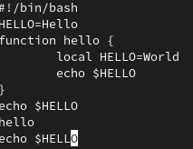

---
## Front matter
title: "Отчет по лабораторной работе н.8"
subtitle: "Текстовой редактор vi"
author: "Петров Артем Евгеньевич"

## Generic otions
lang: ru-RU
toc-title: "Содержание"

## Bibliography
bibliography: bib/cite.bib
csl: pandoc/csl/gost-r-7-0-5-2008-numeric.csl

## Pdf output format
toc: true # Table of contents
toc-depth: 2
lof: true # List of figures
lot: true # List of tables
fontsize: 12pt
linestretch: 1.5
papersize: a4
documentclass: scrreprt
## I18n polyglossia
polyglossia-lang:
  name: russian
  options:
	- spelling=modern
	- babelshorthands=true
polyglossia-otherlangs:
  name: english
## I18n babel
babel-lang: russian
babel-otherlangs: english
## Fonts
mainfont: PT Serif
romanfont: PT Serif
sansfont: PT Sans
monofont: PT Mono
mainfontoptions: Ligatures=TeX
romanfontoptions: Ligatures=TeX
sansfontoptions: Ligatures=TeX,Scale=MatchLowercase
monofontoptions: Scale=MatchLowercase,Scale=0.9
## Biblatex
biblatex: true
biblio-style: "gost-numeric"
biblatexoptions:
  - parentracker=true
  - backend=biber
  - hyperref=auto
  - language=auto
  - autolang=other*
  - citestyle=gost-numeric
## Pandoc-crossref LaTeX customization
figureTitle: "Рис."
tableTitle: "Таблица"
listingTitle: "Листинг"
lofTitle: "Список иллюстраций"
lotTitle: "Список таблиц"
lolTitle: "Листинги"
## Misc options
indent: true
header-includes:
  - \usepackage{indentfirst}
  - \usepackage{float} # keep figures where there are in the text
  - \floatplacement{figure}{H} # keep figures where there are in the text
---

# Цель работы

Познакомиться с операционной системой Linux. Получить практические навыки работы с редактором vi, установленным по умолчанию практически во всех дистрибутивах.

# Задание

Задание 1. Создание нового файла с использованием vi
1. Создайте каталог с именем ~/work/os/lab06.
2. Перейдите во вновь созданный каталог.
3. Вызовите vi и создайте файл hello.sh

```
1 vi hello.sh
```

4. Нажмите клавишу i и вводите следующий текст.

```
1 #!/bin/bash
2 HELL=Hello
3 function hello {
4 LOCAL HELLO=World
5 echo $HELLO
6 }
7 echo $HELLO
8 hello
```

5. Нажмите клавишу Esc для перехода в командный режим после завершения ввода
текста.
6. Нажмите : для перехода в режим последней строки и внизу вашего экрана появится
приглашение в виде двоеточия.
7. Нажмите w (записать) и q (выйти), а затем нажмите клавишу Enter для сохранения
вашего текста и завершения работы.
8. Сделайте файл исполняемым

```
1 chmod +x hello.sh
```

Задание 2. Редактирование существующего файла
1. Вызовите vi на редактирование файла
```
1 vi ~/work/os/lab06/hello.sh
```
1. Установите курсор в конец слова HELL второй строки.
2. Перейдите в режим вставки и замените на HELLO. Нажмите Esc для возврата в команд-
ный режим.
4. Установите курсор на четвертую строку и сотрите слово LOCAL.
5. Перейдите в режим вставки и наберите следующий текст: local, нажмите Esc для
возврата в командный режим.
6. Установите курсор на последней строке файла. Вставьте после неё строку, содержащую следующий текст: echo $HELLO.
7. Нажмите Esc для перехода в командный режим.
8. Удалите последнюю строку.
9. Введите команду отмены изменений u для отмены последней команды.
10. Введите символ : для перехода в режим последней строки. Запишите произведённые
изменения и выйдите из vi

# Теоретическое введение

Команды управления курсором
Курсор влево Курсор вправо Курсор вверх Курсор вниз
Space Enter (клавиша Backspace) (клавиша «пробел»)
h l k j

8.2.1.2. Команды позиционирования
– 0 (ноль) — переход в начало строки;
– $ — переход в конец строки;
– G — переход в конец файла;
– n G — переход на строку с номером n.
8.2.1.3. Команды перемещения по файлу
– Ctrl-d — перейти на пол-экрана вперёд;
– Ctrl-u — перейти на пол-экрана назад;
– Ctrl-f — перейти на страницу вперёд;
– Ctrl-b — перейти на страницу назад.
8.2.1.4. Команды перемещения по словам1
– W или w — перейти на слово вперёд;
– n W или n w — перейти на n слов вперёд;
– b или B — перейти на слово назад;
– n b или n B — перейти на n слов назад.
- 8.2.2. Команды редактирования

8.2.2.1. Вставка текста
– а — вставить текст после курсора;
– А — вставить текст в конец строки;
– i — вставить текст перед курсором;
– n i — вставить текст n раз;
– I — вставить текст в начало строки.
8.2.2.2. Вставка строки
– о — вставить строку под курсором;
– О — вставить строку над курсором.
8.2.2.3. Удаление текста
– x — удалить один символ в буфер;
– d w — удалить одно слово в буфер;
– d $ — удалить в буфер текст от курсора до конца строки;
– d 0 — удалить в буфер текст от начала строки до позиции курсора;
– d d — удалить в буфер одну строку;
– n d d — удалить в буфер n строк.
1При использовании прописных W и B под разделителями понимаются только пробел, табуляция и возврат
каретки. При использовании строчных w и b под разделителями понимаются также любые знаки пунктуации.
72 Лабораторная работа No 8. Текстовой редактор vi
8.2.2.4. Отмена и повтор произведённых изменений
– u — отменить последнее изменение;
– . — повторить последнее изменение.
8.2.2.5. Копирование текста в буфер
– Y — скопировать строку в буфер;
– n Y — скопировать n строк в буфер;
– y w — скопировать слово в буфер.
8.2.2.6. Вставка текста из буфера
– p — вставить текст из буфера после курсора;
– P — вставить текст из буфера перед курсором.
8.2.2.7. Замена текста
– c w — заменить слово;
– n c w — заменить n слов;
– c $ — заменить текст от курсора до конца строки;
– r — заменить слово;
– R — заменить текст.
8.2.2.8. Поиск текста
– / текст — произвести поиск вперёд по тексту указанной строки символов текст;
– ? текст — произвести поиск назад по тексту указанной строки символов текст.
8.2.3. Команды редактирования в режиме командной строки
8.2.3.1. Копирование и перемещение текста
– : n,m d — удалить строки с n по m;
– : i,j m k — переместить строки с i по j, начиная со строки k;
– : i,j t k — копировать строки с i по j в строку k;
– : i,j w имя-файла — записать строки с i по j в файл с именем имя-файла.
8.2.3.2. Запись в файл и выход из редактора
– : w — записать изменённый текст в файл, не выходя из vi;
– : w имя-файла — записать изменённый текст в новый файл с именем имя-файла;
– : w ! имя-файла — записать изменённый текст в файл с именем имя-файла;
– : w q — записать изменения в файл и выйти из vi;
– : q — выйти из редактора vi;
– : q ! — выйти из редактора без записи;
Кулябов Д. С. и др. Операционные системы 73
– : e ! — вернуться в командный режим, отменив все изменения, произведённые
со времени последней записи.
8.2.4. Опции
Опции редактора vi позволяют настроить рабочую среду. Для задания опций использу-
ется команда set (в режиме последней строки):
– : set all — вывести полный список опций;
– : set nu — вывести номера строк;
– : set list — вывести невидимые символы;
– : set ic — не учитывать при поиске, является ли символ прописным или строчным.
Если вы хотите отказаться от использования опции, то в команде set перед именем
опции надо поставить no.

# Выполнение лабораторной работы

## Задание 1. 

1. 2. Создадим каталог с именем ~/work/os/lab06 и перейдем в него.
   
```
cd ~/work/os
mkdir lab06
cd lab06
```

3. Вызовем vi и создадим файл hello.sh:
   
```
vi hello.sh
```

4. Нажмем клавищу i и введем следующий текст(рис. [-@fig:001]):

```
1 #!/bin/bash
2 HELL=Hello
3 function hello {
4 LOCAL HELLO=World
5 echo $HELLO
6 }
7 echo $HELLO
8 hello
```

{ #fig:001 width=70% }

5. Нажмем клавишу Esc для перехода в командный режим после завершения ввода текста.
6. Нажмем : для перехода в режим последней строки и появится следующие(рис. [-@fig:002]):
   
{ #fig:002 width=70% }

7. Введем wq (рис. [-@fig:002]) и enter для сохранения результата.
8. Теперь в терминале сделаем файл исполняем(рис. [-@fig:003]):

```
chmod +x hello.sh 
```

{ #fig:003 width=70% }

## Задание 2. 

1. Вызовем vi на редактирование файла:

```
vi ~/work/os/lab06/hello.sh
```

2. Установим курсор в конец слова HELL во второй строчке. 
3. Нажмем i, чтобы перейти в режим вставки и заменим HELL на HELLO
4. Теперь сделаем то же самое, установим курсор на четвертую строку и сотрем LOCAL.
5. Перейдем опять в режим вставки и наберем local на том месте, где было LOCAL, потом нажмем esc, чтобы вернуться в командный режим.
6. Теперь установим курсор на последней строке файла. Скопируем echo
HELLO(перейдем в предпоследнюю строку и нажмем Y). Теперь вернемся в последнюю строку, перейдем в ее конец и нажмем P, чтобы вставить текст после курсора(рис. [-@fig:004]). 
{ #fig:004 width=70% }
7. Теперь нажмем ESC, чтобы перейти в командный режим.
8. Сотрем последнюю строку.
9. Нажмем u для отмены изменений(рис. [-@fig:005]).
{ #fig:005 width=70% }
10. Перейдем в режим последней строки(нажав :). Запишем wq.

# Выводы

Благодаря этой лабораторной работе мы научились пользоваться редактором vi и его горячим клавишам, которых достаточно много. 

# Ответы на контрольные вопросы

1. Редактор vi имеет три режима работы:
- командный режим — предназначен для ввода команд редактирования и навигации по редактируемому файлу;
- режим вставки — предназначен для ввода содержания редактируемого файла;
- режим последней (или командной) строки — используется для записи изменений в файл и выхода из редактора.

2. q!
3. 
'0' (ноль) — переход в начало строки;
'$' — переход в конец строки;
'G' — переход в конец файла;
'nG' — переход на строку с номером n.

4. Совокупность символов без пробела.
5. Чтобы перейти в конец, нам надо нажать "G", а чтобы перейти в начало, нам надо последовательно нажать "1" и "G"
6. 
Вставка текста
– а — вставить текст после курсора;
– А — вставить текст в конец строки;
– i — вставить текст перед курсором;
– n i — вставить текст n раз;
– I — вставить текст в начало строки.
 
Вставка строки
– о — вставить строку под курсором;
– О — вставить строку над курсором.

Удаление текста
– x — удалить один символ в буфер;
– d w — удалить одно слово в буфер;
– d $ — удалить в буфер текст от курсора до конца строки;
– d 0 — удалить в буфер текст от начала строки до позиции курсора;
– d d — удалить в буфер одну строку;
– n d d — удалить в буфер n строк.

Отмена и повтор произведённых изменений
– u — отменить последнее изменение;
– . — повторить последнее изменение

Копирование текста в буфер
– Y — скопировать строку в буфер;
– n Y — скопировать n строк в буфер;
– y w — скопировать слово в буфер.

Вставка текста из буфера
– p — вставить текст из буфера после курсора;
– P — вставить текст из буфера перед курсором.

Замена текста
– c w — заменить слово;
– n c w — заменить n слов;
– c $ — заменить текст от курсора до конца строки;
– r — заменить слово;
– R — заменить текст.

7. Надо перевести курсор в начало нужной строки и нажать "c" и "$" и потом заполнить "$".
8. Нажатие клавиши "u" в командном режиме.
9. Копирование и перемещение текста:
– : n,m d — удалить строки с n по m;
– : i,j m k — переместить строки с i по j, начиная со строки k;
– : i,j t k — копировать строки с i по j в строку k;
– : i,j w имя-файла — записать строки с i по j в файл с именем имя-файла.

Запись в файл и выход из редактора:
– : w — записать изменённый текст в файл, не выходя из vi;
– : w имя-файла — записать изменённый текст в новый файл с именем имя-файла;
– : w ! имя-файла — записать изменённый текст в файл с именем имя-файла;
– : w q — записать изменения в файл и выйти из vi;
– : q — выйти из редактора vi;
– : q ! — выйти из редактора без записи;
– : e ! — вернуться в командный режим, отменив все изменения, произведённые со времени последней записи;

10. Нажатием "$" в текущей строке. 
11. Опции
Опции редактора vi позволяют настроить рабочую среду. Для задания опций используется команда set (в режиме последней строки):
– : set all — вывести полный список опций;
– : set nu — вывести номера строк;
– : set list — вывести невидимые символы;
– : set ic — не учитывать при поиске, является ли символ прописным или строчным.
Если вы хотите отказаться от использования опции, то в команде set перед именем опции надо поставить no.

12. Если режим вставки, то снизу пишется Insert, если режим командной строки, то снизу двоеточие, иначе это командный режим.