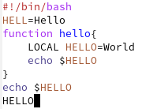
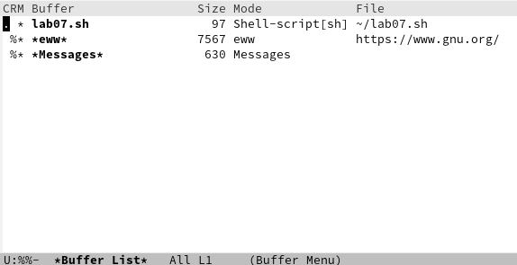
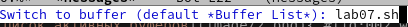
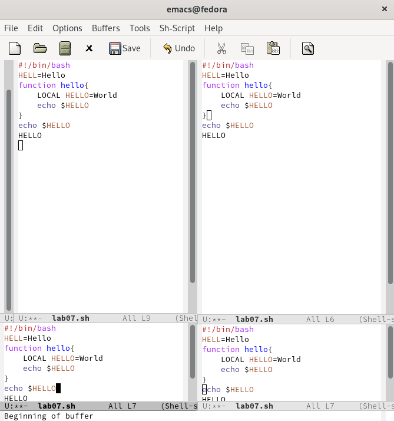
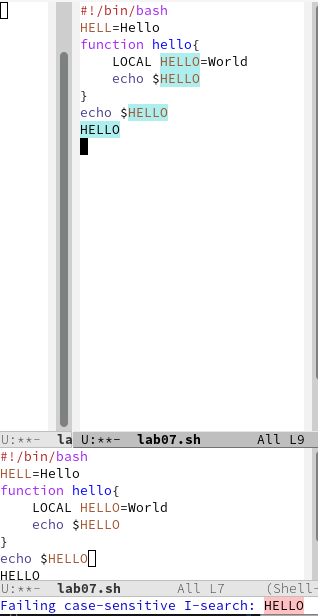
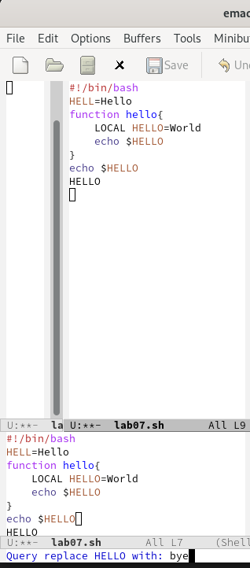

---
## Front matter
lang: ru-RU
title: Текстовой редактор emacs"
author: |
	Leonid A. Sevastianov\inst{1,3}
	\and
	Anton L. Sevastianov\inst{1}
	\and
	Edik A. Ayrjan\inst{2}
	\and
	Anna V. Korolkova\inst{1}
	\and
	Dmitry S. Kulyabov\inst{1,2}
	\and
	Imrikh Pokorny\inst{4}
institute: |
	\inst{1}RUDN University, Moscow, Russian Federation
	\and
	\inst{2}LIT JINR, Dubna, Russian Federation
	\and
	\inst{3}BLTP JINR, Dubna, Russian Federation
	\and
	\inst{4}Technical University of Košice, Košice, Slovakia
date: NEC--2019, 30 September -- 4 October, 2019 Budva, Montenegro

## Formatting
toc: false
slide_level: 2
theme: metropolis
header-includes: 
 - \metroset{progressbar=frametitle,sectionpage=progressbar,numbering=fraction}
 - '\makeatletter'
 - '\beamer@ignorenonframefalse'
 - '\makeatother'
aspectratio: 43
section-titles: true
---

# Цель работы

Познакомиться с операционной системой Linux. Получить практические навыки работы с редактором Emacs

# Выполнение лабораторной работы

## Задание 1. 

- Откроем  emacs

```
emacs &
```

## Задание 2.

- Создадим файл lab07.sh с помощью комбинации Ctrl-x Ctrl-f (C-x C-f).

## Задание 3. 

- Наберем след. текст(рис. [-@fig:001]):

```
1. #!/bin/bash
2. HELL=Hello
3. function hello {
4. LOCAL HELLO=World
5. echo $HELLO
6. }
7. echo $HELLO
8. hello
```

{ #fig:001 width=70% }

## Задание 4.

- Cохраним файл с помощью комбинации Ctrl-x Ctrl-s (C-x C-s).

## Задание 5.

- Проделаем с текстом стандартные процедуры редактирования:
1. Вырежем одной командой целую строку (С-k).
2. Вставим эту строку в конец файла (C-y).
3. Выделим область текста (C-space).
4. Скопируем область в буфер обмена (M-w).
5. Вставим область в конец файла.
6. Вновь выделить эту область и на этот раз вырезать её (C-w).
7. Отменим последнее действие (C-/).

## Задание 6.
- Научимся использовать команды по перемещению курсора.
1. Переместим курсор в начало строки (C-a).
2. Переместим курсор в конец строки (C-e).
3. Переместим курсор в начало буфера (M-<).
4. Переместим курсор в конец буфера (M->).

## Задание 7. 

1. Выведем список активных буферов на экран (C-x C-b)(рис. [-@fig:002]):

{ #fig:002 width=70% }

2. Переместимся во вновь открытое окно (C-x) o со списком открытых
буферов и переключимся на другой буфер.
3. Закроем это окно(С-х, 0).
4. Теперь вновь переключимся между буферами, но уже без вывода их списка на экран (C-x b)(рис. [-@fig:003]).
   
{ #fig:003 width=70% }
   


## Задание 8.

1. Поделим фрейм на 4 части: разделим фрейм на два окна по вертикали (C-x 3), а затем каждое из этих окон на две части по горизонтали (C-x 2) (рис. [-@fig:004]):
2. см. (рис. [-@fig:004]):

{ #fig:004 width=70% }

## Задание 9. 

1. Переключимся в режим поиска(C-s) и найдем несколько слов из текста(рис. [-@fig:005]):

{ #fig:005 width=70% }
2. Теперь попереключаемся между разными методами поиска(С-s)
3. Выйдем из режима поиска(C-g)
4. Перейдум в режим поиска и замены (M-%), введем текст, который следует найти и заменить, нажмем Enter , затем введем текст для замены. После того как будут подсвечены результаты поиска, нажмем ! для подтверждения замены(рис. [-@fig:006]).

{ #fig:006 width=70% }

5. Испробуем другой режим поиска, нажав M-s o. 

# Выводы

Благодаря данной лабораторной работе я научился пользоваться редактором emacs с помощью горячих клавиш.
