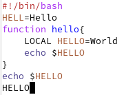
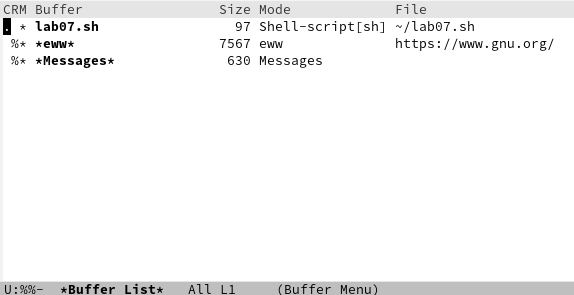
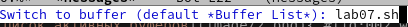
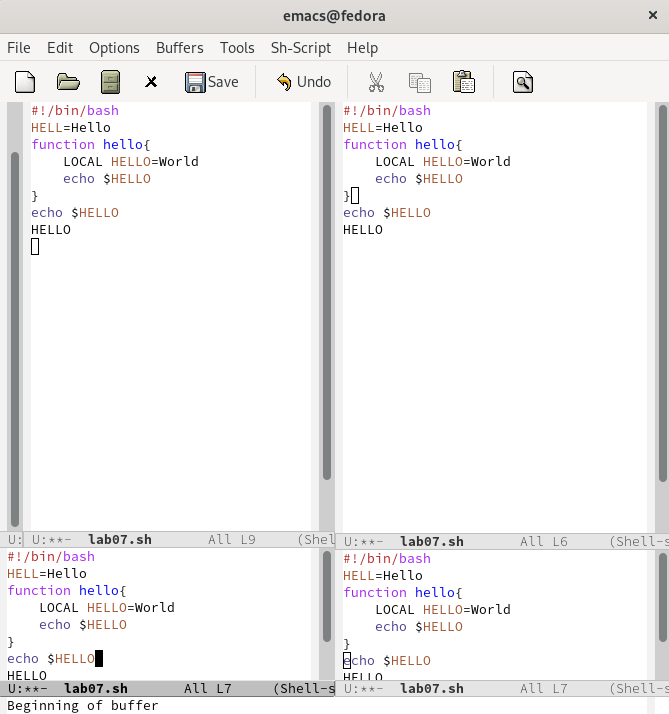
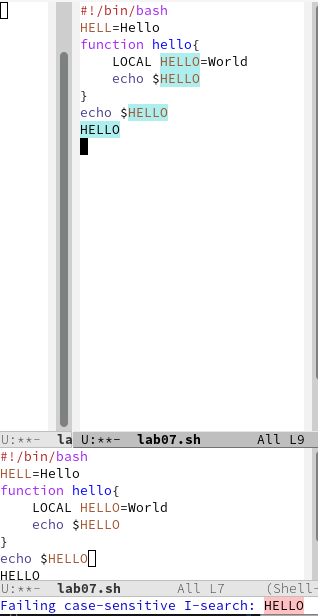
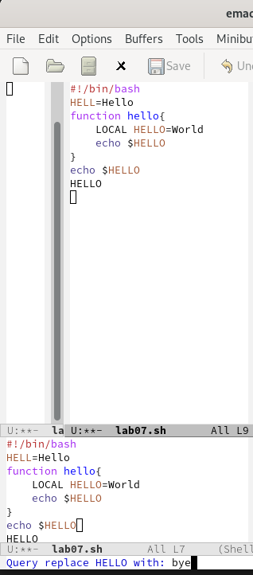

---
## Front matter
title: "Лабораторная работа No 9"
subtitle: "Текстовой редактор emacs"
author: "Петров Артем Евгеньевич"

## Generic otions
lang: ru-RU
toc-title: "Содержание"

## Bibliography
bibliography: bib/cite.bib
csl: pandoc/csl/gost-r-7-0-5-2008-numeric.csl

## Pdf output format
toc: true # Table of contents
toc-depth: 2
lof: true # List of figures
lot: true # List of tables
fontsize: 12pt
linestretch: 1.5
papersize: a4
documentclass: scrreprt
## I18n polyglossia
polyglossia-lang:
  name: russian
  options:
	- spelling=modern
	- babelshorthands=true
polyglossia-otherlangs:
  name: english
## I18n babel
babel-lang: russian
babel-otherlangs: english
## Fonts
mainfont: PT Serif
romanfont: PT Serif
sansfont: PT Sans
monofont: PT Mono
mainfontoptions: Ligatures=TeX
romanfontoptions: Ligatures=TeX
sansfontoptions: Ligatures=TeX,Scale=MatchLowercase
monofontoptions: Scale=MatchLowercase,Scale=0.9
## Biblatex
biblatex: true
biblio-style: "gost-numeric"
biblatexoptions:
  - parentracker=true
  - backend=biber
  - hyperref=auto
  - language=auto
  - autolang=other*
  - citestyle=gost-numeric
## Pandoc-crossref LaTeX customization
figureTitle: "Рис."
tableTitle: "Таблица"
listingTitle: "Листинг"
lofTitle: "Список иллюстраций"
lotTitle: "Список таблиц"
lolTitle: "Листинги"
## Misc options
indent: true
header-includes:
  - \usepackage{indentfirst}
  - \usepackage{float} # keep figures where there are in the text
  - \floatplacement{figure}{H} # keep figures where there are in the text
---

# Цель работы

Познакомиться с операционной системой Linux. Получить практические навыки работы с редактором Emacs

# Задание

1. Открыть emacs.
2. Создать файл lab07.sh с помощью комбинации Ctrl-x Ctrl-f (C-x C-f).
3. Наберите текст:

```
1. #!/bin/bash
2. HELL=Hello
3. function hello {
4. LOCAL HELLO=World
5. echo $HELLO
6. }
7. echo $HELLO
8. hello
```
4. Сохранить файл с помощью комбинации Ctrl-x Ctrl-s (C-x C-s).
5. Проделать с текстом стандартные процедуры редактирования, каждое действие долж-
но осуществляться комбинацией клавиш.
   1. Вырезать одной командой целую строку (С-k).
   2. Вставить эту строку в конец файла (C-y).
   3. Выделить область текста (C-space).
   4. Скопировать область в буфер обмена (M-w).
   5. Вставить область в конец файла.
   6. Вновь выделить эту область и на этот раз вырезать её (C-w).
   7. Отмените последнее действие (C-/).
6. Научитесь использовать команды по перемещению курсора.
   1. Переместите курсор в начало строки (C-a).
   2. Переместите курсор в конец строки (C-e).
   3. Переместите курсор в начало буфера (M-<).
   4. Переместите курсор в конец буфера (M->).
7. Управление буферами.
   1. Вывести список активных буферов на экран (C-x C-b).
   2. Переместитесь во вновь открытое окно (C-x) o со списком открытых буферов
и переключитесь на другой буфер.
   3. Закройте это окно (C-x 0).
   4. Теперь вновь переключайтесь между буферами, но уже без вывода их списка на экран (C-x b).
8. Управление окнами.
   1. Поделите фрейм на 4 части: разделите фрейм на два окна по вертикали (C-x 3),
а затем каждое из этих окон на две части по горизонтали (C-x 2) 
   2. В каждом из четырёх созданных окон откройте новый буфер (файл) и введите
несколько строк текста.
9. Режим поиска
   1. Переключитесь в режим поиска (C-s) и найдите несколько слов, присутствующих
в тексте.
   2. Переключайтесь между результатами поиска, нажимая C-s.
   3. Выйдите из режима поиска, нажав C-g.
   4. Перейдите в режим поиска и замены (M-%), введите текст, который следует найти
и заменить, нажмите Enter , затем введите текст для замены. После того как будут
подсвечены результаты поиска, нажмите ! для подтверждения замены.
   5. Испробуйте другой режим поиска, нажав M-s o. Объясните, чем он отличается от
обычного режима

# Теоретическое введение


# Выполнение лабораторной работы

## Задание 1. 

- Откроем  emacs

```
emacs &
```

## Задание 2.

- Создадим файл lab07.sh с помощью комбинации Ctrl-x Ctrl-f (C-x C-f).

## Задание 3. 

- Наберем след. текст(рис. [-@fig:001]):

```
1. #!/bin/bash
2. HELL=Hello
3. function hello {
4. LOCAL HELLO=World
5. echo $HELLO
6. }
7. echo $HELLO
8. hello
```

{ #fig:001 width=70% }

## Задание 4.

- Cохраним файл с помощью комбинации Ctrl-x Ctrl-s (C-x C-s).

## Задание 5.

- Проделаем с текстом стандартные процедуры редактирования:
1. Вырежем одной командой целую строку (С-k).
2. Вставим эту строку в конец файла (C-y).
3. Выделим область текста (C-space).
4. Скопируем область в буфер обмена (M-w).
5. Вставим область в конец файла.
6. Вновь выделить эту область и на этот раз вырезать её (C-w).
7. Отменим последнее действие (C-/).

## Задание 6.
- Научимся использовать команды по перемещению курсора.
1. Переместим курсор в начало строки (C-a).
2. Переместим курсор в конец строки (C-e).
3. Переместим курсор в начало буфера (M-<).
4. Переместим курсор в конец буфера (M->).

## Задание 7. 

1. Выведем список активных буферов на экран (C-x C-b)(рис. [-@fig:002]):

{ #fig:002 width=70% }

2. Переместимся во вновь открытое окно (C-x) o со списком открытых
буферов и переключимся на другой буфер.
3. Закроем это окно(С-х, 0).
4. Теперь вновь переключимся между буферами, но уже без вывода их списка на экран (C-x b)(рис. [-@fig:003]).
   
{ #fig:003 width=70% }
   


## Задание 8.

1. Поделим фрейм на 4 части: разделим фрейм на два окна по вертикали (C-x 3), а затем каждое из этих окон на две части по горизонтали (C-x 2) (рис. [-@fig:004]):
2. см. (рис. [-@fig:004]):

{ #fig:004 width=70% }

## Задание 9. 

1. Переключимся в режим поиска(C-s) и найдем несколько слов из текста(рис. [-@fig:005]):

{ #fig:005 width=70% }
2. Теперь попереключаемся между разными методами поиска(С-s)
3. Выйдем из режима поиска(C-g)
4. Перейдум в режим поиска и замены (M-%), введем текст, который следует найти и заменить, нажмем Enter , затем введем текст для замены. После того как будут подсвечены результаты поиска, нажмем ! для подтверждения замены(рис. [-@fig:006]).

{ #fig:006 width=70% }

5. Испробуем другой режим поиска, нажав M-s o. 

# Выводы

Благодаря данной лабораторной работе я научился пользоваться редактором emacs с помощью горячих клавиш.

# Контрольные вопросы

1. Emacs представляет собой мощный экранный редактор текста, написанный на языке высокого уровня Elisp.

2. Многие рутинные операции в Emacs удобнее производить с помощью клавиатуры, а не графического меню. Наиболее часто в командах Emacs используются сочетания c клавишами Ctrl и Meta (в обозначениях Emacs: C- и M-; клавиша Shift в Emasc обозначается как S-). Так как на клавиатуре для IBM PC совместимых ПК клавиши Meta нет, то вместо неё можно использовать Alt или Esc.

3. Буфер - это память, содержащая какой-либо текст. Окно же-это область, где выводится текст определенного буфера.

4. Можно открыть больше 10 буферов в одном окне.

5. Только что запущенный Emacs несет один буфер с именем `scratch', который может быть использован для вычисления выражений Лиспа в Emacs.

6. Ctrl-c |(первые две нажму вместе, а третью отдельно), Ctrl-c Ctrl-|(каждую пару нажму раздельно).

7. Разделить фрейм на два окна по вертикали (C-x 3),а по горизонтали (C-x 2) .

8. В файле Emacs хранятся настройки редактора.

9. Кнопка BACKSPACE = функции C-k и ее можно переназначить.

10. Редактор Emacs мне показался удобнее, так как в нем больше возможностей по сравнению с vi.