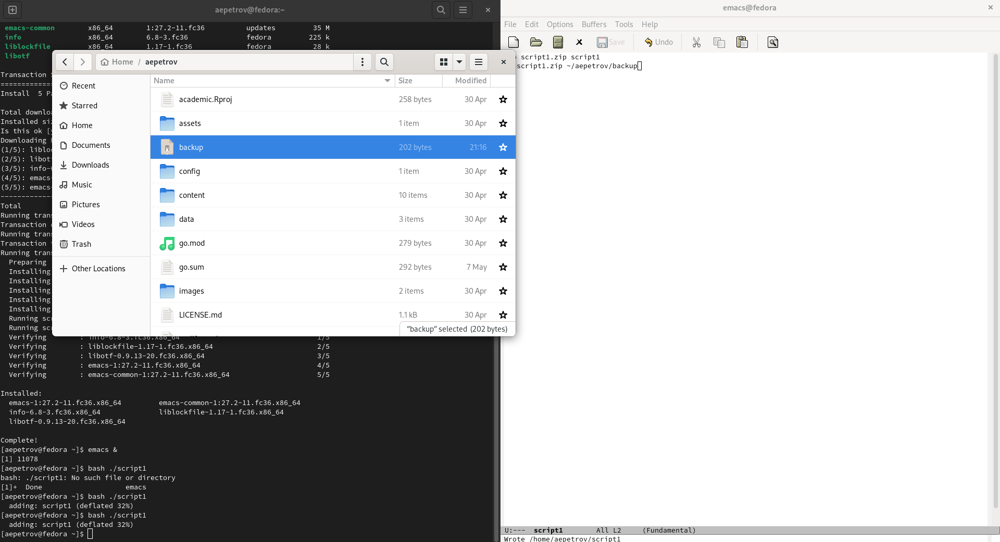
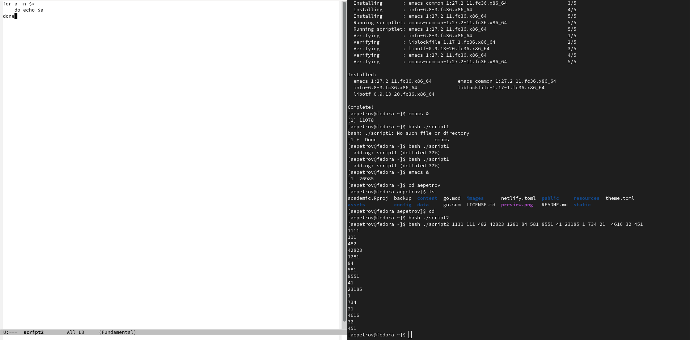
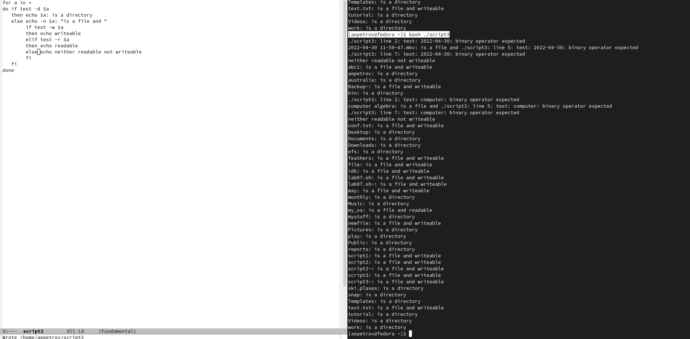
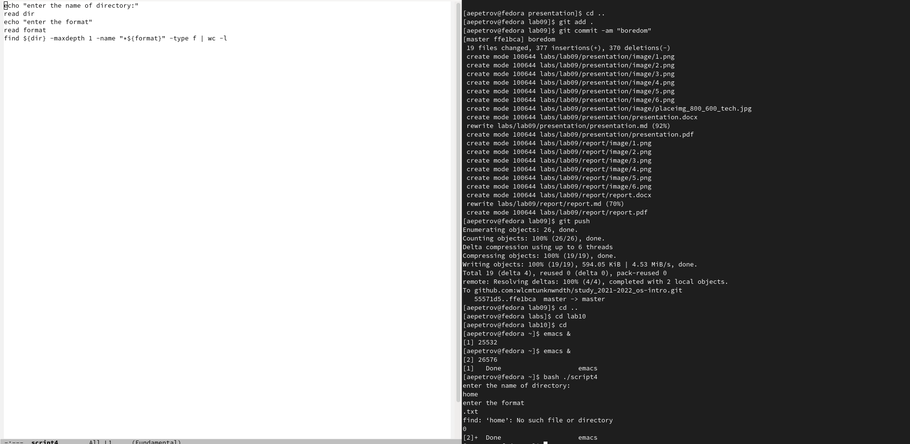

---
## Front matter
lang: ru-RU
title: Программирование в командном процессоре ОС UNIX. Командные файлы
author: |
	Leonid A. Sevastianov\inst{1,3}
	\and
	Anton L. Sevastianov\inst{1}
	\and
	Edik A. Ayrjan\inst{2}
	\and
	Anna V. Korolkova\inst{1}
	\and
	Dmitry S. Kulyabov\inst{1,2}
	\and
	Imrikh Pokorny\inst{4}
institute: |
	\inst{1}RUDN University, Moscow, Russian Federation
	\and
	\inst{2}LIT JINR, Dubna, Russian Federation
	\and
	\inst{3}BLTP JINR, Dubna, Russian Federation
	\and
	\inst{4}Technical University of Košice, Košice, Slovakia
date: NEC--2019, 30 September -- 4 October, 2019 Budva, Montenegro

## Formatting
toc: false
slide_level: 2
theme: metropolis
header-includes: 
 - \metroset{progressbar=frametitle,sectionpage=progressbar,numbering=fraction}
 - '\makeatletter'
 - '\beamer@ignorenonframefalse'
 - '\makeatother'
aspectratio: 43
section-titles: true
---

# Цель работы

Изучить основы программирования в оболочке ОС UNIX/Linux. Научиться писать небольшие командные файлы.

# Ход работы 

1. Напишем скрипт, который делаем резервную копию самого себя, архивирует резервную копию и кладет по адресу ~/aepetrov/backup(рис. [-@fig:001])

```
emacs &
```

Жмем C-x C-f, кладем файл по адресу ~, я назвал его script1

Bash-code:
```
zip script1.zip script1
mv script1.zip ~/aepetrov/backup
```

{ #fig:001 width=70% }

2. Написать пример командного файла, который обрабатывает произвольное число аргументов командной строки, в том числе и превыщающее 10(рис. [-@fig:002]).

```
emacs &
```

Жмем C-x C-f, кладем файл по адресу ~, я назвал его script2

Bash-Code: 

```
for a in $*
    do echo $a
done
```
{ #fig:002 width=70% }

3. Написать командный файл, аналог команды ls, который выдает информацию о нужном каталоге и выводит информацию о правах доступа к файлам каталога(рис. [-@fig:003]).

```
emacs &
```

Жмем C-x C-f, кладем файл по адресу ~, я назвал его script2

Bash-Code: 

```
for a in *
do if test -d $a
    then echo $a: is a directory
    else echo -n $a: "is a file and "
   	if test -w $a
	  then echo writeable
	  elif test -r $a
	  then echo readable
	  else echo neither readable not writeable
	  fi
  fi
done
```

{ #fig:003 width=70% }

4. Написать командный файл, который получает в качестве аргумента командной строки формат файла (.txt, .doc, .jpg, .pdf и т.д.) и вычисляет количество таких файлов
в указанной директории. Путь к директории также передаётся в виде аргумента командной строки(рис. [-@fig:004]).

```
emacs &
```

Жмем C-x C-f, кладем файл по адресу ~, я назвал его script2

Bash-Code: 

``` 
echo "enter the name of directory:"
read dir
echo "enter the format"
read format
find ${dir} -maxdepth 1 -name "*${format}" -type f | wc -l
```

{ #fig:004 width=70% }

# Выводы

На данной лабораторной работе мы научились пользоваться скриптами bash и создавать свои, которые выполняют несложные команды, иногда заменяющие команды linux.
