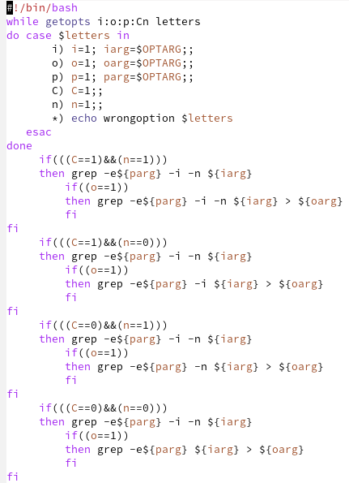
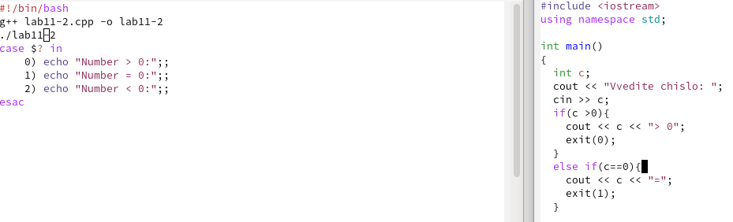
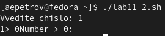
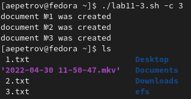
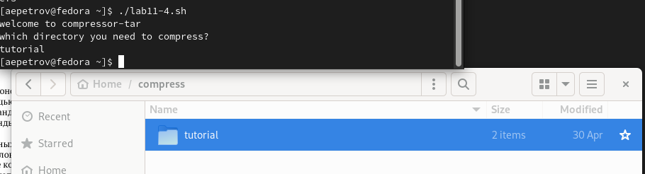

---
## Front matter
lang: ru-RU
title: "Программирование в командном процессоре ОС UNIX. Ветвления и циклы"
author: |
	Petrov Artyem E.\inst{1}
	\and
institute: |
	\inst{1}RUDN University, Moscow, the Russian Federation
	\and
date:25 May, 2022 Moscow, the Russian Federation

## Formatting
toc: false
slide_level: 2
theme: metropolis
header-includes: 
 - \metroset{progressbar=frametitle,sectionpage=progressbar,numbering=fraction}
 - '\makeatletter'
 - '\beamer@ignorenonframefalse'
 - '\makeatother'
aspectratio: 43
section-titles: true
---

# Цель работы

Изучить основы программирования в оболочке ОС UNIX. Научится писать более
сложные командные файлы с использованием логических управляющих конструкций
и циклов.

# Выполнение лабораторной работы

## Задание 1. Рис. [-@fig:001].

```
#!/bin/bash
while getopts i:o:p:Cn letters
do case $letters in
       i) i=1; iarg=$OPTARG;;
       o) o=1; oarg=$OPTARG;;
       p) p=1; parg=$OPTARG;;
       C) C=1;;
       n) n=1;;
       *) echo wrongoption $letters
   esac
done
     if(((C==1)&&(n==1)))
     then grep -e${parg} -i -n ${iarg}
         if((o==1))
         then grep -e${parg} -i -n ${iarg} > ${oarg}
         fi
fi
     if(((C==1)&&(n==0)))
     then grep -e${parg} -i -n ${iarg}
         if((o==1))
         then grep -e${parg} -i ${iarg} > ${oarg}
         fi
fi
     if(((C==0)&&(n==1)))
     then grep -e${parg} -i -n ${iarg}
         if((o==1))
         then grep -e${parg} -n ${iarg} > ${oarg}
         fi
fi
     if(((C==0)&&(n==0)))
     then grep -e${parg} -i -n ${iarg}
         if((o==1))
         then grep -e${parg} ${iarg} > ${oarg}
         fi
fi
```

{#fig:001 width=70%}

## Задание 2. Рис. [-@fig:002] - [-@fig:003].
1. Cpp code:

```
#include <iostream>
using namespace std;

int main()
{
  int c;
  cout << "Vvedite chislo: ";
  cin >> c;
  if(c >0){
    cout << c << "> 0";
    exit(0);
  }
  else if(c==0){
    cout << c << "=";
    exit(1);
  }

  cout << c << "<0";
  exit(2);
  return 0;
}  
```

2. Bash:

```
#!/bin/bash
g++ lab11-2.cpp -o lab11-2
./lab11-2
case $? in
    0) echo "Number > 0:";;
    1) echo "Number = 0:";;
    2) echo "Number < 0:";;
esac
```

{#fig:002 width=70%}

{#fig:003 width=70%}

## Задание 3. Рис. [-@fig:004].

1. Bash:

```
#!/bin/bash
let delete=0;
while getopts c:d letters
do case $letters in
       c)create=1; arg=$OPTARG;;
       d)delete=1;;
       *) echo wrongoption $letters
   esac
done

if((delete==0))
then for((i=1;i<=arg;i++))
     do touch ${i}.txt
	echo document №${i} was created
     done
fi
if((delete==1))
then for((i=1;i<=arg;i++))
     do rm ${i}.txt
	echo document №${i} was deleted
     done
fi
```

{#fig:004 width=70%}

## Задание 4. Рис. [-@fig:005].

1. Bash:

```
#!/bin/bash
directory=""
echo welcome to compressor-tar
echo which directory you need to compress?
read directory
#tar -cf compressed.tar $director
find $directory -mtime -7 | tar -cf compress.tar $directory
```

{#fig:005 width=70%}

# Выводы

Благодаря данной лабораторной работе я научился программировать скрипты на Bash, которые в свою очередь добавляли опции, архивирвали архив, проверяли числа и создавали сразу несколько файлов