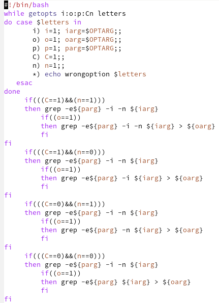
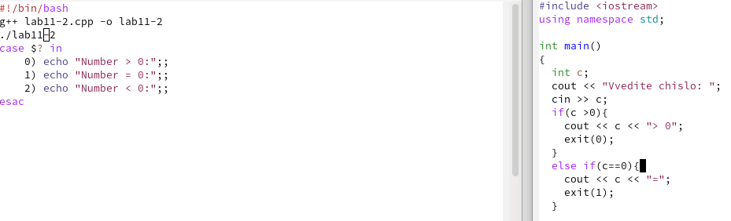
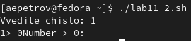
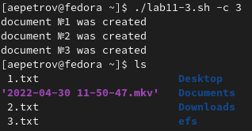
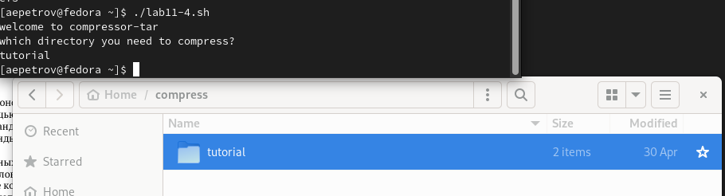

---
## Front matter
title: "Отчет по лабораторной работе н.11"
subtitle: "Программирование в командном процессоре ОС UNIX. Ветвления и циклы"
author: "Петров Артем Евгеньевич"

## Generic otions
lang: ru-RU
toc-title: "Содержание"

## Bibliography
bibliography: bib/cite.bib
csl: pandoc/csl/gost-r-7-0-5-2008-numeric.csl

## Pdf output format
toc: true # Table of contents
toc-depth: 2
lof: true # List of figures

fontsize: 12pt
linestretch: 1.5
papersize: a4
documentclass: scrreprt
## I18n polyglossia
polyglossia-lang:
  name: russian
  options:
	- spelling=modern
	- babelshorthands=true
polyglossia-otherlangs:
  name: english
## I18n babel
babel-lang: russian
babel-otherlangs: english
## Fonts
mainfont: PT Serif
romanfont: PT Serif
sansfont: PT Sans
monofont: PT Mono
mainfontoptions: Ligatures=TeX
romanfontoptions: Ligatures=TeX
sansfontoptions: Ligatures=TeX,Scale=MatchLowercase
monofontoptions: Scale=MatchLowercase,Scale=0.9
## Biblatex
biblatex: true
biblio-style: "gost-numeric"
biblatexoptions:
  - parentracker=true
  - backend=biber
  - hyperref=auto
  - language=auto
  - autolang=other*
  - citestyle=gost-numeric
## Pandoc-crossref LaTeX customization
figureTitle: "Рис."
tableTitle: "Таблица"
listingTitle: "Листинг"
lofTitle: "Список иллюстраций"

lolTitle: "Листинги"
## Misc options
indent: true
header-includes:
  - \usepackage{indentfirst}
  - \usepackage{float} # keep figures where there are in the text
  - \floatplacement{figure}{H} # keep figures where there are in the text
---

# Цель работы

Изучить основы программирования в оболочке ОС UNIX. Научится писать более
сложные командные файлы с использованием логических управляющих конструкций
и циклов.

# Задание

1. Используя команды getopts grep, написать командный файл, который анализирует
командную строку с ключами:
– -iinputfile — прочитать данные из указанного файла;
– -ooutputfile — вывести данные в указанный файл;
– -pшаблон — указать шаблон для поиска;
– -C — различать большие и малые буквы;
– -n — выдавать номера строк.
а затем ищет в указанном файле нужные строки, определяемые ключом -p.
2. Написать на языке Си программу, которая вводит число и определяет, является ли оно
больше нуля, меньше нуля или равно нулю. Затем программа завершается с помощью
функции exit(n), передавая информацию в о коде завершения в оболочку. Команд-
ный файл должен вызывать эту программу и, проанализировав с помощью команды
'$'?, выдать сообщение о том, какое число было введено.
3. Написать командный файл, создающий указанное число файлов, пронумерованных
последовательно от 1 до N (например 1.tmp, 2.tmp, 3.tmp,4.tmp и т.д.). Число файлов,
которые необходимо создать, передаётся в аргументы командной строки. Этот же ко-
мандный файл должен уметь удалять все созданные им файлы (если они существуют).
4. Написать командный файл, который с помощью команды tar запаковывает в архив
все файлы в указанной директории. Модифицировать его так, чтобы запаковывались
только те файлы, которые были изменены менее недели тому назад (использовать
команду find).

# Выполнение лабораторной работы

## Задание 1. Рис. [-@fig:001].

```
#!/bin/bash
while getopts i:o:p:Cn letters
do case $letters in
       i) i=1; iarg=$OPTARG;;
       o) o=1; oarg=$OPTARG;;
       p) p=1; parg=$OPTARG;;
       C) C=1;;
       n) n=1;;
       *) echo wrongoption $letters
   esac
done
     if(((C==1)&&(n==1)))
     then grep -e${parg} -i -n ${iarg}
         if((o==1))
         then grep -e${parg} -i -n ${iarg} > ${oarg}
         fi
fi
     if(((C==1)&&(n==0)))
     then grep -e${parg} -i -n ${iarg}
         if((o==1))
         then grep -e${parg} -i ${iarg} > ${oarg}
         fi
fi
     if(((C==0)&&(n==1)))
     then grep -e${parg} -i -n ${iarg}
         if((o==1))
         then grep -e${parg} -n ${iarg} > ${oarg}
         fi
fi
     if(((C==0)&&(n==0)))
     then grep -e${parg} -i -n ${iarg}
         if((o==1))
         then grep -e${parg} ${iarg} > ${oarg}
         fi
fi
```

{#fig:001 width=70%}

## Задание 2. Рис. [-@fig:002] - [-@fig:003].
1. Cpp code:

```
#include <iostream>
using namespace std;

int main()
{
  int c;
  cout << "Vvedite chislo: ";
  cin >> c;
  if(c >0){
    cout << c << "> 0";
    exit(0);
  }
  else if(c==0){
    cout << c << "=";
    exit(1);
  }

  cout << c << "<0";
  exit(2);
  return 0;
}  
```

2. Bash:

```
#!/bin/bash
g++ lab11-2.cpp -o lab11-2
./lab11-2
case $? in
    0) echo "Number > 0:";;
    1) echo "Number = 0:";;
    2) echo "Number < 0:";;
esac
```

{#fig:002 width=70%}

{#fig:003 width=70%}

## Задание 3. Рис. [-@fig:004].

1. Bash:

```
#!/bin/bash
let delete=0;
while getopts c:d letters
do case $letters in
       c)create=1; arg=$OPTARG;;
       d)delete=1;;
       *) echo wrongoption $letters
   esac
done

if((delete==0))
then for((i=1;i<=arg;i++))
     do touch ${i}.txt
	echo document №${i} was created
     done
fi
if((delete==1))
then for((i=1;i<=arg;i++))
     do rm ${i}.txt
	echo document №${i} was deleted
     done
fi
```

{#fig:004 width=70%}

## Задание 4. Рис. [-@fig:005].

1. Bash:

```
#!/bin/bash
directory=""
echo welcome to compressor-tar
echo which directory you need to compress?
read directory
#tar -cf compressed.tar $director
find $directory -mtime -7 | tar -cf compress.tar $directory
```

{#fig:005 width=70%}

# Выводы

Благодаря данной лабораторной работе я научился программировать скрипты на Bash, которые в свою очередь добавляли опции, архивирвали архив, проверяли числа и создавали сразу несколько файлов

# Контрольные вопросы

1. `getpods` - эта утилита анализирует аргументы команд из исполняемого файла
2. Следующие метасимволы используют для генерации имен файлов:
+ `*` - любая или пустая последовательность символов
+ `?` - один любой символ
+ `[...]` - любой из символов указанных в квадратных скобках с перечислением или указанием диапазона
+ `cat N*` - выдает все файлы начинающиеся с `N`
+ `cat *N*` - выдает все файлы содержащие `N`
+ `cat` - выдаст все файлы с однобуквенным расширением `hello.o`, `hello.c`, но не `hello.cpp`
+ `program.?` - выдаст `program.com`
+ `cat [a-d]*` - выдаст файлы которые начинаются с буквы `a` и заканчиваются `d`
3. Операторы управления действиями - > (вывод информации), < (ввод информации), & (управляет потоком исполнения команд), && (запускает исполнения команды или команд в фоне), | (передает данные между программами), || (проверяет код завершения предыдущей команды)
4. Команда `break` служит для прерывания цикла и передает управление программой команде, которая идет следующей за циклом
5. 
+ `false` - логическое нет, отрицание, то есть дальнейшую остановку программы или переход в другую ветвь ветвления программы в зависимости от условий
+ `true` - логическое да, согласие на дальнейшее исполнение программы согласно заданным условия
6. Строка `if test -f man$s/$i.$s` означает условие для проверки существования файла `man`
7. `while` - выполняет цикл пока указанное в нем условие истинно (1, true), а `until` - выполняет цикл пока указанное в нем условие ложно (0, false)
