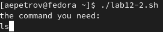

---
## Front matter
lang: ru-RU
title: "Программирование в командном процессоре ОС UNIX. Расширенное программирование"
author: |
	Petrov Artyem E.\inst{1}
	\and
institute: |
	\inst{1}RUDN University, Moscow, Russian Federation
	\and
date: NEC--2022, 25 May, 2022 Moscow, the Russian Federation

## Formatting
toc: false
slide_level: 2
theme: metropolis
header-includes: 
 - \metroset{progressbar=frametitle,sectionpage=progressbar,numbering=fraction}
 - '\makeatletter'
 - '\beamer@ignorenonframefalse'
 - '\makeatother'
aspectratio: 43
section-titles: true
---

# Цель работы

Изучить основы программирования в оболочке ОС UNIX. Научиться писать более
сложные командные файлы с использованием логических управляющих конструкций
и циклов.

# Задание

1. Написать командный файл, реализующий упрощённый механизм семафоров. Ко-
мандный файл должен в течение некоторого времени t1 дожидаться освобождения
ресурса, выдавая об этом сообщение, а дождавшись его освобождения, использовать
его в течение некоторого времени t2<>t1, также выдавая информацию о том, что
ресурс используется соответствующим командным файлом (процессом). Запустить
командный файл в одном виртуальном терминале в фоновом режиме, перенаправив
его вывод в другой (> /dev/tty#, где # — номер терминала куда перенаправляется
вывод), в котором также запущен этот файл, но не фоновом, а в привилегированном
режиме. Доработать программу так, чтобы имелась возможность взаимодействия трёх
и более процессов.
2. Реализовать команду man с помощью командного файла. Изучите содержимое ката-
лога /usr/share/man/man1. В нем находятся архивы текстовых файлов, содержащих
справку по большинству установленных в системе программ и команд. Каждый архив
можно открыть командой less сразу же просмотрев содержимое справки. Командный
файл должен получать в виде аргумента командной строки название команды и в виде
результата выдавать справку об этой команде или сообщение об отсутствии справки,
если соответствующего файла нет в каталоге man1.
3. Используя встроенную переменную $RANDOM, напишите командный файл, генерирую-
щий случайную последовательность букв латинского алфавита. Учтите, что $RANDOM
выдаёт псевдослучайные числа в диапазоне от 0 до 32767.


# Выполнение лабораторной работы

## Задание 1. Рис. [-@fig:001].

``` 
#!/bin/bash
lockfile = "./lock.file"
exec {fn}>lockfile

echo 'locked'
until flock -n ${fn}
do
    echo "idk not wrkin"
    sleep 1
    flick -n ${fn}
done
for ((i=0; i<=7; i++))
do
    echo "it works"
    sleep 1
done
``` 

{ #fig:001 width=70% }

## Задание 2. Рис. [-@fig:002]-[-@fig:003].

```
#!/bin/bash
cd /usr/share/man/man1
echo the command you need:
read command
less $command*
``` 

{ #fig:002 width=70% }

{ #fig:003 width=70% }

## Задание 3. Рис. [-@fig:004].

```
#!/bin/bash
num
echo enter num of random stuff:
read word
for((i=0;i<$word;i++))
do
    echo $RANDOM | tr '[0-32670]' '[a-z]'
done 
``` 
{ #fig:004 width=70% }

# Выводы

Благодаря данной лабораторной работе я научился создавать генератор случайных последовательностей символов, написал упрощенный механизм семафоров и узнал, как реализовать замену для базовых команды Unix
