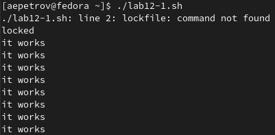
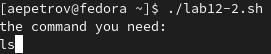
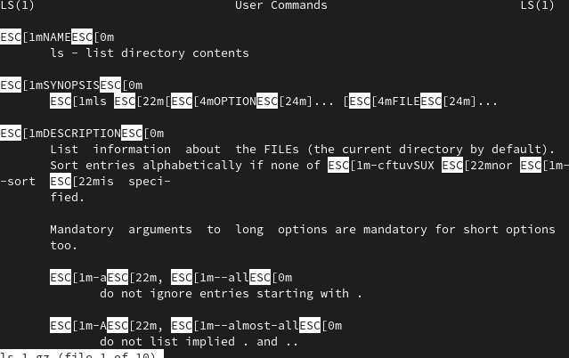
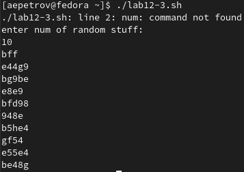

---
## Front matter
title: "Лабораторная работа н.12"
subtitle: "Программирование в командном процессоре ОС UNIX. Расширенное программирование"
author: "Петров Артем Евгеньевич"

## Generic otions
lang: ru-RU
toc-title: "Содержание"

## Bibliography
bibliography: bib/cite.bib
csl: pandoc/csl/gost-r-7-0-5-2008-numeric.csl

## Pdf output format
toc: true # Table of contents
toc-depth: 2
lof: true # List of figures
lot: false # List of tables
fontsize: 12pt
linestretch: 1.5
papersize: a4
documentclass: scrreprt
## I18n polyglossia
polyglossia-lang:
  name: russian
  options:
	- spelling=modern
	- babelshorthands=true
polyglossia-otherlangs:
  name: english
## I18n babel
babel-lang: russian
babel-otherlangs: english
## Fonts
mainfont: PT Serif
romanfont: PT Serif
sansfont: PT Sans
monofont: PT Mono
mainfontoptions: Ligatures=TeX
romanfontoptions: Ligatures=TeX
sansfontoptions: Ligatures=TeX,Scale=MatchLowercase
monofontoptions: Scale=MatchLowercase,Scale=0.9
## Biblatex
biblatex: true
biblio-style: "gost-numeric"
biblatexoptions:
  - parentracker=true
  - backend=biber
  - hyperref=auto
  - language=auto
  - autolang=other*
  - citestyle=gost-numeric
## Pandoc-crossref LaTeX customization
figureTitle: "Рис."
tableTitle: "Таблица"
listingTitle: "Листинг"
lofTitle: "Список иллюстраций"
lotTitle: "Список таблиц"
lolTitle: "Листинги"
## Misc options
indent: true
header-includes:
  - \usepackage{indentfirst}
  - \usepackage{float} # keep figures where there are in the text
  - \floatplacement{figure}{H} # keep figures where there are in the text
---

# Цель работы

Изучить основы программирования в оболочке ОС UNIX. Научиться писать более
сложные командные файлы с использованием логических управляющих конструкций
и циклов.

# Задание

1. Написать командный файл, реализующий упрощённый механизм семафоров. Ко-
мандный файл должен в течение некоторого времени t1 дожидаться освобождения
ресурса, выдавая об этом сообщение, а дождавшись его освобождения, использовать
его в течение некоторого времени t2<>t1, также выдавая информацию о том, что
ресурс используется соответствующим командным файлом (процессом). Запустить
командный файл в одном виртуальном терминале в фоновом режиме, перенаправив
его вывод в другой (> /dev/tty#, где # — номер терминала куда перенаправляется
вывод), в котором также запущен этот файл, но не фоновом, а в привилегированном
режиме. Доработать программу так, чтобы имелась возможность взаимодействия трёх
и более процессов.
2. Реализовать команду man с помощью командного файла. Изучите содержимое ката-
лога /usr/share/man/man1. В нем находятся архивы текстовых файлов, содержащих
справку по большинству установленных в системе программ и команд. Каждый архив
можно открыть командой less сразу же просмотрев содержимое справки. Командный
файл должен получать в виде аргумента командной строки название команды и в виде
результата выдавать справку об этой команде или сообщение об отсутствии справки,
если соответствующего файла нет в каталоге man1.
3. Используя встроенную переменную $RANDOM, напишите командный файл, генерирую-
щий случайную последовательность букв латинского алфавита. Учтите, что $RANDOM
выдаёт псевдослучайные числа в диапазоне от 0 до 32767.


# Выполнение лабораторной работы

## Задание 1. Рис. [-@fig:001].

``` 
#!/bin/bash
lockfile = "./lock.file"
exec {fn}>lockfile

echo 'locked'
until flock -n ${fn}
do
    echo "idk not wrkin"
    sleep 1
    flick -n ${fn}
done
for ((i=0; i<=7; i++))
do
    echo "it works"
    sleep 1
done
``` 

{ #fig:001 width=70% }

## Задание 2. Рис. [-@fig:002]-[-@fig:003].

```
#!/bin/bash
cd /usr/share/man/man1
echo the command you need:
read command
less $command*
``` 

{ #fig:002 width=70% }

{ #fig:003 width=70% }

## Задание 3. Рис. [-@fig:004].

```
#!/bin/bash
num
echo enter num of random stuff:
read word
for((i=0;i<$word;i++))
do
    echo $RANDOM | tr '[0-32670]' '[a-z]'
done 
``` 
{ #fig:004 width=70% }

# Выводы

Благодаря данной лабораторной работе я научился создавать генератор случайных последовательностей символов, написал упрощенный механизм семафоров и узнал, как реализовать замену для базовых команды Unix

# Контрольные вопросы 

1. Для правильного исполнения командной строки `while [$1 != "exit"]` квадратные скобки нужно поменять на круглые скобки
2. Использовать знак `$` между двумя переменными символьного типа для оъединения нескольких строк в одно единую целую строку 
3. `seq` - выводит последовательность целых или действительных чисел для передачи в другие программы, на языке bash её можно реализовать с помощью цикла `for`
4. 10 / 3 = 3 (дробная часть будет отброшена, так как числа целые, но если бы было 10.000/3.000 = 3.333)
5. Zsh выполнен на основе bash, а поэтому наследует как недостатки так и преимущества bash, но  в zsh есть автодополнение, горячие клавишы, алиасы, различные удобства в виде тем, плагинов и расширенной поддержке, однако есть минус всей этой красоты и удобства, на узкоспециализированных машинах это красоты быть не может в принципе из-за ограничений железа или системного администратора
6. Синтаксиси верен, однако для надежности лучше писать `for` и `((some words))` без пробела, т.е. слитно