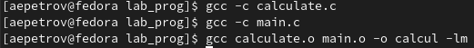
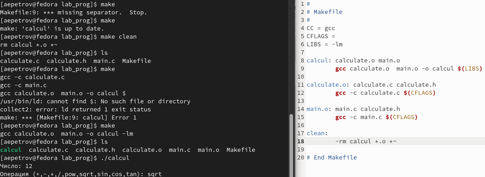
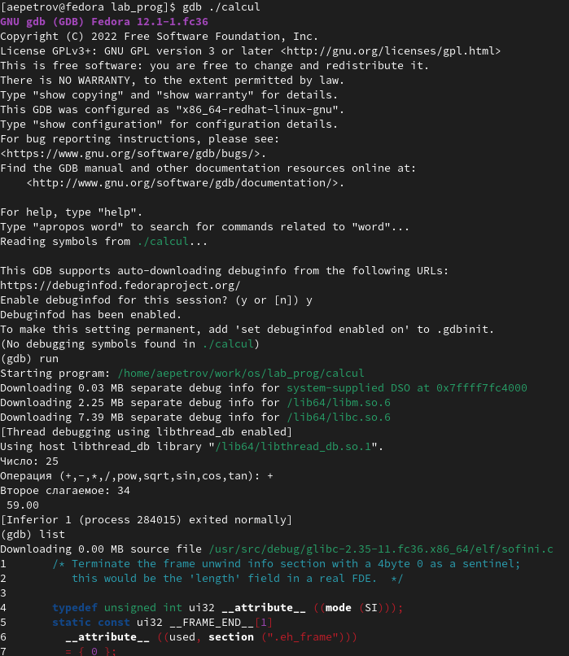
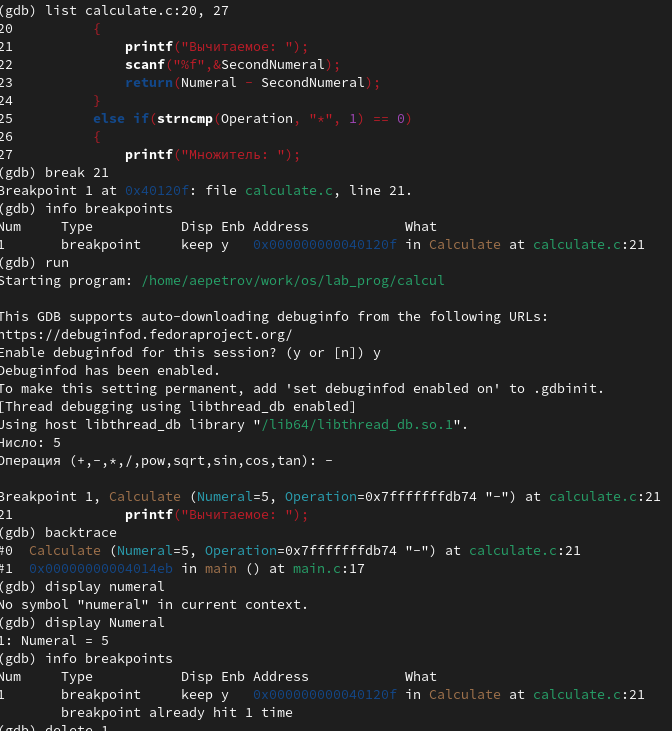
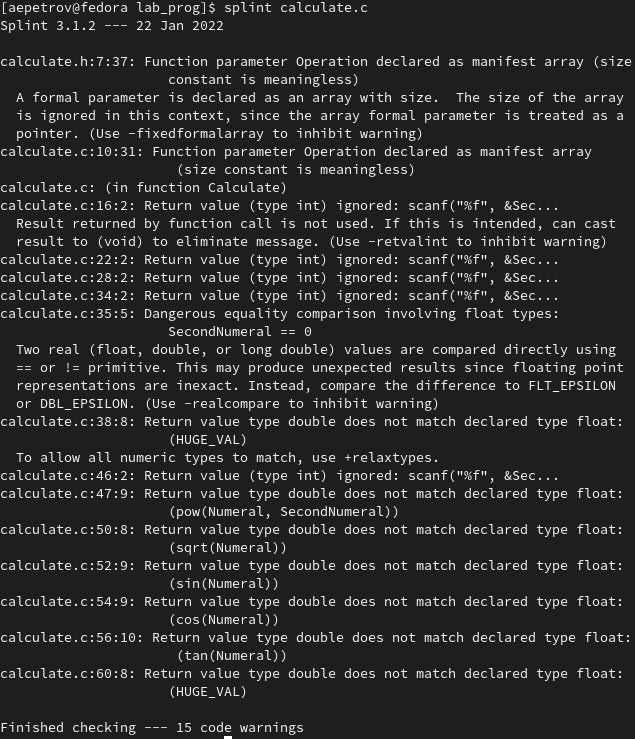
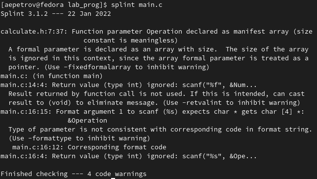

---
## Front matter
lang: ru-RU
title: "Средства, применяемые при разработке программного обеспечения в ОС типа Unix/Linux"
author: |
	Artyem E. Petrov

institute: |
	RUDN University, Moscow, the Russian Federation
date: NEC--2022, 28 May -- 4 June, 2022 Moscow, the Russian Federation

## Formatting
toc: false
slide_level: 2
theme: metropolis
header-includes: 
aspectratio: 43
section-titles: true
---

# Цель работы

Приобрести простейшие навыки разработки, анализа, тестирования и отладки приложений в ОС типа UNIX/Linux на примере создания на языке программирования.С калькулятора с простейшими функциями

# Задание

1. В домашнем каталоге создайте подкаталог ~/work/os/lab_prog.
2. Создайте в нём файлы: calculate.h, calculate.c, main.c.
Это будет примитивнейший калькулятор, способный складывать, вычитать, умножать
и делить, возводить число в степень, брать квадратный корень, вычислять sin, cos, tan. При запуске он будет запрашивать первое число, операцию, второе число. После этого программа выведет результат и остановится.
3. Выполните компиляцию программы посредством gcc
4. При необходимости исправьте синтаксические ошибки.
5. Создайте Makefile со следующим содержанием:

``` 
1 #
2 # Makefile
3 #
4
5 CC = gcc
6 CFLAGS =
7 LIBS = -lm
8
9 calcul: calculate.o main.o
10 gcc calculate.o main.o -o calcul $(LIBS)
11
12 calculate.o: calculate.c calculate.h
13 gcc -c calculate.c $(CFLAGS)
14
15 main.o: main.c calculate.h
16 gcc -c main.c $(CFLAGS)
17
18 clean:
19 -rm calcul *.o *~
20
21 # End Makefile
``` 

Поясните в отчёте его содержание.

6. С помощью gdb выполните отладку программы calcul (перед использованием gdb исправьте Makefile):
- Запустите отладчик GDB, загрузив в него программу для отладки.
- Для запуска программы внутри отладчика введите команду run
- Для постраничного (по 9 строк) просмотра исходного код используйте команду list:
- Для просмотра строк с 12 по 15 основного файла используйте list с параметрами
- Для просмотра определённых строк не основного файла используйте list с параметрами
- Установите точку останова в файле calculate.c на строке номер 21
- Выведите информацию об имеющихся в проекте точка останова
- Запустите программу внутри отладчика и убедитесь, что программа остановится в момент прохождения точки останова
- Отладчик выдаст следующую информацию

``` 
1 #0 Calculate (Numeral=5, Operation=0x7fffffffd280 "-")
2 at calculate.c:21
3 #1 0x0000000000400b2b in main () at main.c:17
``` 
а команда backtrace покажет весь стек вызываемых функций от начала программы до текущего места.
- Посмотрите, чему равно на этом этапе значение переменной Numeral, введя:

```
1 print Numeral
```

На экран должно быть выведено число 5.
- Сравните с результатом вывода на экран после использования команды:

```
1 display Numeral
```

- Уберите точки останова:

```
1 info breakpoints
2 delete 1
```

7. С помощью утилиты splint попробуйте проанализировать коды файлов calculate.c и main.c.

# Выполнение лабораторной работы

Описываются проведённые действия, в качестве иллюстрации даётся ссылка на иллюстрацию (рис. [-@fig:001])

{ #fig:001 width=70% }

## Задание 1. 

- Создадим в домашнем каталоге подкаталог '~'/work/os/lab_prog

```
mkdir ~/work/os/lab_prog
```

## Задание 2. 

- Создадим в новом каталоге файлы calculate.h, calculate.c, main.c 

```
cd ~/work/os/lab_prog
touch calculate.h calculate.c main.c
```

- Скопируем текст программ из лабораторной работы в эти файлы.

```
emacs &
```
## Задание 3.

-Выполним компиляцию программу посредством gcc(рис. [-@fig:001]):

```
gcc -c calculate.c
gcc -c main.c
gcc calculate.o main.o -o calcul -lm
```

{ #fig:001 width=70% }

## Задание 4. 

- Синтаксических ошибок не обнаружено

## Задание 5.

- Создадим makefile с требуемым содержание(см. лабораторную работу н. 13) в каталоге tech_prog

```
touch Makefile 
emacs Makefile
```

Пояснение содержания makefile:

5-7 строки-локальные переменные.
9, 15, 18(синим)-названия процессов.
9, 10, 12, 13, 15, 16, 19-команды для терминала.
Таким образом, наш makefile выполняет следующие действия:
1. Компанует объектные файлы в executable
2. Компилирует программу calculate.c 
3. Компилирует программу main.c 
4. Удаляет оставшиеся объектные файлы. 

## Задание 6. 

- В моем случае в makefile не хватало знаком табуляции(без них никак) и значение переменной должно быть установлено, как -g, чтобы в будущем работать с отладчиком(рис. [-@fig:002]):

{ #fig:002 width=70% }

1. Запустим отладчик нашего приложения с помощью команды(прежде обязательно пропишите make)(рис. [-@fig:003])

```
make // Если не создали еще исполняемый файл(в папке tech_prog). 
gdb ./calcul
```

2. Запустим исполняемый файл внутри

```
run
```

{ #fig:003 width=70% }

3. Установим точку остановки в файле calculate.c на строке 21(рис. [-@fig:004]) и проверим значение переменной Numeral в точке остановки и в конце программы(рис. [-@fig:004]) :

```
list calculate.c:20, 27
break 21
info breakpoints
run 
5
-
backtrace
print Numeral
display Numeral
info breakpoints
delete 1
```

{ #fig:004 width=70%}

## Задание 7
-См. рис. [-@fig:005] и рис. [-@fig:006]
```
splint calculate.c
```

```
splint main.c
```

{ #fig:005 width=70%}


{ #fig:006 width=70%}

# Выводы

С помощью данной лабораторной работы я научился работать с компилятором, компилировать программные файлы языка C/C++, создавать сценарии работы в makefile с помощью утилиты make и так же заниматься отладкой программы.