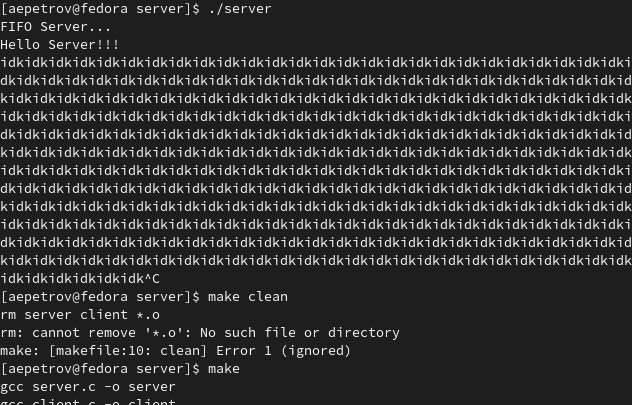

---
## Front matter
lang: ru-RU
title: "Лабораторная работа н. 14.Именованные каналы"
author: | 
  Petrov Artyem Evgenjevich
institute: |
	inst{1}RUDN University, Moscow, the Russian Federation
date: NEC--2022, 4 June, 2022 Moscow, the Russian Federation

## Formatting
toc: false
slide_level: 2
theme: metropolis
header-includes: 
aspectratio: 43
section-titles: true
---

# Цель работы

Приобретение практических навыков работы с именованными каналами.

# Задание

Изучите приведённые в тексте программы server.c и client.c. Взяв данные примеры
за образец, напишите аналогичные программы, внеся следующие изменения:
1. Работает не 1 клиент, а несколько (например, два).
2. Клиенты передают текущее время с некоторой периодичностью (например, раз в пять
секунд). Используйте функцию sleep() для приостановки работы клиента.
3. Сервер работает не бесконечно, а прекращает работу через некоторое время (напри-
мер, 30 сек). Используйте функцию clock() для определения времени работы сервера.
Что будет в случае, если сервер завершит работу, не закрыв канал?

# Выполнение лабораторной работы

- Создадим папку server:

```
cd ..
cd work/os
mkdir server && cd server 
touch client.c common.h server.c makefile
```

- Скопируем содержимое одноименных программ из лабораторных работ в новосозданные файлы

```
gedit client.c 
//after done copying
gedit common.h
gedit server.c
gedit makefile
```

Приведем программу к следующему виду: 
- client.c

```
/*
* client.c - реализация клиента
*
* чтобы запустить пример, необходимо:
* 1. запустить программу server на одной консоли;
* 2. запустить программу client на другой консоли.
*/
#include "common.h"

#define MESSAGE "Hello Server!!!\n"

int main()
{
   int writefd, msglen, count;
   long long int t;
   char message[10];
   
   for (count = 0; count < -5; count++)
   {
      sleep(5);
      t=(long long int) time(0);
      sprintf(message, "%lli", t);
      if ((writefd=open(FIFO_NAME, O_RDONLY)) < 0)
      {
         fprintf(stderr, "%s: Невозможно открыть FIFO (%s) \n", 
         __FILE__, strerror(errno));
         exit(-1);
      }
      
      msglen = strlen(MESSAGE);
      if (write(writefd, MESSAGE, msglen) != msglen)
      {
         fprintf("%s: Ошибка записи в FIFO (%s)\n",
         __FILE__, strerror(errno));
         exit(-2);
      }
      
   }
   close(writefd);
   exit(0);
}
```

- server.c

```
*
 * server.c - реализация сервера
 *
 * чтобы запустить пример, необходимо:
 * 1. запустить программу server на одной консоли;
 * 2. запустить программу client на другой консоли.
 */

#include "common.h"

int
main()
{
   int readfd; /* дескриптор для чтения из FIFO */
   int n;
   char buff[MAX_BUFF]; /* буфер для чтения данных из FIFO */
   /* баннер */
   printf("FIFO Server...\n");
   /* создаем файл FIFO с открытыми для всех
    * правами доступа на чтение и запись
    */
   if(mknod(FIFO_NAME, S_IFIFO | 0666, 0) < 0)
   {
	fprintf(stderr, "%s: Невозможно создать FIFO (%s)\n",
	__FILE__, strerror(errno));
	exit(-1);
   }

/* откроем FIFO на чтение */
   if((readfd = open(FIFO_NAME, O_RDONLY)) < 0)
   {
	fprintf(stderr, "%s: Невозможно открыть FIFO (%s)\n",
	__FILE__, strerror(errno));
	exit(-2);
   }

   clock_t now=time(NULL), start=time(NULL);
   while (now-start<30)
   {
      while ((n=read(readfd, buff, MAX_BUFF))>0)
      {
         if(write(1, buff, n) != n)
 	      {
	         fprintf(stderr, "%s: Ошибка вывода (%s)\n",
	         __FILE__, strerror(errno));
         }      
      }
      now=time(NULL);
   }
   
   printf("server not ok, %li-seconds passed\n", (now-start));
   close(readfd);
   /* удалим FIFO из системы */
   if(unlink(FIFO_NAME) < 0)
   {
	   fprintf(stderr, "%s: Невозможно удалить FIFO (%s)\n",
	      __FILE__, strerror(errno));
	   exit(-4);
   }

   exit(0);
}
```

- common.h 

```
/*
 * common.h - заголовочный файл со стандартными определениями
 */

#ifndef __COMMON_H__
#define __COMMON_H__
#include <stdio.h>
#include <stdlib.h>
#include <string.h>
#include <errno.h>
#include <sys/types.h>
#include <sys/stat.h>
#include <fcntl.h>


#define FIFO_NAME "/tmp/fifo"
#define MAX_BUFF 80

#endif /* __COMMON_H__ */

```

- Результат работы(рис. [-@fig:001])

{ #fig:001 width=70% }

# Выводы

Благодаря данной лабораторной работе я научился работать с именованными каналами и создавать "сервер", которые обменивается информацией с пользователем. 