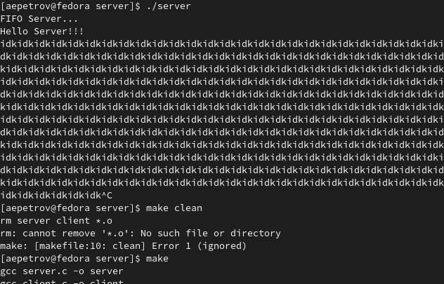

---
## Front matter
title: "Лабораторная работа н. 14.Именованные каналы"
subtitle: "Простейший вариант"
author: "Петров Артем Евгеньевич"

## Generic otions
lang: ru-RU
toc-title: "Содержание"

## Bibliography
bibliography: bib/cite.bib
csl: pandoc/csl/gost-r-7-0-5-2008-numeric.csl

## Pdf output format
toc: true # Table of contents
toc-depth: 2
lof: true # List of figures
lot: false # List of tables
fontsize: 12pt
linestretch: 1.5
papersize: a4
documentclass: scrreprt
## I18n polyglossia
polyglossia-lang:
  name: russian
  options:
	- spelling=modern
	- babelshorthands=true
polyglossia-otherlangs:
  name: english
## I18n babel
babel-lang: russian
babel-otherlangs: english
## Fonts
mainfont: PT Serif
romanfont: PT Serif
sansfont: PT Sans
monofont: PT Mono
mainfontoptions: Ligatures=TeX
romanfontoptions: Ligatures=TeX
sansfontoptions: Ligatures=TeX,Scale=MatchLowercase
monofontoptions: Scale=MatchLowercase,Scale=0.9
## Biblatex
biblatex: true
biblio-style: "gost-numeric"
biblatexoptions:
  - parentracker=true
  - backend=biber
  - hyperref=auto
  - language=auto
  - autolang=other*
  - citestyle=gost-numeric
## Pandoc-crossref LaTeX customization
figureTitle: "Рис."
tableTitle: "Таблица"
listingTitle: "Листинг"
lofTitle: "Список иллюстраций"
lotTitle: "Список таблиц"
lolTitle: "Листинги"
## Misc options
indent: true
header-includes:
  - \usepackage{indentfirst}
  - \usepackage{float} # keep figures where there are in the text
  - \floatplacement{figure}{H} # keep figures where there are in the text
---

# Цель работы

Приобретение практических навыков работы с именованными каналами.

# Задание

Изучите приведённые в тексте программы server.c и client.c. Взяв данные примеры
за образец, напишите аналогичные программы, внеся следующие изменения:
1. Работает не 1 клиент, а несколько (например, два).
2. Клиенты передают текущее время с некоторой периодичностью (например, раз в пять
секунд). Используйте функцию sleep() для приостановки работы клиента.
3. Сервер работает не бесконечно, а прекращает работу через некоторое время (напри-
мер, 30 сек). Используйте функцию clock() для определения времени работы сервера.
Что будет в случае, если сервер завершит работу, не закрыв канал?

# Теоретическое введение

Одним из видов взаимодействия между процессами в операционных системах яв-
ляется обмен сообщениями. Под сообщением понимается последовательность байтов,
передаваемая от одного процесса другому.
В операционных системах типа UNIX есть 3 вида межпроцессорных взаимодействий:
общеюниксные (именованные каналы, сигналы), System V Interface Definition (SVID —
разделяемая память, очередь сообщений, семафоры) и BSD (сокеты).
Для передачи данных между неродственными процессами можно использовать меха-
низм именованных каналов (named pipes). Данные передаются по принципу FIFO (First
In First Out) (первым записан — первым прочитан), поэтому они называются также FIFO
pipes или просто FIFO. Именованные каналы отличаются от неименованных наличием
идентификатора канала, который представлен как специальный файл (соответственно
имя именованного канала — это имя файла). Поскольку файл находится на локальной
файловой системе, данное IPC используется внутри одной системы.
Файлы именованных каналов создаются функцией mkfifo(3).

```
1 #include <sys/types.h>
2 #include <sys/stat.h>
3
4 int mkfifo(const char *pathname, mode_t mode);
5
```

Первый параметр — имя файла, идентифицирующего канал, второй параметр — маска
прав доступа к файлу.
После создания файла канала процессы, участвующие в обмене данными, должны
открыть этот файл либо для записи, либо для чтения. При закрытии файла сам канал
продолжает существовать. Для того чтобы закрыть сам канал, нужно удалить его файл,
например с помощью вызова unlink(2).
Рассмотрим работу именованного канала на примере системы клиент–сервер. Сервер
создаёт канал, читает из него текст, посылаемый клиентом, и выводит его на терминал.
Вызов функции mkfifo() создаёт файл канала (с именем, заданным макросом
FIFO_NAME):

```
1
2 mkfifo(FIFO_NAME, 0600);
3
```

В качестве маски доступа используется восьмеричное значение 0600, разрешающее
процессу с аналогичными реквизитами пользователя чтение и запись. Можно также
установить права доступа 0666.
Открываем созданный файл для чтения:

```
1
2 f = fopen(FIFO_NAME, O_RDONLY);
3
```

Ждём сообщение от клиента. Сообщение читаем с помощью функции read() и печа-
таем на экран. После этого удаляется файл FIFO_NAME и сервер прекращает работу.
Клиент открывает FIFO для записи как обычный файл:

```
1
2 f = fopen(FIFO_NAME, O_WRONLY);
3
```

Посылаем сообщение серверу с помощью функции write().
Для создания файла FIFO можно использовать более общую функцию mknod(2), пред-
назначенную для создания специальных файлов различных типов (FIFO, сокеты, файлы
устройств и обычные файлы для хранения данных).

```
1 #include <sys/types.h>
2 #include <sys/stat.h>
3 #include <fcntl.h>
4 #include <unistd.h>
5
6 int mknod(const char *pathname, mode_t mode, dev_t dev);
```

Тогда, вместо

```
1 mkfifo(FIFO_NAME, 0600);
```

пишем

```
1 mknod(FIFO_NAME, S_IFIFO | 0600, 0);
```

Каналы представляют собой простое и удобное средство передачи данных, которое,
однако, подходит не во всех ситуациях. Например, с помощью каналов довольно трудно
организовать обмен асинхронными сообщениями между процессами.
Пример программы
Файл common.h

```
1 /*
2 * common.h - заголовочный файл со стандартными определениями
3 */
4
5 #ifndef __COMMON_H__
6 #define __COMMON_H__
7
8 #include <stdio.h>
9 #include <stdlib.h>
10 #include <string.h>
11 #include <errno.h>
12 #include <sys/types.h>
13 #include <sys/stat.h>
14 #include <fcntl.h>
15
16 #define FIFO_NAME "/tmp/fifo"
17 #define MAX_BUFF 80
18
19 #endif /* __COMMON_H__ */
```

14.3.2. Файл server.c

```
1 /*
2 * server.c - реализация сервера
3 *
4 * чтобы запустить пример, необходимо:
5 * 1. запустить программу server на одной консоли;
6 * 2. запустить программу client на другой консоли.
7 */
8
9 #include "common.h"
10
11 int
12 main()
13 {
14 int readfd; /* дескриптор для чтения из FIFO */
15 int n;
16 char buff[MAX_BUFF]; /* буфер для чтения данных из FIFO */
17
18 /* баннер */
19 printf("FIFO Server...\n");
20
21 /* создаем файл FIFO с открытыми для всех
22 * правами доступа на чтение и запись
23 */
24 if(mknod(FIFO_NAME, S_IFIFO | 0666, 0) < 0)
25 {
26 fprintf(stderr, "%s: Невозможно создать FIFO (%s)\n",
27 __FILE__, strerror(errno));
28 exit(-1);
29 }
30
31 /* откроем FIFO на чтение */
32 if((readfd = open(FIFO_NAME, O_RDONLY)) < 0)
33 {
34 fprintf(stderr, "%s: Невозможно открыть FIFO (%s)\n",
35 __FILE__, strerror(errno));
36 exit(-2);
37 }
38
39 /* читаем данные из FIFO и выводим на экран */
40 while((n = read(readfd, buff, MAX_BUFF)) > 0)
41 {
42 if(write(1, buff, n) != n)
43 {
44 fprintf(stderr, "%s: Ошибка вывода (%s)\n",
45 __FILE__, strerror(errno));
46 exit(-3);
47 }
48 }
49
50 close(readfd); /* закроем FIFO */
51
52 /* удалим FIFO из системы */
53 if(unlink(FIFO_NAME) < 0)
54 {
55 fprintf(stderr, "%s: Невозможно удалить FIFO (%s)\n",
56 __FILE__, strerror(errno));
57 exit(-4);
58 }
59
60 exit(0);
61 }
```

14.3.3. Файл client.c

```
1 /*
2 * client.c - реализация клиента
3 *
4 * чтобы запустить пример, необходимо:
5 * 1. запустить программу server на одной консоли;
6 * 2. запустить программу client на другой консоли.
7 */
8
9 #include "common.h"
10
11 #define MESSAGE "Hello Server!!!\n"
12
13 int
14 main()
15 {
16 int writefd; /* дескриптор для записи в FIFO */
17 int msglen;
18
19 /* баннер */
20 printf("FIFO Client...\n");
21
22 /* получим доступ к FIFO */
23 if((writefd = open(FIFO_NAME, O_WRONLY)) < 0)
24 {
25 fprintf(stderr, "%s: Невозможно открыть FIFO (%s)\n",
26 __FILE__, strerror(errno));
27 exit(-1);
28 }
29
30 /* передадим сообщение серверу */
31 msglen = strlen(MESSAGE);
32 if(write(writefd, MESSAGE, msglen) != msglen)
33 {
34 fprintf(stderr, "%s: Ошибка записи в FIFO (%s)\n",
35 __FILE__, strerror(errno));
36 exit(-2);
37 }
38
39 /* закроем доступ к FIFO */
40 close(writefd);
41
42 exit(0);
43 }
```

14.3.4. Файл Makefile

```
1 all: server client
2
3 server: server.c common.h
4 gcc server.c -o server
5
6 client: client.c common.h
7 gcc client.c -o client
8
9 clean:
10 -rm server client *.o
```


# Выполнение лабораторной работы

- Создадим папку server:

```
cd ..
cd work/os
mkdir server && cd server 
touch client.c common.h server.c makefile
```

- Скопируем содержимое одноименных программ из лабораторных работ в новосозданные файлы

```
gedit client.c 
//after done copying
gedit common.h
gedit server.c
gedit makefile
```

Приведем программу к следующему виду: 
- client.c

```
/*
* client.c - реализация клиента
*
* чтобы запустить пример, необходимо:
* 1. запустить программу server на одной консоли;
* 2. запустить программу client на другой консоли.
*/
#include "common.h"

#define MESSAGE "Hello Server!!!\n"

int main()
{
   int writefd, msglen, count;
   long long int t;
   char message[10];
   
   for (count = 0; count < -5; count++)
   {
      sleep(5);
      t=(long long int) time(0);
      sprintf(message, "%lli", t);
      if ((writefd=open(FIFO_NAME, O_RDONLY)) < 0)
      {
         fprintf(stderr, "%s: Невозможно открыть FIFO (%s) \n", 
         __FILE__, strerror(errno));
         exit(-1);
      }
      
      msglen = strlen(MESSAGE);
      if (write(writefd, MESSAGE, msglen) != msglen)
      {
         fprintf("%s: Ошибка записи в FIFO (%s)\n",
         __FILE__, strerror(errno));
         exit(-2);
      }
      
   }
   close(writefd);
   exit(0);
}
```

- server.c

```
*
 * server.c - реализация сервера
 *
 * чтобы запустить пример, необходимо:
 * 1. запустить программу server на одной консоли;
 * 2. запустить программу client на другой консоли.
 */

#include "common.h"

int
main()
{
   int readfd; /* дескриптор для чтения из FIFO */
   int n;
   char buff[MAX_BUFF]; /* буфер для чтения данных из FIFO */
   /* баннер */
   printf("FIFO Server...\n");
   /* создаем файл FIFO с открытыми для всех
    * правами доступа на чтение и запись
    */
   if(mknod(FIFO_NAME, S_IFIFO | 0666, 0) < 0)
   {
	fprintf(stderr, "%s: Невозможно создать FIFO (%s)\n",
	__FILE__, strerror(errno));
	exit(-1);
   }

/* откроем FIFO на чтение */
   if((readfd = open(FIFO_NAME, O_RDONLY)) < 0)
   {
	fprintf(stderr, "%s: Невозможно открыть FIFO (%s)\n",
	__FILE__, strerror(errno));
	exit(-2);
   }

   clock_t now=time(NULL), start=time(NULL);
   while (now-start<30)
   {
      while ((n=read(readfd, buff, MAX_BUFF))>0)
      {
         if(write(1, buff, n) != n)
 	      {
	         fprintf(stderr, "%s: Ошибка вывода (%s)\n",
	         __FILE__, strerror(errno));
         }      
      }
      now=time(NULL);
   }
   
   printf("server not ok, %li-seconds passed\n", (now-start));
   close(readfd);
   /* удалим FIFO из системы */
   if(unlink(FIFO_NAME) < 0)
   {
	   fprintf(stderr, "%s: Невозможно удалить FIFO (%s)\n",
	      __FILE__, strerror(errno));
	   exit(-4);
   }

   exit(0);
}
```

- common.h 

```
/*
 * common.h - заголовочный файл со стандартными определениями
 */

#ifndef __COMMON_H__
#define __COMMON_H__
#include <stdio.h>
#include <stdlib.h>
#include <string.h>
#include <errno.h>
#include <sys/types.h>
#include <sys/stat.h>
#include <fcntl.h>


#define FIFO_NAME "/tmp/fifo"
#define MAX_BUFF 80

#endif /* __COMMON_H__ */

```

- Результат работы(рис. [-@fig:001])

{ #fig:001 width=70% }

# Выводы

Благодаря данной лабораторной работе я научился работать с именованными каналами и создавать "сервер", которые обменивается информацией с пользователем. 
# Контрольные вопросы


    Именованные каналы отличаются от неименованных наличием идентификатора канала, который представлен как специальный файл (соответственно имя именованного канала — это имя файла). Поскольку файл находится на локальной файловой системе, данное IPC используется внутри одной системы.

    Да, командой pipe.

    Да, командой $ mkfifo имя_файла.

    int read(int pipe_fd, void *area, int cnt); int write(int pipe_fd, void *area, int cnt); Первый аргумент этих вызовов - дескриптор канала, второй - указатель на область памяти, с которой происходит обмен, третий - количество байт. Оба вызова возвращают число переданных байт (или -1 - при ошибке).

    int mkfifo (const char *pathname, mode_t mode); Первый параметр — имя файла, идентифицирующего канал, второй параметр маска прав доступа к файлу. Вызов функции mkfifo() создаёт файл канала (с именем, заданным макросом FIFO_NAME): mkfifo(FIFO_NAME, 0600).

    При чтении меньшего числа байтов, чем находится в канале, возвращается требуемое число байтов, остаток сохраняется для последующих чтений. При чтении большего числа байтов, чем находится в канале или FIFO возвращается доступное число байтов.

    При записи большего числа байтов, чем это позволяет канал или FIFO, вызов write(2) блокируется до освобождения требуемого места. При этом атомарность операции не гарантируется. Если процесс пытается записать данные в канал, не открытый ни одним процессом на чтение, процессу генерируется сигнал. Запись числа байтов, меньшего емкости канала или FIFO, гарантированно атомарно. Это означает, что в случае, когда несколько процессов одновременно записывают в канал, порции данных от этих процессов не перемешиваются.

    В общем случае возможна многонаправленная работа процессов с каналом, т.е. возможна ситуация, когда с одним и тем же каналом взаимодействуют два и более процесса, и каждый из взаимодействующих каналов пишет и читает информацию в канал. Но традиционной схемой организации работы с каналом является однонаправленная организация, когда канал связывает два, в большинстве случаев, или несколько взаимодействующих процесса, каждый из которых может либо читать, либо писать в канал.

    Функция записывает length байтов из буфера buffer в файл, определенный дескриптором файла fd. Эта операция чисто 'двоичная' и без буферизации. Реализуется как непосредственный вызов DOS. С помощью функции write мы посылаем сообщение клиенту или серверу.

    Функция, транслирующая код ошибки, который обычно хранится в глобальной переменной errno, в сообщение об ошибке, понятном человеку. Ошибки эти возникают при вызове функций стандартных Си-библиотек. Возвращенный указатель ссылается на статическую строку с ошибкой, которая не должна быть изменена программой. Дальнейшие вызовы функции strerror перезапишут содержание этой строки. Интерпретированные сообщения об ошибках могут различаться, это зависит от платформы и компилятора.

